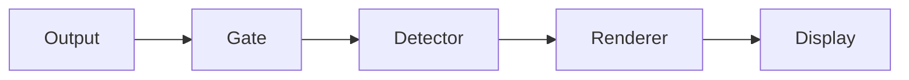

# ptymark

<!--
@dependency-start
contract design
responsibility Provides the user-facing entrypoint for ptymark installation, engine setup, configuration, WezTerm use, safety guarantees, and development.
upstream design documents/ptymark-design.md defines the current pre-display architecture and extension boundary.
upstream design documents/ptymark-installer.md defines installation-time resolution and replacement behavior.
upstream environment docker/ptymark.Dockerfile defines the canonical validation environment.
downstream implementation src/cli.rs implements the documented command surface.
downstream test tests/cli_contract.rs and tests/install_contract.rs validate the documented behavior.
@dependency-end
-->

`ptymark` is an alpha-stage **pre-display renderer** for terminal output. It detects complete,
explicitly delimited Markdown blocks and replaces only those blocks before bytes are committed to the
terminal display.

```text
child output
  -> terminal safety gate
  -> explicit semantic detector
  -> render decision
  -> selected engine handoff
  -> independent cache
  -> terminal-safe display bytes
```

It does not replace keyboard input, termios, signal routing, window-size forwarding, mouse reporting,
bracketed paste, or child exit-status handling.

## Current status

Implemented:

- stream and file rendering through `ptymark preview`;
- Mermaid fences and block-math fences;
- byte-exact bypass for ANSI, OSC, DCS-style controls, carriage-return updates, and alternate-screen
  applications;
- built-in preview and exact-source rendering;
- installed Mermaid CLI and MathJax-compatible engine slots;
- SVG presentation through Chafa `symbols` output;
- installation-time engine resolution into absolute paths;
- idempotent engine replacement without resetting unrelated user settings;
- bounded in-memory and no-op caches;
- a thin WezTerm launcher plugin;
- Docker and GitHub Actions validation.

Not implemented yet:

- the interactive child-PTY host behind `ptymark -- COMMAND`;
- WezTerm/Kitty/iTerm2/Sixel pixel placement;
- persistent renderer workers;
- live resize generations and cancellation;
- persistent cache;
- Windows ConPTY support.

`ptymark -- COMMAND` currently validates configuration and transparently executes the command. The
command shape is reserved for the later PTY host.

## Install

The supported alpha installation flow is source-based. The installer installs the Rust binary, then
resolves rendering engines that are already present on the machine.

### 1. Install optional rendering tools

The core works without optional tools and falls back to the built-in textual preview. Install only the
engines you plan to use.

Mermaid CLI:

```bash
npm install --global @mermaid-js/mermaid-cli@11.16.0
command -v mmdc
mmdc --version
```

MathJax-compatible `tex2svg`:

```bash
npm install --global mathjax-node-cli@1.0.1
command -v tex2svg
tex2svg 'E = mc^2' | head
```

The `mathjax-cli` slot accepts any executable that implements the narrow contract:

```text
tex2svg FORMULA
  stdout -> SVG
```

A wrapper around a newer MathJax installation can therefore replace `mathjax-node-cli`.

Chafa presenter:

```bash
# macOS
brew install chafa

# Debian / Ubuntu
sudo apt-get update
sudo apt-get install chafa

command -v chafa
```

External layout engines produce SVG. Chafa converts that SVG to terminal-safe ANSI/Unicode symbols.
Raw SVG is never written to the terminal.

### 2. Run the installer

```bash
git clone --recurse-submodules https://github.com/iwashita-nozomu/ptymark.git
cd ptymark
bash scripts/install.sh
```

The script runs:

```text
cargo install --locked --force --path REPOSITORY
ptymark install resolve
ptymark install status
```

By default it writes:

```text
~/.config/ptymark/config.toml
~/.local/state/ptymark/install.toml
```

The configuration is runtime policy. The state file is diagnostic evidence of what the installer
resolved.

Environment overrides:

```text
PTYMARK_CONFIG
PTYMARK_INSTALL_STATE
XDG_CONFIG_HOME
XDG_STATE_HOME
```

### 3. Verify

```bash
ptymark --version
ptymark install status
ptymark config check
ptymark config show
ptymark engine check
```

A resolved installation reports absolute executable paths:

```text
state      /home/user/.local/state/ptymark/install.toml
config     /home/user/.config/ptymark/config.toml
mermaid    mermaid-cli    ready    /home/user/.local/bin/mmdc
math       preview        built-in -
presenter  chafa-symbols  ready    /usr/bin/chafa
```

## What the installer resolves

On a first installation, each engine slot starts in `auto` behavior:

```text
mmdc + chafa found
  -> Mermaid uses mermaid-cli

tex2svg + chafa found
  -> math uses mathjax-cli

layout engine or presenter missing
  -> that automatic slot uses built-in preview
```

The generated configuration stores canonical absolute paths. Normal rendering uses those resolved
paths instead of selecting a different program from `PATH` for each block.

The installer never runs npm, Homebrew, apt, curl, or a browser downloader. Package-manager ownership
remains explicit and visible to the user.

## Re-run and replace engines

The installer is idempotent. If a valid configuration already exists, it preserves the current
backend selections and all unrelated detection, rendering, and cache settings.

Re-probe all known slots after installing or upgrading tools:

```bash
bash scripts/install.sh --reprobe
```

Equivalent direct command:

```bash
ptymark install resolve \
  --mermaid auto \
  --math auto \
  --presenter auto
```

Replace only Mermaid:

```bash
ptymark install resolve \
  --mermaid /opt/homebrew/bin/mmdc
```

Replace only the math engine:

```bash
ptymark install resolve \
  --math /Users/example/.local/bin/tex2svg
```

Replace the presenter:

```bash
ptymark install resolve \
  --presenter /usr/local/bin/chafa
```

Use exact source for one kind:

```bash
ptymark install resolve --mermaid source
ptymark install resolve --math source
```

Reset project-owned settings and resolve again:

```bash
ptymark install resolve --reset
```

Print the plan without writing files:

```bash
ptymark install resolve --dry-run
```

The full installer design is in
[documents/ptymark-installer.md](documents/ptymark-installer.md).

## Installer options

```text
bash scripts/install.sh [OPTIONS]

--root DIR          cargo installation root
--binary PATH       installed ptymark binary to invoke
--skip-core         skip cargo install; requires --binary
--config PATH       configuration destination
--state PATH        installation-state destination
--mermaid VALUE     keep | auto | preview | source | EXECUTABLE
--math VALUE        keep | auto | preview | source | EXECUTABLE
--presenter VALUE   keep | auto | EXECUTABLE
--reprobe           re-run automatic resolution for every slot
--reset             start from built-in defaults
--dry-run           install core but only print the resolution plan
```

The native command is also available directly:

```text
ptymark install resolve [OPTIONS]
ptymark install status [--state PATH]
```

## Executable path rules

Engine and presenter paths accept:

1. an absolute path; or
2. a bare executable name resolved by the installer process `PATH`.

Examples:

```toml
[engines.mermaid]
backend = "mermaid-cli"
path = "mmdc"
```

```toml
[engines.mermaid]
backend = "mermaid-cli"
path = "/opt/homebrew/bin/mmdc"
```

Relative paths containing directories, such as `tools/mmdc`, are rejected. Their meaning would
otherwise depend on the current working directory.

WezTerm and other GUI applications may inherit a smaller `PATH` than an interactive shell. The
installer-generated absolute paths avoid that ambiguity.

## Configuration

The default user configuration is discovered automatically. `--config PATH` or `PTYMARK_CONFIG`
overrides it.

```toml
schema_version = 1

[detection]
mermaid = true
math = true
max_block_bytes = 1048576

[rendering]
mode = "preview" # preview | source
strict = false
columns = 80

[cache]
enabled = true
max_entries = 128
max_bytes = 33554432

[engines.mermaid]
backend = "preview" # preview | source | mermaid-cli
path = "mmdc"

[engines.math]
backend = "preview" # preview | source | mathjax-cli
path = "tex2svg"

[engines.presenter]
path = "chafa"
```

Validate and inspect:

```bash
ptymark config check
ptymark config show
ptymark engine check
```

Unknown keys, invalid limits, empty executable paths, and working-directory-relative executable paths
are errors.

## Use `preview`

Built-in textual preview:

````bash
cat <<'EOF' | ptymark preview
ordinary output



$$
E = mc^2
$$
EOF
````

Use the installed configuration explicitly:

```bash
ptymark \
  --config ~/.config/ptymark/config.toml \
  preview README.md
```

Keep semantic blocks exactly as source:

```bash
ptymark preview --source README.md
```

Disable cache for one invocation:

```bash
ptymark preview --no-cache README.md
```

Set the width hint used by renderers and Chafa:

```bash
ptymark preview --columns 100 README.md
```

## Detection syntax

The initial detector recognizes only complete line-bounded forms:

````markdown


$$
E = mc^2
$$

```latex
\frac{-b \pm \sqrt{b^2 - 4ac}}{2a}
```
````

Inline `$...$`, headings, lists, and other ambiguous Markdown are intentionally not detected in
interactive output.

## Safety and failure behavior

The renderer may change only a complete recognized semantic block.

```text
keyboard input ------------------------------> child process
signals / termios / resize ------------------> child process
child output:
  safe text ---------------------------------> detector
  ANSI / OSC / DCS / CR / alternate screen -> byte-exact passthrough
```

For each semantic block, the display pipeline commits exactly one result:

1. cached final display bytes;
2. newly rendered and presented bytes;
3. exact original source after a non-strict failure;
4. an error before replacement bytes in strict mode.

Failures include missing executables, non-zero exit, timeout, oversized output, malformed SVG, and
presenter failure.

```toml
[rendering]
strict = true
```

External processes are invoked directly with fixed arguments. No shell command string, pipe,
redirect, package install, or arbitrary argument template is used.

Initial limits:

```text
process timeout       5 seconds
layout artifact       8 MiB
terminal output       8 MiB
diagnostic output    64 KiB
```

## Cache

`ArtifactCache` is independent from detection, routing, engine execution, and display commit.

Current implementations:

```text
MemoryCache
NoopCache
```

The complete key includes renderer identity, semantic kind, exact source bytes, terminal columns,
color permission, and theme fingerprint. Only successful final display bytes are cached.

Persistent cache is deferred until the interactive PTY path is measured.

## WezTerm plugin

Install the native binary and run the installer first. Then add the plugin to `~/.wezterm.lua`:

```lua
local wezterm = require 'wezterm'
local config = wezterm.config_builder()

local ptymark = wezterm.plugin.require(
  'https://github.com/iwashita-nozomu/ptymark'
)

ptymark.apply_to_config(config, {
  binary = '/Users/example/.cargo/bin/ptymark',
  config_file = '/Users/example/.config/ptymark/config.toml',
  key = {
    key = 'P',
    mods = 'CTRL|SHIFT',
  },
})

return config
```

The plugin appends a launch-menu entry and key binding; it does not replace existing entries. At this
stage it is a launcher. Interactive interception becomes active after the PTY host is implemented.

For local plugin development:

```lua
local ptymark = wezterm.plugin.require(
  'file:///absolute/path/to/ptymark'
)
```

## Extending engine resolution

Installation-time program lookup is behind one interface:

```rust
pub trait ProgramResolver: Send + Sync {
    fn resolve(&self, configured: &Path) -> Result<PathBuf, InstallError>;
}
```

The initial resolver supports absolute paths and `PATH`. A future verified managed bundle or
platform-specific package location can implement the same interface without changing configuration
serialization, installation-state serialization, render routing, engine handoff, or terminal stream
processing.

This is intentionally not a dynamic plugin registry. A new engine slot still requires a concrete
protocol, installation route, exact-source fallback, dependency ownership, and end-to-end tests.

## Development

The repository retains its AgentCanon and project-template workspace. `GNUmakefile` includes the
inherited `Makefile` and project-local `ptymark.mk`.

Canonical environment:

```bash
make ptymark-build
make ptymark-check
make ptymark-dev
```

The Docker image contains:

- Rust 1.97.0 with rustfmt and Clippy;
- Node.js 24.18.0;
- Mermaid CLI 11.16.0;
- MathJax 4.1.3 for correctness smoke;
- Debian Chromium;
- Chafa;
- Lua 5.4 and ShellCheck.

GitHub Actions is the formal pull-request evidence. It runs:

- Rust formatting, Clippy, and all tests on Linux and macOS;
- installer contract tests;
- shell syntax and ShellCheck;
- end-to-end installer smoke;
- WezTerm plugin smoke;
- real Mermaid, MathJax, and Chafa checks in the canonical Docker image.

## Design documents

- [ptymark architecture](documents/ptymark-design.md)
- [installer and engine resolution](documents/ptymark-installer.md)

## License

Apache-2.0. Optional rendering engines and system packages retain their own licenses and update
ownership.
