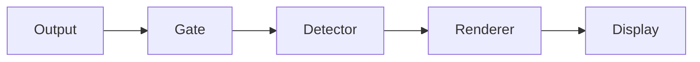

# ptymark

<!--
@dependency-start
contract design
responsibility Provides the user-facing entrypoint for installation, renderer setup, configuration, shell coexistence, WezTerm use, safety guarantees, and development.
upstream design documents/ptymark-design.md defines the pre-display architecture and extension boundary.
upstream design documents/ptymark-installer.md defines OS/shell-specific installation and managed-bundle behavior.
upstream compatibility documents/shell-plugin-compatibility.md defines shell and rich-plugin coexistence evidence.
upstream design documents/release.md defines immutable release publication, verification, and recovery.
downstream implementation src/cli.rs, src/install.rs, scripts/installer.sh, scripts/installer.ps1, and distribution installers implement the documented surface.
downstream test tests, scripts/check-release-metadata.py, release-package jobs, and GitHub Actions validate the documented behavior.
@dependency-end
-->

`ptymark` is an alpha-stage **pre-display renderer** for terminal output. It recognizes complete,
explicitly delimited Markdown blocks and replaces only those blocks immediately before bytes are
committed to the terminal display.

```text
child output
  -> terminal safety gate
  -> explicit semantic detector
  -> render decision
  -> engine handoff
  -> independent cache
  -> terminal-safe display bytes
```

The rendering pipeline never interprets keyboard input, signals, shell hooks, prompt definitions,
completion bindings, mouse reports, or bracketed paste. In interactive mode, the native PTY/ConPTY
host transports those bytes and terminal-size changes without giving them to semantic rendering, and
restores the parent terminal mode before exit.

## Current status

Implemented:

- stream and file rendering through `ptymark preview`;
- native Unix PTY and Windows ConPTY sessions through `ptymark -- COMMAND`;
- keyboard-byte forwarding, terminal resize propagation, and child exit-status preservation;
- complete Mermaid fences and block-math fences;
- byte-exact bypass for ANSI, OSC, DCS-style controls, carriage-return updates, completion redraws,
  right prompts, and alternate-screen applications;
- built-in preview and exact-source routes;
- installed Mermaid CLI and MathJax-compatible engines;
- an isolated, versioned default renderer bundle;
- terminal-safe ANSI/Unicode presentation;
- platform-specific installers for POSIX shells, Windows PowerShell, cmd.exe, and Windows Bash;
- installation-time path normalization and absolute-path configuration;
- role-by-role engine replacement without resetting unrelated settings;
- bounded in-memory and no-op caches;
- a thin WezTerm launcher plugin and portable example;
- release executable packages for Linux, macOS, and Windows in GitHub Actions;
- shell coexistence contracts for Bash, Zsh, Fish, PowerShell, and Nushell;
- Docker plus Ubuntu, macOS, and Windows GitHub Actions validation.

Not implemented yet:

- WezTerm/Kitty/iTerm2/Sixel pixel placement;
- persistent renderer workers;
- cancellation of a renderer already running during a resize storm;
- persistent cache.

`ptymark -- COMMAND` is the practical interactive path. It starts the child in a native Unix PTY or
Windows ConPTY, forwards input, propagates size changes, filters only safe child-output regions, and
returns the child exit status. `ptymark run -- COMMAND` remains the pipe-oriented path for batch and
log-producing commands.

## Install from a versioned GitHub Release

Version tags publish smoke-tested native archives for Linux, macOS, and Windows. Asset names include
the ptymark version, operating system, and architecture:

```text
ptymark-<version>-linux-<architecture>.tar.gz
ptymark-<version>-macos-<architecture>.tar.gz
ptymark-<version>-windows-<architecture>.zip
```

Download the archive and its adjacent `.sha256` file, or download `SHA256SUMS` and
`release-manifest.json` from the same GitHub Release. Verify the checksum before installation. GitHub
CLI users can also verify the build-provenance attestation:

```bash
gh attestation verify ptymark-*.tar.gz --repo iwashita-nozomu/ptymark
```

```powershell
gh attestation verify .\ptymark-*.zip --repo iwashita-nozomu/ptymark
```

### Linux or macOS package

```bash
tar -xzf ptymark-*.tar.gz
cd ptymark-*
bash install.sh
```

### Windows package from PowerShell

```powershell
Expand-Archive .\ptymark-*.zip -DestinationPath .\ptymark-package
Set-Location .\ptymark-package\ptymark-*
.\install.ps1
```

### Windows package from cmd.exe

```bat
install.cmd
```

The package installer uses the executable shipped in `bin/`; Rust and Cargo are not required for
this path. Missing default renderer roles may still require network access during the first managed
bundle installation. Release archives are currently unsigned alpha packages; SHA-256 verification
and GitHub provenance do not replace Apple Developer ID or Windows Authenticode signing.

The immutable asset, checksum, compatibility, and rollback rules are documented in
[`documents/release.md`](documents/release.md).

## Install from a source checkout

Source installation requires Git and Rust/Cargo 1.97 or newer.

### Linux, macOS, or WSL

```bash
git clone --recurse-submodules https://github.com/iwashita-nozomu/ptymark.git
cd ptymark
bash scripts/installer.sh
```

WSL is treated as Linux. It installs the Linux binary and Linux renderer bundle inside the WSL
distribution; it does not reuse Windows `.exe` renderers implicitly.

### Windows PowerShell 7+

```powershell
git clone --recurse-submodules https://github.com/iwashita-nozomu/ptymark.git
Set-Location ptymark
pwsh -File scripts/installer.ps1
```

Windows PowerShell 5.1 is also supported:

```powershell
powershell -ExecutionPolicy Bypass -File scripts/installer.ps1
```

### Windows cmd.exe

```bat
git clone --recurse-submodules https://github.com/iwashita-nozomu/ptymark.git
cd ptymark
scripts\installer.cmd
```

`installer.cmd` only selects `pwsh.exe` or `powershell.exe` and delegates to `installer.ps1`.

### Git Bash, MSYS2, or Cygwin

```bash
git clone --recurse-submodules https://github.com/iwashita-nozomu/ptymark.git
cd ptymark
bash scripts/installer.sh
```

The Bash frontend detects a Windows Bash environment, converts path-valued options with `cygpath`,
disables MSYS argument rewriting for the final call, and delegates to `installer.ps1`. Generated TOML
therefore contains native paths such as `C:\Users\...`, not `/c/Users/...`.

The former `scripts/install.sh` and `scripts/install.ps1` names remain compatibility wrappers.

## What one setup command does

```text
place or select the ptymark native executable
    -> inspect explicit and already-installed renderer commands
    -> install missing default roles in an isolated managed bundle
    -> normalize selected executables to native absolute paths
    -> call the shared Rust `ptymark install resolve` command
    -> atomically write config.toml and install.toml
    -> run installation and engine status checks
```

Installer frontends own only platform and shell concerns: core placement, standard user directories,
bundle installation, and path conversion. Rust owns engine-selection semantics, configuration merge,
validation, installation-state serialization, and status reporting.

The installer does **not** edit `.bashrc`, `.zshrc`, Fish configuration, Nushell configuration, or a
PowerShell profile. It also does not add managed renderer aliases to the global `PATH`.

## Does ptymark require JavaScript?

The Rust core, detector, cache, source fallback, and terminal-safety gate do **not** require
JavaScript. The selected default Mermaid and MathJax engines are JavaScript projects, so the optional
managed renderer bundle contains a private Node runtime and lockfile-pinned packages.

Users do not need to:

- install Node globally;
- run `npm install -g`;
- add an npm prefix to `PATH`;
- manage Mermaid or MathJax package paths;
- expose the managed runtime to other applications.

The bundle is an implementation detail behind `EngineHandoff`. A later native or non-JavaScript
engine can replace one role without changing the detector, cache, display pipeline, or configuration
contract.

## Default renderer selection

On first install, each role is selected in this order:

```text
1. explicit installer option
2. compatible command already available to the installer shell
3. an existing complete ptymark-managed bundle
4. install the pinned ptymark-managed bundle
5. built-in textual preview only when managed installation is disabled
```

On an ordinary rerun, valid existing selections are preserved. `--reprobe`/`-Reprobe` deliberately
searches the current environment again.

The managed set is pinned and tested together:

| Role | Managed default |
| --- | --- |
| Mermaid layout | `@mermaid-js/mermaid-cli` 11.16.0 |
| TeX block math | MathJax 4.1.3 |
| JavaScript runtime | Node.js 24.18.0 |
| Browser bridge | Puppeteer 25.2.1 |
| Terminal presentation | ptymark ANSI/Unicode presenter |

The installer prefers an already-installed Chromium-compatible browser. On Windows this normally
means Microsoft Edge. If none is selected and downloads are allowed, Puppeteer may install a private
compatible browser inside the bundle cache.

## Managed bundle isolation

The fallback bundle is versioned and private to ptymark. It does not modify a global npm prefix and
does not add anything to `PATH`.

```text
Linux
  ${XDG_DATA_HOME:-~/.local/share}/ptymark/renderer-bundles/<bundle-id>/

macOS
  ~/Library/Application Support/ptymark/renderer-bundles/<bundle-id>/

Windows
  %LOCALAPPDATA%\ptymark\renderer-bundles\<bundle-id>\
```

Each bundle contains:

```text
bundle.toml                 validated launcher manifest
bundle.stamp                lock/runtime/launcher identity
puppeteer-config.json       fixed browser launch policy
app/                        lockfile-resolved packages and fixed entrypoints
runtime/                    private Node runtime when exact system Node is unavailable
cache/                      private npm and browser cache
bin/mmdc[.exe]              native ptymark alias for Mermaid
bin/tex2svg[.exe]           native ptymark alias for MathJax
bin/chafa[.exe]             native ptymark alias for ANSI presentation
```

The aliases are copies or hard links of the native `ptymark` binary. They inspect their executable
name, validate `bundle.toml`, and invoke Node directly with one fixed role-specific entrypoint. User
source and renderer arguments are not forwarded through a generated shell or batch wrapper.

The official Node archive is checked against the release SHA-256 list. JavaScript packages are
installed with `npm ci` from the committed lockfile. No package manager, browser downloader, or
network request runs during normal rendering.

## Control installation behavior

Use installed commands first and fill missing roles from the managed bundle; this is the default:

```bash
bash scripts/installer.sh --managed auto
```

```powershell
pwsh -File scripts/installer.ps1 -Managed auto
```

Force every role to the isolated bundle:

```bash
bash scripts/installer.sh --managed always
```

```powershell
pwsh -File scripts/installer.ps1 -Managed always
```

Disable managed installation and use built-in preview for unresolved roles:

```bash
bash scripts/installer.sh --managed never
```

```powershell
pwsh -File scripts/installer.ps1 -Managed never
```

Use an existing browser and prohibit a private browser download:

```bash
bash scripts/installer.sh \
  --browser /usr/bin/chromium \
  --skip-browser-download
```

```powershell
pwsh -File scripts/installer.ps1 `
  -Browser 'C:\Program Files (x86)\Microsoft\Edge\Application\msedge.exe' `
  -SkipBrowserDownload
```

Re-probe commands after an upgrade:

```bash
bash scripts/installer.sh --reprobe
```

```powershell
pwsh -File scripts/installer.ps1 -Reprobe
```

Use only existing core and bundle files, making no download attempt:

```bash
bash scripts/installer.sh --offline
```

```powershell
pwsh -File scripts/installer.ps1 -Offline
```

Replace one role while preserving unrelated settings:

```bash
bash scripts/installer.sh --mermaid /opt/homebrew/bin/mmdc
bash scripts/installer.sh --math /absolute/path/to/tex2svg
bash scripts/installer.sh --presenter /usr/local/bin/chafa
bash scripts/installer.sh --math source
```

```powershell
pwsh -File scripts/installer.ps1 -Mermaid 'C:\Tools\mmdc.exe'
pwsh -File scripts/installer.ps1 -Math source
```

Explicit paths must resolve successfully. `preview` and `source` do not require an external
executable.

## Installer destinations

Default runtime configuration:

```text
Linux/macOS/WSL  ~/.config/ptymark/config.toml
Windows          %APPDATA%\ptymark\config.toml
```

Default installation state:

```text
Linux        ${XDG_STATE_HOME:-~/.local/state}/ptymark/install.toml
macOS        ~/.local/state/ptymark/install.toml
Windows      %LOCALAPPDATA%\ptymark\state\install.toml
```

The configuration is user-owned runtime policy. The state file records the selected backend,
resolution origin, requested path, resolved native path, and readiness.

## Verify installation

```bash
ptymark --version
ptymark install status
ptymark config check
ptymark config show
ptymark engine check
```

On Windows, use `ptymark.exe` when the executable directory is not already on `PATH`.

A managed installation reports absolute paths, for example:

```text
mermaid    mermaid-cli    ready    C:\Users\name\AppData\Local\ptymark\...\mmdc.exe
math       mathjax-cli    ready    C:\Users\name\AppData\Local\ptymark\...\tex2svg.exe
presenter  chafa-symbols  ready    C:\Users\name\AppData\Local\ptymark\...\chafa.exe
```

## Use `preview`

````bash
cat <<'EOF' | ptymark preview
ordinary output



$$
E = mc^2
$$
EOF
````

Common options:

```bash
ptymark preview --source README.md
ptymark preview --no-cache README.md
ptymark preview --columns 100 README.md
ptymark preview --strict README.md
ptymark --config /absolute/path/config.toml preview README.md
```

The detector recognizes only complete, line-bounded Mermaid and block-math forms. Inline `$...$`,
headings, lists, and other ambiguous Markdown are intentionally not detected in interactive output.

## Configuration

The installer writes strict TOML with resolved absolute paths:

```toml
schema_version = 1

[detection]
mermaid = true
math = true
max_block_bytes = 1048576

[rendering]
mode = "preview"
strict = false
columns = 80

[cache]
enabled = true
max_entries = 128
max_bytes = 33554432

[engines.mermaid]
backend = "mermaid-cli"
path = "/absolute/path/to/mmdc"

[engines.math]
backend = "mathjax-cli"
path = "/absolute/path/to/tex2svg"

[engines.presenter]
path = "/absolute/path/to/chafa-compatible-presenter"
```

Manually written bare executable names are supported and resolved through the runtime `PATH`.
Working-directory-relative paths such as `tools/mmdc` are rejected.

## Shell and rich-plugin coexistence

The installer and launcher do not source, replace, or reorder shell plugins. The compatibility suite
tracks twenty widely used integrations for each of five shells—Bash, Zsh, Fish, PowerShell, and
Nushell—for a total of 100 reviewed entries.

The matrix includes prompt frameworks, autosuggestions, syntax highlighting, completion menus,
history search, fuzzy selectors, directory hooks, environment managers, and Nushell plugins.
Representative names include Oh My Zsh, Powerlevel10k, zsh-autosuggestions, Tide, Fisher, PSReadLine,
Terminal-Icons, Atuin, Starship, Oh My Posh, fzf, zoxide, Carapace, and official Nushell plugins.

Compatibility is checked by behavior rather than brand-specific code:

| Behavior | Verification |
| --- | --- |
| ANSI/SGR prompts and glyph-rich output | byte-exact preservation |
| OSC shell integration, title, and cwd markers | byte-exact raw path |
| right prompts and cursor save/restore | byte-exact raw path |
| autosuggestions, syntax highlighting, and line redraw | byte-exact raw path |
| completion menus and cursor movement | byte-exact raw path |
| carriage-return progress output | byte-exact raw path |
| fzf/history/file-browser alternate screen | full bypass until exit |
| environment and directory hooks | profile files unchanged; environment preserved |

`contract-verified` means an integration is mapped to one of these terminal behavior profiles and the
profile is exercised with arbitrary chunk boundaries. It does not claim that ptymark redistributes or
pins every third-party project. The complete 100-entry list, evidence levels, and limitations are in
[the shell compatibility matrix](documents/shell-plugin-compatibility.md).

The current live checks cover the installer, transparent command launcher, and reusable pre-display
pipeline. The same matrix becomes a mandatory live PTY regression suite when the interactive PTY host
is implemented.

## Safety and failure behavior

The renderer may change only a complete recognized semantic block.

```text
keyboard input ------------------------------> child process
signals / termios / resize ------------------> child process
child output:
  safe text ---------------------------------> detector
  ANSI / OSC / DCS / CR / alternate screen -> byte-exact passthrough
```

For each semantic block, the display pipeline commits exactly one result:

1. cached final display bytes;
2. newly rendered and presented bytes;
3. exact original source after a non-strict failure;
4. an error before replacement bytes in strict mode.

External processes use fixed argument protocols. Configuration cannot contain an arbitrary shell
command, pipe, redirect, or argument template.

Initial bounds:

```text
process timeout      30 seconds per cold-start process
layout artifact       8 MiB
terminal output       8 MiB
diagnostic output    64 KiB
```

## Cache

`ArtifactCache` is independent from detection, routing, engine execution, and display commit. Current
implementations are `MemoryCache` and `NoopCache`. The complete key includes renderer identity,
semantic kind, exact source bytes, terminal columns, color permission, and theme fingerprint. Only
successful final display bytes are cached.

## WezTerm

Run the appropriate installer, then copy [`examples/wezterm.lua`](examples/wezterm.lua):

```bash
cp examples/wezterm.lua ~/.wezterm.lua
```

```powershell
Copy-Item examples/wezterm.lua $HOME/.wezterm.lua
```

The example uses `wezterm.target_triple` to select Unix or Windows defaults. `PTYMARK_BINARY` and
`PTYMARK_CONFIG` override those paths. The plugin appends one launch-menu entry and one
`CTRL|SHIFT+P` binding; it does not replace existing entries.

The plugin is currently a launcher. Interactive interception becomes active after the PTY host is
implemented.

## Extension boundaries

Installation-time executable lookup is behind `ProgramResolver`. OS/shell frontends normalize paths
before calling the shared Rust resolver. Managed launchers are versioned by `bundle.toml`. Render
selection and execution remain behind `RenderDecider` and `EngineHandoff`.

A new resolver, engine, or handoff must not change the terminal safety gate, semantic detector, cache,
or display-commit contract. A new engine role requires a concrete protocol, install route, integrity
policy, exact-source fallback, dependency owner, and Ubuntu/macOS/Windows tests.

A new shell integration does not receive special-case code merely because it has a new name. A new
terminal behavior profile is added only when the tool emits an interaction not represented by the
existing prompt, line-editor, completion, progress, OSC, or alternate-screen profiles.

## Development and CI

```bash
make ptymark-build
make ptymark-check
make ptymark-dev
```

Build a release package locally after a release build:

```bash
cargo build --release --locked
bash scripts/package-release.sh target/release/ptymark dist
```

```powershell
cargo build --release --locked
.\scripts\package-release.ps1 `
  -Binary .\target\release\ptymark.exe `
  -OutputDir .\dist
```

GitHub Actions is the formal pull-request evidence. It runs:

- Rust formatting, Clippy, and all tests on Ubuntu, macOS, and Windows;
- all 100 shell-integration inventory contracts and terminal behavior profiles;
- unchanged Unix and Windows shell-profile checks;
- shell-hook environment propagation checks;
- PowerShell, cmd.exe, and Git Bash installer entrypoint checks;
- a real managed-bundle install on Windows using installed Edge;
- direct and strict Mermaid, MathJax, and presenter rendering;
- canonical Docker checks, ShellCheck, and isolated managed-engine smoke;
- WezTerm plugin and platform example checks;
- Linux, macOS, and Windows release-package creation, package-local installation, configuration
  validation, preview smoke, checksums, and artifact upload;
- inherited repository and Docker-pack checks.

## Design documents

- [pre-display architecture](documents/ptymark-design.md)
- [installer and managed engine resolution](documents/ptymark-installer.md)
- [shell and rich-plugin compatibility](documents/shell-plugin-compatibility.md)
- [example configurations](examples/README.md)
