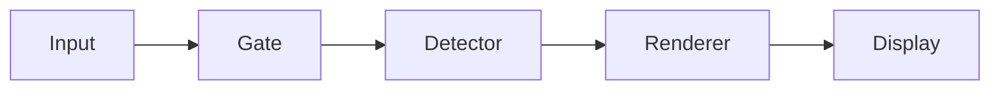

# ptymark

<!--
@dependency-start
contract design
responsibility Human-facing entrypoint for ptymark installation, safe use, configuration, engine diagnostics, WezTerm integration, extension, and development.
upstream design AGENTS.md agent runtime entrypoint
upstream design documents/system-design.md abstract-to-component architecture and lifecycle
upstream design documents/design-review.md reviewed findings and merge gates
upstream design documents/configuration.md user configuration and profile contract
upstream design documents/extension-guide.md provider and extension procedures
upstream environment docker/ptymark.Dockerfile canonical ptymark product environment
downstream design QUICK_START.md shortest setup path
@dependency-end
-->

`ptymark`は、端末へ表示される**前**の出力ストリームを扱うpre-display semantic rendererです。
通常の出力と端末制御列はそのまま保ち、明示的に閉じたMermaid／block mathだけを意味ブロックとして扱います。

```text
child output bytes
    ↓
terminal safety gate
    ├─ ANSI / OSC / DCS / alternate screen / CR updates
    │      └─ byte-for-byte passthrough
    └─ safe text
           ↓
       semantic detector
           ↓
       runtime coordinator
           ├─ ordered engine selection
           ├─ bounded process execution
           ├─ independent artifact cache
           └─ source fallback
           ↓
       artifact presenter
           ↓
       display bytes
```

> **重要**
>
> 現在の`0.1.0-alpha.1`では、`ptymark preview`／`demo`のpre-display pipeline、設定、engine catalog、cache、terminal safety gateを実装しています。
> `ptymark -- COMMAND`は設定を検証してから対象commandへ透過`exec`する段階であり、対話child PTYを包んで出力を変換するruntimeはまだ実装していません。

## 目次

- [現在利用できる機能](#現在利用できる機能)
- [安全性の基本保証](#安全性の基本保証)
- [インストール](#インストール)
- [5分で試す](#5分で試す)
- [CLIリファレンス](#cliリファレンス)
- [認識する入力](#認識する入力)
- [設定ファイル](#設定ファイル)
- [profile](#profile)
- [renderer engineと依存関係](#renderer-engineと依存関係)
- [custom process engine](#custom-process-engine)
- [WezTermプラグイン](#weztermプラグイン)
- [privacyとsecurity](#privacyとsecurity)
- [トラブルシューティング](#トラブルシューティング)
- [拡張する](#拡張する)
- [開発と検証](#開発と検証)
- [現在の制限と今後](#現在の制限と今後)

## 現在利用できる機能

| 機能 | 状態 | 説明 |
| --- | --- | --- |
| `ptymark preview` | 利用可能 | stdinまたはfileをpre-display pipelineへ通す |
| `ptymark demo` | 利用可能 | 組み込みMermaid／数式サンプルを処理する |
| 明示fence detector | 利用可能 | Mermaid、`$$`、設定したmath fence alias |
| terminal safety gate | 利用可能 | ANSI／OSC／DCS／alternate screen等をbyte-exactで保護 |
| source fallback | 利用可能 | 未完成、過大、失敗、非対応時に原文を復元 |
| TOML設定とprofile | 利用可能 | discovery、merge、inheritance、validation、private mode |
| `config paths/check/show` | 利用可能 | 探索候補、検証、effective config、provenance |
| `engine list/doctor` | 利用可能 | runtime provider、engine、optional dependencyの診断 |
| memory cache | 利用可能 | entry数とbyte数を制限したprocess-local LRU |
| custom one-shot process engine | library/runtimeで利用可能 | shellを介さないbounded stdio-v1 adapter |
| renderer bundle smoke／benchmark | canonical Dockerで利用可能 | Mermaid、MathJax、KaTeX、Typstを実生成して測定 |
| WezTerm launcher plugin | 利用可能 | profile付きのptymark tabを追加する |
| 対話child PTY host | 未実装 | command outputを実時間でpipelineへ接続する部分 |
| terminal画像配置 | 未実装 | Kitty／iTerm2／Sixel presenter |
| persistent worker transport | 未実装 | 現在のbundle adapterはbounded one-shot互換経路 |
| disk／tiered cache | 未実装 | traitと設定境界のみ確保済み |

## 安全性の基本保証

`ptymark`は、Markdownらしさよりterminal correctnessを優先します。

### 変換しないもの

次の機能はrenderer設定の対象外です。

- keyboard input
- termios、raw mode、echo
- `Ctrl+C`、`Ctrl+Z`、`Ctrl+D`
- signal forwarding
- `SIGWINCH`とPTY resize
- mouse report、bracketed paste
- child processのenvironment、working directory、exit status
- 既に表示済みのscrollback

### 常にそのまま通す出力

次の領域はsemantic engineへ渡しません。

- ANSI／CSI／SGR
- OSC 8 hyperlink
- OSC 133 shell integration
- unknown OSC／DCS／APC／PM
- alternate-screen content
- cursor addressing／eraseを使うscreen UI
- `\r`やbackspaceで更新するprogress表示
- 不完全なcontrol sequence
- binary-like dataや安全に分類できない領域

### semantic blockのcommit規則

完成したblockごとに、displayへ書くのは次のどちらか一方だけです。

```text
compatible rendered result
        または
exact original source
```

renderer failure、timeout、output overflow、artifact validation failure、presentation incompatibilityで原文が失われることはありません。

## インストール

### 必要なもの

通常のRust binaryをbuildするだけなら次で十分です。

- Git
- Rust 1.97.0
- Cargo

Mermaid／MathJax／KaTeX／Typstを含む正式な製品検証にはDocker Compose v2を使います。

### repositoryからインストール

```bash
git clone --recurse-submodules https://github.com/iwashita-nozomu/ptymark.git
cd ptymark
cargo install --locked --path .
ptymark --version
```

Git URLから直接入れる場合:

```bash
cargo install --locked \
  --git https://github.com/iwashita-nozomu/ptymark.git \
  ptymark
```

更新:

```bash
cargo install --locked --force \
  --git https://github.com/iwashita-nozomu/ptymark.git \
  ptymark
```

### release archive

公開release作成後は、OS／architectureに対応するarchiveとchecksumを使用します。

```text
ptymark-v<VERSION>-<TARGET>.tar.gz
ptymark-v<VERSION>-<TARGET>.tar.gz.sha256
```

archiveに含めるもの:

```text
ptymark
README.md
LICENSE
plugin/init.lua
examples/config/*.toml
```

Node.js、Chromium、Mermaid、MathJax、KaTeX、Typstは通常archiveへ同梱しません。

## 5分で試す

### 組み込みdemo

```bash
ptymark demo
ptymark demo --color
```

### stdinをpreviewする

````bash
cat <<'EOF' | ptymark preview
ordinary output remains unchanged



$$
E = mc^2
$$
EOF
````

通常行はそのまま、明示blockはterminal-safe previewへ置き換わります。

### 原文をそのまま確認する

```bash
cat notes.md | ptymark preview --source
```

`--source`はdetectorを通したうえでexact sourceを表示します。copy／log／screen reader向けの経路です。

### fileを読む

```bash
ptymark preview README.md
ptymark preview --terminal-width 100 examples/document.md
```

### 設定を検証する

```bash
ptymark config paths
ptymark config check --config examples/ptymark.example.toml
ptymark config show --config examples/ptymark.example.toml --profile interactive
```

### engine環境を診断する

```bash
ptymark engine list --no-config
ptymark engine doctor --profile interactive
```

## CLIリファレンス

```text
ptymark [CONFIG OPTIONS] -- COMMAND [ARG...]
ptymark [CONFIG OPTIONS] preview [OPTIONS] [FILE|-]
ptymark [CONFIG OPTIONS] demo [OPTIONS]
ptymark config paths [CONFIG OPTIONS]
ptymark config check [CONFIG OPTIONS]
ptymark config show [CONFIG OPTIONS] [--provenance]
ptymark engine list [CONFIG OPTIONS]
ptymark engine doctor [CONFIG OPTIONS]
```

### 共通設定option

| Option | 意味 |
| --- | --- |
| `--config PATH` | user configより後に明示configを重ねる |
| `--profile NAME` | sessionで使うprofileを選ぶ |
| `--no-config` | 外部設定をすべて無視する |
| `--private` | cacheとsource-bearing diagnosticsを強制的に無効化する |

共通optionはcommand名の前にも、対応subcommandの後にも記述できます。

```bash
ptymark --profile private preview notes.md
ptymark preview --profile private notes.md
```

### `preview`

| Option | 意味 |
| --- | --- |
| `--source` | semantic blockもexact sourceで表示 |
| `--strict` | renderer failure時にsource fallbackせずエラー終了 |
| `--color` | 対応previewでANSI colorを有効化 |
| `--max-buffer-bytes N` | sessionのsemantic buffer上限を上書き |
| `--terminal-width N` | rendererへ渡すcolumn hint |
| `--no-cache` | sessionのmemory cacheを無効化 |

```bash
ptymark preview --strict --max-buffer-bytes 1048576 notes.md
```

安全分類の不確実性には`--strict`を適用しません。不確実なterminal領域は常にpassthroughです。

### `config paths`

探索候補、trust class、存在状態を表示します。

```text
user        user-owned                     present  /home/user/.config/ptymark/config.toml
project     untrusted-project-not-loaded    present  /work/project/.ptymark.toml
```

project fileは候補として見えても自動loadしません。

### `config check`

rendererやchild processを起動せず、次を検証します。

- TOML syntax
- `schema_version`
- unknown key
- profile inheritanceとcycle
- byte／timeout／cache limit
- engine candidateとartifact type
- image protocol名
- custom engineの必須field
- diagnostics sinkとpathの整合性

```bash
ptymark config check --config ./ptymark.toml
```

設定エラーはterminal mode変更やchild起動より前に返ります。

### `config show`

effectiveなimmutable session設定をTOMLで出します。

```bash
ptymark config show --profile private
ptymark config show --config ./ptymark.toml --profile ci --provenance
```

`--provenance`のsource情報はstderrへ出し、stdoutのTOMLを機械的に読める状態に保ちます。custom engineのenvironment valueは`<redacted>`になります。

### `engine list`

runtime compositionで登録されたengine descriptorをtab区切りで表示します。

```text
preview    0.1.0-alpha.1    math,mermaid    terminal-text    InProcess
source     0.1.0-alpha.1    math,mermaid    source           InProcess
```

### `engine doctor`

次をまとめて診断します。

- selected profileとsnapshot generation
- engine provider
- registered engineとexecution model
- optional engineが利用不能な理由
- selected cache backend
- selected presenter
- one-shot compatibility等のwarning

```bash
ptymark engine doctor --config ./ptymark.toml --profile interactive
```

optional engineが無くても`preview`／`source`が利用できる限り診断自体は成功します。

### command mode

```bash
ptymark -- zsh -l
ptymark -- codex
```

現在は次の順で動きます。

```text
load and validate configuration
apply private/session override
exec target command with original stdin/stdout/stderr
```

このalphaではcommand outputをpre-display pipelineへ接続しません。設定エラー時はcommandを起動せず、正常時はchildのexit statusをそのまま返します。

## 認識する入力

一般shell output向け既定detectorは、行境界を持つ明示blockだけを認識します。

### Mermaid

````markdown

````

### block math

```markdown
$$
\int_a^b f(x)\,dx
$$
```

### configured math fence

````markdown
```latex
\frac{-b \pm \sqrt{b^2 - 4ac}}{2a}
```
````

### 自動認識しないもの

- inline `$...$`
- Markdown heading
- list marker
- shell comment
- currency表記
- 曖昧なcode block

文書全体をMarkdownとして解釈するdetectorは、一般interactive profileとは別の明示的なdocument profile／providerとして追加する設計です。

## 設定ファイル

設定形式はTOML、schemaは`schema_version = 1`です。

### 探索場所

Linux:

```text
$XDG_CONFIG_HOME/ptymark/config.toml
~/.config/ptymark/config.toml
```

macOS:

```text
~/Library/Application Support/ptymark/config.toml
```

project候補:

```text
./.ptymark.toml
```

project候補はv1では自動loadしません。明示的に`--config`で選択してください。

### 優先順位

低い方から:

```text
built-in defaults
  < user config
  < PTYMARK_CONFIG file
  < --config PATH
  < PTYMARK_PROFILE / --profile
  < explicit session flags such as --private / --no-cache
```

`PTYMARK_NO_CONFIG=1`はuser configと`PTYMARK_CONFIG`を無効化しますが、CLIで明示した`--config`は利用できます。CLIの`--no-config`はすべての外部configを無効化し、`--config`との併用をエラーにします。

### 対応environment variable

```text
PTYMARK_CONFIG
PTYMARK_PROFILE
PTYMARK_NO_CONFIG
PTYMARK_RENDERER_ROOT
```

`PTYMARK_RENDERER_ROOT`はoptional Node renderer bundleの探索に使います。

### 最小設定

```toml
schema_version = 1
default_profile = "interactive"
```

### 詳細例

```toml
schema_version = 1
default_profile = "interactive"

[profiles.interactive]
mode = "transform"
fallback = "source"

[profiles.interactive.detection]
mode = "explicit-blocks"
mermaid = true
block_math = true
max_buffer_bytes = 1048576
max_line_bytes = 65536

[profiles.interactive.detection.fences]
mermaid = ["mermaid"]
math = ["math", "latex", "tex"]

[profiles.interactive.engines.mermaid]
candidates = ["mermaid-worker", "mermaid-cli", "source"]
preferred_artifacts = ["image/svg+xml", "text/plain"]

[profiles.interactive.engines.math]
candidates = ["mathjax-worker", "katex", "source"]
preferred_artifacts = ["image/svg+xml", "application/mathml+xml", "text/plain"]

[profiles.interactive.render]
soft_latency_budget_ms = 250
hard_timeout_ms = 1500
max_in_flight = 1
ordering = "strict"
prewarm = true
worker_idle_ms = 300000
worker_max_requests = 1000

[profiles.interactive.presentation]
mode = "auto"
prefer = ["image/svg+xml", "text/plain"]
image_protocols = ["kitty", "iterm2", "sixel"]
unsupported = "source"
transparent_background = true
max_columns = 120
max_rows = 40
preserve_aspect_ratio = true

[profiles.interactive.cache]
backend = "memory"
max_entries = 128
max_bytes = 33554432
private = false

[diagnostics]
level = "warn"
format = "text"
sink = "stderr"
include_source = false
metrics = true
```

設定の全項目とvalidation規則は[Configuration](documents/configuration.md)にあります。

## profile

profileは一つの親だけを`extends`できます。arrayは置換、tableはfield単位mergeです。

```toml
[profiles.large-diagram]
extends = "interactive"

[profiles.large-diagram.detection]
max_buffer_bytes = 4194304

[profiles.large-diagram.render]
hard_timeout_ms = 5000
```

循環継承は起動前エラーです。

### built-in profile

| Profile | 用途 |
| --- | --- |
| `interactive` | explicit detection、strict ordering、memory cache |
| `source` | exact source presentation、cacheなし |
| `private` | cacheなし、source diagnosticsなし |
| `ci` | deterministic source presentation、prewarmなし、cacheなし |

### private session

```bash
ptymark --private preview notes.md
ptymark --profile private preview notes.md
```

private overrideは最終的に次を強制します。

```text
cache backend = none
cache private = true
diagnostics sink = stderr
diagnostics file path = none
include source = false
metrics = false
```

## renderer engineと依存関係

`ptymark`はMermaidや数式のlayout algorithmを再実装しません。

| Semantic kind | Engine role | Artifact | Current execution path |
| --- | --- | --- | --- |
| Mermaid | `mermaid-worker` | SVG | one-shot stdio compatibility; persistent transportは後続 |
| Mermaid | `mermaid-cli` | SVG | one-shot stdio-v1 |
| Math | `mathjax-worker` | SVG | one-shot stdio compatibility; persistent transportは後続 |
| Math | `katex` | MathML | one-shot stdio-v1 |
| Any supported kind | `preview` | terminal text | in-process |
| Any supported kind | `source` | exact source | in-process |

### plain binary

外部rendererがなくても次は動作します。

```text
preview engine
source engine
configuration commands
engine diagnostics
terminal safety gate
memory/no-op cache
```

### renderer bundle探索

次の順でoptional bundleを探します。

```text
[renderer_bundle].path
PTYMARK_RENDERER_ROOT
/opt/ptymark-renderers when present
```

bundleには`worker.mjs`とlockfileどおりのNode dependencyが必要です。

### canonical dependency pins

| Dependency | Pin |
| --- | --- |
| Rust | 1.97.0 |
| Node.js | 24.18.0 |
| Mermaid CLI | 11.16.0 |
| Mermaid library | 11.12.2 |
| MathJax | 4.1.3 |
| KaTeX | 0.17.0 |
| Puppeteer | 25.2.1 |
| Typst | 0.15.0 |

正本:

```text
Cargo.toml / Cargo.lock
rust-toolchain.toml
renderers/package.json / package-lock.json
docker/ptymark-versions.env
docker/ptymark.Dockerfile
```

通常render中に`npm install`、browser download、`cargo install`は行いません。

## custom process engine

custom engineはshell command文字列ではなく、programとargvを分離して定義します。

```toml
[engines.custom-mermaid]
type = "process"
version = "1"
semantic_kinds = ["mermaid"]
artifact_types = ["image/svg+xml"]
layout = "pixels"
execution = "one-shot"
program = "/opt/tools/render-mermaid"
args = ["--format", "svg"]
timeout_ms = 1500
max_stdout_bytes = 8388608
max_stderr_bytes = 65536
working_directory = "/tmp"
inherit_environment = ["PATH", "LANG"]

[engines.custom-mermaid.environment]
EXAMPLE_MODE = "safe"

[profiles.custom.engines.mermaid]
candidates = ["custom-mermaid", "source"]
preferred_artifacts = ["image/svg+xml", "text/plain"]
```

v1 runtimeのsecurity contract:

- `program`はabsolute path
- `working_directory`を指定する場合もabsolute path
- shell expansion、pipe、redirect、command substitutionなし
- environmentは一度clearし、allowlistだけを継承
- explicit environmentが継承値を上書き
- stdinはsemantic bodyのみ
- stdout／stderr／timeoutを独立制限
- non-zero exit、empty artifact、overflow、timeoutはfailure
- failure／partial artifactはcacheしない

process protocol:

```text
stdin   semantic body
stdout  one artifact
stderr  bounded diagnostics
```

hostから次の変数を渡します。

```text
PTYMARK_RENDERER_PROTOCOL=stdio-v1
PTYMARK_RENDERER_ID
PTYMARK_BLOCK_KIND
PTYMARK_SOURCE_BYTES
PTYMARK_COLOR
PTYMARK_TERMINAL_WIDTH
```

custom engineのenvironment valueは`config show`でredactされます。

## WezTermプラグイン

先にhost OS用`ptymark` binaryを`PATH`へ入れます。

```lua
local wezterm = require 'wezterm'
local config = wezterm.config_builder()

local ptymark = wezterm.plugin.require(
  'https://github.com/iwashita-nozomu/ptymark'
)

ptymark.apply_to_config(config, {
  binary = 'ptymark',
  config_file = '/home/user/.config/ptymark/config.toml',
  profile = 'interactive',
  key = {
    key = 'P',
    mods = 'CTRL|SHIFT',
  },
})

return config
```

追加されるもの:

- launch menuの`ptymark shell`
- 既定`CTRL|SHIFT+P` key binding
- `ptymark [selectors] -- "$SHELL" -l`を実行するnew tab

### plugin option

| Option | Default | 意味 |
| --- | --- | --- |
| `binary` | `ptymark` | executable path |
| `config_file` | none | `--config PATH` |
| `profile` | none | `--profile NAME` |
| `no_config` | false | `--no-config` |
| `private` | false | `--private` |
| `shell` | `$SHELL` or `/bin/sh` | 起動shell |
| `login_shell` | true | shellへ`-l`を追加 |
| `command` | none | 完全なargv array |
| `label` | `ptymark shell` | launch menu label |
| `key` | `CTRL|SHIFT+P` | key table。`false`で無効 |
| `launch_menu` | true | `false`でmenu追加なし |
| `cwd` | none | spawned tab working directory |
| `set_environment_variables` | none | child tab environment |

`command`を明示した場合は完全なargvとして扱うため、`profile`等のhelper optionとは併用できません。

既存の`config.keys`と`config.launch_menu`は置換せず追記します。

### local plugin開発

```lua
local ptymark = wezterm.plugin.require(
  'file:///absolute/path/to/ptymark'
)
```

更新後、WezTerm Debug Overlayで:

```lua
wezterm.plugin.update_all()
```

> 現在のpluginはlauncherです。対話shell outputのpre-display変換はchild PTY host実装後に有効になります。

## privacyとsecurity

### trust class

```text
built-in code
user-owned config
explicitly selected config
trusted project config     future
untrusted project candidate
```

`.ptymark.toml`を見つけても自動実行しません。将来のproject trustは、canonical directoryとcryptographic config digestを別trust storeへ保存する設計です。

### secretの扱い

- custom engine environment valueを表示しない
- fingerprint materialをlogへ出さない
- private modeでsource diagnosticsとpersistent storageを禁止
- renderer stderrをbounded diagnosticとして扱う
- child environmentとrenderer environmentを分離する

### browser engine

canonical DockerではChromiumを使います。production bundleでは、sandbox、temporary directory、network access、remote font/icon fetchをplatformごとに明示する必要があります。既定でrender中のnetwork取得を前提にしません。

## トラブルシューティング

### `configuration file does not exist`

`--config`または`PTYMARK_CONFIG`は明示選択なので、存在しない場合は起動前エラーです。

```bash
ptymark config paths
ls -l /path/to/config.toml
```

### `unknown field`

typoを黙って無視しません。

```bash
ptymark config check --config ./ptymark.toml
```

`schema_version`とtableの位置を確認してください。

### blockが変換されない

確認項目:

1. fenceが行頭から最大3 space以内か
2. closing fenceがあるか
3. profileが`source`／`ci`／`mode = "bypass"`でないか
4. `detection.mode = "off"`でないか
5. `max_line_bytes`／`max_buffer_bytes`を超えていないか
6. ANSI／alternate screen等のunsafe region内でないか

安全上の理由で変換しない場合、exact sourceが表示されます。

### engineが見つからない

```bash
ptymark engine doctor --profile interactive
```

bundle path、Node executable、worker file、登録済みdescriptor、unavailable reasonを確認します。optional engineが無くてもpreview/source fallbackは動作します。

### 画像が表示されない

現在の標準presenterはterminal text／sourceです。Kitty、iTerm2、Sixelへの画像配置は未実装です。SVG生成自体はcanonical Docker smokeで検証しますが、terminal inline image表示とは別の責務です。

### cacheを完全に止めたい

```bash
ptymark preview --no-cache notes.md
ptymark --private preview notes.md
```

### WezTermでbinaryが見つからない

absolute pathを指定します。

```lua
ptymark.apply_to_config(config, {
  binary = '/absolute/path/to/ptymark',
})
```

### command outputがpreviewされない

現在のcommand modeは透過`exec`です。実時間変換は未実装のchild PTY hostが必要です。pipelineの確認には`ptymark preview`を使用してください。

## 拡張する

runtimeはraw TOMLではなくimmutable `ConfigSnapshot`から構成します。

```text
ConfigSnapshot + RuntimeRequest
    ↓
RuntimeBuilder
    ├─ DetectorProvider
    ├─ EngineProvider[]
    ├─ CacheProvider
    └─ PresenterProvider
    ↓
SessionRuntime
```

### extension axis

| 拡張 | Interface | 他componentの変更 |
| --- | --- | --- |
| engine | `EngineProvider`／`RenderEngine` | 不要 |
| detector | `DetectorProvider`／`SemanticDetector` | 既存kindなら不要 |
| cache | `CacheProvider`／`ArtifactCache` | 不要 |
| presenter | `PresenterProvider`／`ArtifactPresenter` | 不要 |
| terminal host | 将来の`TerminalHost` | render plane変更不要 |
| diagnostics | 将来のevent sink | stream loop変更不要 |

Rust embedding例:

```rust
use ptymark::{ConfigSnapshot, RuntimeBuilder, RuntimeRequest};

fn build(snapshot: ConfigSnapshot) -> Result<(), Box<dyn std::error::Error>> {
    let runtime = RuntimeBuilder::default()
        .with_engine_provider(MyEngineProvider::new())?
        .build(snapshot, RuntimeRequest::preview())?;

    println!("{}", runtime.build_report().summary());
    Ok(())
}
```

拡張のidentity、version、cache invalidation、security、test checklistは[Extension Guide](documents/extension-guide.md)を参照してください。

## 開発と検証

### canonical Docker

```bash
git clone --recurse-submodules https://github.com/iwashita-nozomu/ptymark.git
cd ptymark
make ptymark-docker-build
make ptymark-check
```

開発shell:

```bash
make ptymark-dev
```

一回だけ実行:

```bash
bash scripts/ptymark-dev-container.sh cargo test --locked --all-targets
bash scripts/ptymark-dev-container.sh ptymark engine doctor --no-config
bash scripts/ptymark-dev-container.sh bash scripts/check-ptymark-renderers.sh
```

### `make ptymark-check`

canonical image内で次を実行します。

```text
cargo metadata --locked
cargo fmt --check
cargo clippy -D warnings
all Rust targets and contract tests
runtime provider/composition contracts
configuration fixtures
terminal byte-compatibility contracts
CLI and WezTerm plugin smoke
Bash syntax and ShellCheck
Python and Node syntax
Mermaid / MathJax / KaTeX / Typst real artifact smoke
renderer/cache latency benchmark and budget gate
release archive/checksum smoke
```

### benchmark

```bash
make ptymark-benchmark
```

出力:

```text
reports/benchmarks/renderer.json
reports/benchmarks/core.json
reports/benchmarks/budget.txt
```

計測対象:

- persistent Node worker request latency
- one-shot Node process latency
- Mermaid／MathJax artifact bytes
- Rust coordinator cache-hit latency
- p50／p95／max

CI budgetはregression gateであり、すべての端末／machineで同じlatencyを保証するものではありません。

### GitHub Actions

- `ptymark CI`: Linux/macOS native、canonical Docker、real engine、benchmark、package
- `CI`: inherited repository／template／AgentCanon checks
- `Docker Build`: inherited Docker pack checks
- `ptymark Release`: tagからnative archiveとchecksumを生成

## 現在の制限と今後

### 次の主要実装

1. Unix child PTY host
2. stdin／signal／resize／exit status forwarding
3. terminal output gateを実PTY outputへ接続
4. persistent Node worker clientとrecycle policy
5. monotonic commit sequenceを持つbounded scheduler
6. cancellation、hard deadline、backpressure
7. terminal capability query
8. Kitty／iTerm2／Sixel presenter
9. disk／tiered cache
10. cryptographic project trust store

### 設計済みの将来契約

async runtimeは次を必須とします。

```text
monotonic commit sequence
bounded in-flight renders
bounded pending source/output bytes
hard deadline
viewport generation
cancellation token
stale-result rejection
source fallback under pressure
```

後続outputがrender中のblockを追い越す設計は採用しません。queueやbyte budgetを超えた場合は、未commit blockをexact sourceとして確定しstreamを継続します。

### 非目標

- terminal emulator自体の実装
- Mermaid／TeX／Typst layout engineの再実装
- 曖昧なshell outputを汎用Markdownとして推測すること
- 表示済みscrollbackをcursor trickで消して置換すること
- render中の自動package install
- untrusted project configの自動実行

## 設計文書

- [System Design](documents/system-design.md) — 抽象planeからcomponentまで
- [Design Review](documents/design-review.md) — finding、resolution、merge gate
- [Extension Guide](documents/extension-guide.md) — provider／engine／cache／presenter拡張
- [Configuration](documents/configuration.md) — TOML schema、profile、validation
- [Renderer Architecture](documents/renderer-architecture.md) — engine、coordinator、cache、performance
- [Terminal UI Design](documents/ui-design.md) — resize、theme、image lifecycle
- [Usage](documents/usage.md) — CLIとprotocol詳細
- [Dependencies](documents/dependencies.md) — pin、update、license boundary
- [Development Environment](documents/development-environment.md)
- [Distribution](documents/distribution.md)
- [Document Index](documents/README.md)

## ライセンス

repository本体はApache License 2.0です。AgentCanon submodule、Node／Rust dependency、Chromium、fonts、外部rendererはそれぞれのupstream licenseを維持します。

詳細:

- [LICENSE](LICENSE)
- [Licensing Policy](documents/licensing-policy.md)
