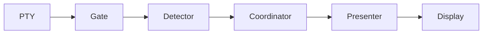

# ptymark

<!--
@dependency-start
contract design
responsibility Human-facing entrypoint for ptymark installation, use, configuration, architecture, and development.
upstream design AGENTS.md agent runtime entrypoint
upstream design documents/architecture.md ptymark pre-display renderer contract
upstream design documents/renderer-architecture.md renderer coordinator and cache contract
upstream design documents/configuration.md user configuration and profile contract
upstream design documents/ui-design.md terminal UI, resize, and cache lifecycle contract
upstream environment docker/ptymark.Dockerfile canonical ptymark product environment
downstream design QUICK_START.md shortest setup path
@dependency-end
-->

`ptymark`は、子プロセスの端末出力を**表示前**に受け取り、明確に閉じた意味ブロック
だけを既存レンダリングエンジンへ渡し、端末向け表示へ差し替える
**pre-display renderer**です。

```text
shell / CLI
    ↓ child PTY output
terminal output safety gate
    ├─ ANSI / OSC / DCS / CR / alternate screen → byte-for-byte passthrough
    └─ safe text region
          ↓
      semantic detector
          ↓
      render coordinator
          ├─ engine selector / registry
          ├─ independent artifact cache
          └─ existing rendering engine
          ↓
      artifact presenter
          ↓ display bytes
terminal emulator
```

キーボード入力、termios、signal、resize、child exit statusは表示レンダラーの責務外です。
WezTermプラグインも`ptymark`を新しいタブで起動する薄い統合層であり、既存のterminal
機能を置き換えません。

## 現在の状態

現在は`0.1.0-alpha.1`のbootstrapです。

実装済み:

- `ptymark preview`による表示前ストリーム処理
- Mermaid fenceと`$$` blockのbounded detector
- detector kind/line/buffer policy。無効化は検出を厳しくする方向だけ
- ordinary outputとterminal control outputのlossless passthrough
- ANSI、OSC、DCS、carriage-return、alternate-screen向けoutput safety gate
- renderer failure時のsource fallbackとstrict mode
- `EngineRegistry`、`EngineSelector`、`RenderCoordinator`
- engine identity/version、artifact format、layout sensitivityを持つ`RenderArtifact`
- `ArtifactPresenter`によるengineとterminal protocolの分離
- 独立`ArtifactCache` interface、no-op backend、bounded memory LRU backend
- viewport、resize判定、theme/width-aware cache key
- TOML設定、built-in profile、単一継承、探索/precedence、完全validation
- `ptymark config paths|check|show`
- WezTerm launcher plugin
- Dockerで固定したMermaid、MathJax、KaTeX、Typst、Chromium環境
- Rust cache-hit、persistent worker、one-shot rendererのperformance harness
- unit/integration/plugin/renderer/terminal/configuration contract tests

未実装:

- 対話shellを包むchild PTY host
- live ANSI observerからoutput safety gateへの接続
- selected workerを通常command modeへ登録するruntime builder
- terminal image protocolへの配置
- live resize generation、画像再配置、persistent cache
- project configuration trust storeとdisk/tiered cache backend

`ptymark -- zsh -l`は現在、設定を端末変更前に検証した後、公開CLI形を固定する透過
`exec`です。`ptymark preview`では表示前renderer、設定、cache骨格を実際に利用できます。
UI runtimeは[Issue #3](https://github.com/iwashita-nozomu/ptymark/issues/3)、renderer/性能は
[Issue #4](https://github.com/iwashita-nozomu/ptymark/issues/4)、設定項目は
[Issue #5](https://github.com/iwashita-nozomu/ptymark/issues/5)以降で追跡します。

## 配布形態

利用者向け配布は次の三層を想定します。

1. GitHub ReleasesのOS/architecture別archive
2. `cargo install`によるsource install
3. repository cloneからのdeveloper install

release archiveには次だけを入れます。

```text
ptymark
README.md
LICENSE
plugin/init.lua
```

Mermaid、MathJax、KaTeX、Typst、Chromium、Node.jsはplain binary archiveへ同梱しません。
source/preview modeはrenderer bundleなしでも利用でき、外部backendを有効にした利用者だけが
該当engineを導入します。

> [!NOTE]
> このalpha bootstrapの公開releaseはまだありません。release作成前は
> 「Sourceからインストール」を使用してください。

## インストール

### Sourceからインストール

Rust toolchainをホストへ導入済みなら、crateだけをインストールできます。

```bash
git clone --recurse-submodules https://github.com/iwashita-nozomu/ptymark.git
cd ptymark
cargo install --locked --path .
ptymark --version
```

mainから直接インストールする場合:

```bash
cargo install --locked \
  --git https://github.com/iwashita-nozomu/ptymark.git \
  ptymark
```

更新:

```bash
cargo install --locked --force \
  --git https://github.com/iwashita-nozomu/ptymark.git \
  ptymark
```

repository全体の正式検証はDocker必須ですが、利用者向けネイティブbinaryのbuildは
Cargoで行えます。

### GitHub Release archiveからインストール

release公開後は、OSとarchitectureに合う
`ptymark-v<version>-<target>.tar.gz`と`.sha256`を取得します。

```bash
tar -xzf ptymark-v<version>-<target>.tar.gz
cd ptymark-v<version>-<target>
install -m 0755 ptymark "$HOME/.local/bin/ptymark"
ptymark --version
```

checksum確認例:

```bash
sha256sum --check ptymark-v<version>-<target>.tar.gz.sha256
```

macOSでは`shasum -a 256`で同じ値を確認できます。

## 設定

設定形式はTOMLで、`schema_version = 1`が必須です。完全な例は
[`examples/ptymark.example.toml`](examples/ptymark.example.toml)にあります。

```toml
schema_version = 1
default_profile = "interactive"

[profiles.interactive.detection]
mode = "explicit-blocks"
mermaid = true
block_math = true
max_buffer_bytes = 1048576
max_line_bytes = 65536

[profiles.interactive.engines.mermaid]
candidates = ["mermaid-worker", "mermaid-cli", "source"]
preferred_artifacts = ["image/svg+xml", "text/plain"]

[profiles.interactive.engines.math]
candidates = ["mathjax-worker", "katex", "source"]
preferred_artifacts = ["image/svg+xml", "application/mathml+xml", "text/plain"]

[profiles.interactive.cache]
backend = "memory"
max_entries = 128
max_bytes = 33554432
```

探索順序:

```text
built-in defaults
  < user config
  < PTYMARK_CONFIG
  < --config PATH
  < PTYMARK_PROFILE / --profile
  < current-command CLI override
```

project直下の`.ptymark.toml`は候補として表示しますが、自動実行しません。外部engine pathを
含み得るため、project trust設計が完了するまでは`--config`による明示選択が必要です。

```bash
ptymark config paths
ptymark config check
ptymark config check --config examples/ptymark.example.toml
ptymark config show --profile private
ptymark config show --config ./ptymark.toml --provenance
```

built-in profile:

| Profile | Behavior |
| --- | --- |
| `interactive` | explicit block detection、memory cache、source fallback |
| `source` | semantic sourceをexactに保持 |
| `private` | no cache、source-bearing diagnostics禁止 |
| `ci` | source presentation、no cache、広いtimeout budget |

設定はchild起動前にimmutable `ResolvedConfig`へ変換します。unknown key、profile cycle、無効な
latency/cache/engine設定はterminal modeを変更する前に失敗します。詳細は
[Configuration](documents/configuration.md)を参照してください。

## WezTermプラグインを導入する

`ptymark` binaryを先に`PATH`へ入れ、`~/.wezterm.lua`へ追加します。

```lua
local wezterm = require 'wezterm'
local config = wezterm.config_builder()

local ptymark = wezterm.plugin.require(
  'https://github.com/iwashita-nozomu/ptymark'
)

ptymark.apply_to_config(config, {
  binary = 'ptymark',
  key = {
    key = 'P',
    mods = 'CTRL|SHIFT',
  },
})

return config
```

これにより次が追加されます。

- launch menuの`ptymark shell`
- `CTRL|SHIFT+P`で新しいタブを開くkey binding
- `ptymark -- "$SHELL" -l`相当の起動

binaryが`PATH`にない場合:

```lua
ptymark.apply_to_config(config, {
  binary = '/absolute/path/to/ptymark',
})
```

任意コマンドを直接指定する場合:

```lua
ptymark.apply_to_config(config, {
  command = {
    '/absolute/path/to/ptymark',
    'preview',
    '--profile',
    'private',
  },
  label = 'ptymark private preview',
})
```

ローカルplugin開発ではHTTPS URLの代わりに`file://` URLを使います。

```lua
local ptymark = wezterm.plugin.require(
  'file:///absolute/path/to/ptymark'
)
```

plugin更新後はWezTerm Debug Overlayで次を実行します。

```lua
wezterm.plugin.update_all()
```

## 利用方法

### 内蔵デモ

```bash
ptymark demo
ptymark demo --color
ptymark demo --profile private --no-cache
```

### 標準入力を表示前レンダリングする

````bash
cat <<'EOF' | ptymark preview
ordinary output



$$
E = mc^2
$$
EOF
````

現在の既定rendererは、意味ブロックをterminal-safeなpreview artifactへ変換します。
original sourceをlosslessに確認する場合:

```bash
cat document.md | ptymark preview --source
ptymark preview --profile source document.md
```

file、設定、buffer上限、幅hint:

```bash
ptymark preview \
  --config examples/ptymark.example.toml \
  --profile interactive \
  --max-buffer-bytes 1048576 \
  --terminal-width 100 \
  document.md
```

renderer failureをfallbackではなくエラーにする開発用モード:

```bash
ptymark preview --strict document.md
```

### Command mode

```bash
ptymark -- zsh -l
ptymark -- codex
```

alpha bootstrapでは設定を完全検証し、対象commandへ透過`exec`します。child PTY outputを
`DisplayInterceptor`へ接続するruntimeは後続です。

## 選定した既存レンダリングエンジン

`ptymark`はMermaidや数式のlayout/typesettingを再実装しません。

| Input | Primary real-time candidate | Compatibility/comparator | Artifact |
| --- | --- | --- | --- |
| Mermaid | persistent Mermaid/Puppeteer worker | one-shot Mermaid CLI | SVG |
| TeX block math | persistent MathJax worker | KaTeX | SVG / MathML |
| Typst-native input | Typst CLI | source fallback | SVG / PDF |

`RenderCoordinator`がengine selection、timeout、output bound、cache、fallback、metricsを所有し、
engineは`RenderArtifact`を返すだけです。terminal escape sequenceは`ArtifactPresenter`だけが
生成します。Docker checkでworker correctness、one-shot path、cache-hit、p50/p95/max latencyを
測定し、GitHub Actions artifactとして保存します。

## 開発環境

`ptymark`製品コード、plugin、既存renderer engine、release packageの正式検証は
Dockerを必須経路にします。

ホスト側の必須依存:

- Git
- Docker EngineまたはDocker Desktop
- Docker Compose v2
- 実機統合時だけWezTerm

初期セットアップ:

```bash
git clone --recurse-submodules https://github.com/iwashita-nozomu/ptymark.git
cd ptymark
make ptymark-docker-build
make ptymark-check
```

開発shellと個別command:

```bash
make ptymark-dev
bash scripts/ptymark-dev-container.sh cargo test --locked --all-targets
bash scripts/ptymark-dev-container.sh cargo run --locked -- config check \
  --config examples/ptymark.example.toml
bash scripts/ptymark-dev-container.sh bash scripts/check-ptymark-renderers.sh
make ptymark-benchmark
```

主な固定依存:

```text
Rust 1.97.0
serde 1.x + toml 0.9.x（Cargo.lockでexact resolution）
Node.js 24.18.0
Mermaid CLI / Mermaid 11.16.0
MathJax 4.1.3
KaTeX 0.17.0
Puppeteer 25.2.1
Typst 0.15.0
Debian Chromium / Noto fonts / Lua / ShellCheck
```

## テストとGitHub Actions

`make ptymark-check`はcanonical Docker imageをbuildし、その中で次を実行します。

```text
cargo fmt --check
cargo clippy -D warnings
library + pre-display + coordinator/cache + terminal + config + CLI tests
release build and archive packaging
WezTerm plugin smoke
locked Rust/npm dependency consistency
Mermaid / MathJax / KaTeX / Typst correctness smoke
persistent-worker / one-shot / cache-hit benchmark budget
ShellCheck and Python/Node syntax checks
```

GitHub Actionsを正式な検証根拠にします。

- canonical Docker product/config/renderer/performance job
- native Linux/macOS format、Clippy、contract tests、release build
- renderer benchmark JSON/budget artifact upload
- tagged releaseのnative archive/checksum生成
- 既存template/AgentCanon CIと同期workflow

ローカル検査は早期フィードバックであり、PR判定はActions結果を正本にします。

## ローカル作業用テンプレート構造

このrepositoryは`ptymark`製品だけに縮退させません。元のproject-template構造と
AgentCanon submodule/root viewsをローカル作業基盤として維持します。

```text
.
├── Cargo.toml, src/                 # ptymark Rust core/CLI/config
├── renderers/                       # locked existing-engine workers and benchmark
├── plugin/                          # WezTerm plugin
├── tests/                           # ptymark + template/AgentCanon tests
├── examples/                        # config and benchmark examples
├── docker/ptymark.*                 # ptymark canonical product environment
├── ptymark.mk, GNUmakefile          # product targets layered over template Makefile
├── documents/                       # project docs + template-owned active contracts
├── vendor/agent-canon/              # shared AgentCanon submodule
├── agents/, .agents/, .codex/       # shared runtime views
├── tools/                           # AgentCanon automation view
├── python/, cmake/, experiments/    # retained local-work profiles
└── Makefile                         # retained template/AgentCanon targets
```

- `Makefile`はtemplate/AgentCanon用の正本として残します。
- `GNUmakefile`が`Makefile`と`ptymark.mk`をincludeし、通常の`make`から両方を使えます。
- AgentCanonの更新・同期・runtime checksは従来targetを使います。
- `ptymark`固有checkは`make ptymark-check`を使います。

## 文書

- [Quick Start](QUICK_START.md)
- [利用方法](documents/usage.md)
- [基本設計](documents/architecture.md)
- [Renderer抽象設計](documents/renderer-architecture.md)
- [設定設計](documents/configuration.md)
- [UI設計](documents/ui-design.md)
- [依存関係](documents/dependencies.md)
- [開発環境](documents/development-environment.md)
- [配布](documents/distribution.md)
- [文書索引](documents/README.md)
- [AgentCanon runtime profiles](vendor/agent-canon/documents/runtime-profiles-and-check-matrix.md)

## ライセンス

Apache License 2.0です。詳細は[LICENSE](LICENSE)と
[ライセンス方針](documents/licensing-policy.md)を参照してください。
