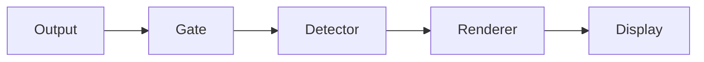

# ptymark

`ptymark` is an alpha-stage **pre-display renderer** for terminal output. It inspects only
the bytes travelling from a child process toward the terminal, detects explicitly delimited
Markdown blocks, and replaces a complete block before it is written to the display.

The initial merge deliberately keeps the design small:

```text
child output
  -> terminal safety gate
  -> explicit block detector
  -> renderer
  -> independent in-memory cache
  -> stdout / terminal emulator
```

It does **not** replace terminal input handling, termios, signals, window-size forwarding,
mouse reporting, bracketed paste, or child exit-status handling.

## Current status

Implemented now:

- `ptymark preview` for streams and files;
- explicit Mermaid fences and block-math fences;
- byte-exact bypass for ANSI/OSC/DCS-style control output, carriage-return update lines,
  and alternate-screen applications;
- source fallback for incomplete, oversized, or failed blocks;
- a small renderer interface with built-in preview and source renderers;
- an independent bounded memory cache and a no-op cache;
- a strict TOML configuration file;
- a WezTerm launcher plugin;
- Docker-based development and GitHub Actions checks;
- pinned Mermaid CLI and MathJax smoke-test versions in the Docker environment.

Not implemented yet:

- the interactive child-PTY host used by `ptymark -- COMMAND`;
- terminal image placement through Kitty, iTerm2, Sixel, or a WezTerm-specific path;
- a production process adapter connecting Mermaid/MathJax artifacts to the display pipeline;
- resize generations, render cancellation, and persistent cache;
- Windows ConPTY support.

`ptymark -- COMMAND` currently validates configuration and then transparently executes the
command. The public command shape is reserved for the later PTY host without changing how users
launch shells or Codex.

## Safety contract

The renderer is allowed to change only an explicitly recognized, fully closed semantic block.
Everything else is preserved.

```text
keyboard input ------------------------------> child process
signals / termios / resize ------------------> child process
child output:
  ordinary safe text ------------------------> detector
  ANSI / OSC / DCS / CR / alternate screen -> byte-exact passthrough
```

The first implementation recognizes only:

````markdown


$$
E = mc^2
$$

```latex
\frac{-b \pm \sqrt{b^2 - 4ac}}{2a}
```
````

Inline `$...$`, headings, lists, and other ambiguous Markdown are intentionally not detected in
interactive output.

## Install

### From source

Rust 1.97.0 or a compatible newer toolchain is required.

```bash
git clone --recurse-submodules https://github.com/iwashita-nozomu/ptymark.git
cd ptymark
cargo install --locked --path .
ptymark --version
```

Install directly from GitHub:

```bash
cargo install --locked \
  --git https://github.com/iwashita-nozomu/ptymark.git \
  ptymark
```

There is no published release archive yet. Release packaging is intentionally deferred until the
interactive PTY path and terminal presentation contract are stable.

## Try it

Render standard input:

````bash
cat <<'EOF' | ptymark preview
ordinary output



$$
E = mc^2
$$
EOF
````

Render a file:

```bash
ptymark preview README.md
```

Keep semantic blocks exactly as source:

```bash
ptymark preview --source README.md
```

Disable the cache for one command:

```bash
ptymark preview --no-cache README.md
```

Set a width hint for the renderer:

```bash
ptymark preview --columns 100 README.md
```

Launch a command through the reserved command-mode interface:

```bash
ptymark -- zsh -l
ptymark -- codex
```

At this alpha stage command mode is a transparent `exec`, not yet a PTY proxy.

## Configuration

Configuration is explicit TOML. No project file is auto-loaded.

```toml
schema_version = 1

[detection]
mermaid = true
math = true
max_block_bytes = 1048576

[rendering]
mode = "preview" # preview | source
strict = false
columns = 80

[cache]
enabled = true
max_entries = 128
max_bytes = 33554432
```

Validate a file:

```bash
ptymark config check --config examples/ptymark.toml
```

Print the effective configuration:

```bash
ptymark config show --config examples/ptymark.toml
```

Use it for preview:

```bash
ptymark --config examples/ptymark.toml preview README.md
```

Use it before command launch:

```bash
ptymark --config examples/ptymark.toml -- zsh -l
```

Unknown keys and invalid limits are errors. Validation happens before command execution.

The configuration intentionally has no profile inheritance, project trust store, engine registry,
persistent cache, or hot reload. Those are added only when a concrete runtime requirement needs
them.

## WezTerm plugin

Install the native `ptymark` binary first, then add the plugin to `~/.wezterm.lua`:

```lua
local wezterm = require 'wezterm'
local config = wezterm.config_builder()

local ptymark = wezterm.plugin.require(
  'https://github.com/iwashita-nozomu/ptymark'
)

ptymark.apply_to_config(config, {
  binary = 'ptymark',
  config_file = '/home/user/.config/ptymark/config.toml',
  key = {
    key = 'P',
    mods = 'CTRL|SHIFT',
  },
})

return config
```

The plugin appends:

- a `ptymark shell` launch-menu entry;
- a `CTRL|SHIFT+P` binding by default;
- a new tab running `ptymark [--config PATH] -- "$SHELL" -l`.

It does not replace existing key bindings or launch-menu entries. For local plugin development:

```lua
local ptymark = wezterm.plugin.require(
  'file:///absolute/path/to/ptymark'
)
```

The current plugin is a launcher. Inline image display becomes a separate presenter after the PTY
host is implemented.

## Development

The repository retains its AgentCanon and project-template structure for local work. `GNUmakefile`
includes both the inherited `Makefile` and `ptymark.mk`.

The canonical ptymark environment is Docker:

```bash
make ptymark-build
make ptymark-check
make ptymark-dev
```

The Docker image contains:

- Rust 1.97.0 with rustfmt and Clippy;
- Node.js 24.18.0;
- Mermaid CLI 11.16.0;
- MathJax 4.1.3;
- Debian Chromium;
- Lua 5.4 and ShellCheck.

The renderer packages are development and integration-test dependencies. They are not bundled into
the native binary and are not automatically installed during a terminal session.

Native quick checks:

```bash
cargo fmt --all -- --check
cargo clippy --locked --all-targets -- -D warnings
cargo test --locked --all-targets
```

Formal pull-request evidence comes from `.github/workflows/ptymark-ci.yml`.

## Design

The detailed design is in [documents/ptymark-design.md](documents/ptymark-design.md).

The stable extension points are intentionally few:

```text
SemanticDetector
Renderer
ArtifactCache
TerminalOutputGate
DisplayPipeline
```

A future engine or presenter should be added behind one of these boundaries rather than through a
general plugin framework. Provider registries, runtime catalogs, and schema fields are not added in
advance.

## Repository workspace

This repository is derived from the local project template and keeps:

- `vendor/agent-canon/` and its root views;
- the inherited `Makefile`, Python/C++/experiment surfaces, and Dev Container;
- existing AgentCanon and template workflows;
- project-local ptymark files layered alongside those surfaces.

Shared AgentCanon policy remains owned by `vendor/agent-canon/`; ptymark-specific implementation,
tests, Docker files, and design documents remain project-local.
