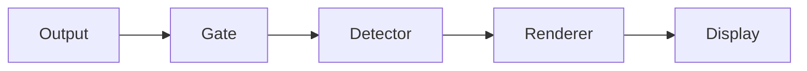

# ptymark

<!--
@dependency-start
contract design
responsibility Provides the user-facing entrypoint for ptymark installation, engine setup, configuration, WezTerm use, safety guarantees, and development.
upstream design documents/ptymark-design.md defines the current minimal architecture and rejected overdesign.
upstream environment docker/ptymark.Dockerfile defines the canonical validation environment.
downstream implementation src/cli.rs implements the documented command surface.
downstream test tests/cli_contract.rs validates the documented CLI behavior.
@dependency-end
-->

`ptymark` is an alpha-stage **pre-display renderer** for terminal output. It inspects only bytes
travelling from a child process toward the terminal, detects explicitly delimited Markdown blocks,
and replaces a complete block before it is written to the display.

The first integration deliberately keeps the runtime small:

```text
child output
  -> terminal safety gate
  -> explicit block detector
  -> selected renderer
  -> independent in-memory cache
  -> terminal-safe display bytes
```

It does **not** replace terminal input handling, termios, signals, window-size forwarding, mouse
reporting, bracketed paste, or child exit-status handling.

## Current status

Implemented now:

- `ptymark preview` for streams and files;
- explicit Mermaid fences and block-math fences;
- byte-exact bypass for ANSI/OSC/DCS-style control output, carriage-return update lines, and
  alternate-screen applications;
- source fallback for incomplete, oversized, unsafe, or failed blocks;
- built-in preview and exact-source renderers;
- optional Mermaid CLI and MathJax-CLI-compatible renderer slots;
- SVG-to-terminal presentation through Chafa symbol output;
- executable selection through `PATH` or absolute paths in TOML;
- `ptymark engine check` for installation verification;
- an independent bounded memory cache and a no-op cache;
- a strict, explicit TOML configuration file;
- a WezTerm launcher plugin;
- Docker-based development and GitHub Actions checks.

Not implemented yet:

- the interactive child-PTY host used by `ptymark -- COMMAND`;
- pixel image placement through Kitty, iTerm2, Sixel, or a WezTerm-specific path;
- persistent external renderer workers;
- resize generations, render cancellation, and persistent cache;
- Windows ConPTY support.

`ptymark -- COMMAND` currently validates configuration and then transparently executes the command.
The public command shape is reserved for the later PTY host without changing how users launch shells
or Codex.

## Safety contract

The renderer may change only an explicitly recognized, fully closed semantic block. Everything else
is preserved.

```text
keyboard input ------------------------------> child process
signals / termios / resize ------------------> child process
child output:
  ordinary safe text ------------------------> detector
  ANSI / OSC / DCS / CR / alternate screen -> byte-exact passthrough
```

The initial detector recognizes only:

````markdown


$$
E = mc^2
$$

```latex
\frac{-b \pm \sqrt{b^2 - 4ac}}{2a}
```
````

Inline `$...$`, headings, lists, and other ambiguous Markdown are intentionally not detected in
interactive output.

External engines never write terminal protocol bytes directly. Their output follows this path:

```text
semantic body
  -> mmdc or tex2svg-compatible command
  -> SVG artifact
  -> Chafa in symbols mode
  -> ANSI/Unicode display bytes
```

Chafa is initially forced to `symbols` mode. Pixel protocols are deferred until capability checking,
multiplexer passthrough, placement, deletion, and resize behavior are tested end to end.

## Install the core

The core binary has no runtime dependency on Node.js, Mermaid, MathJax, Chromium, or Chafa. With the
default configuration it uses the built-in textual preview renderer.

Rust 1.97.0 or a compatible newer toolchain is required.

### From a clone

```bash
git clone --recurse-submodules https://github.com/iwashita-nozomu/ptymark.git
cd ptymark
cargo install --locked --path .
ptymark --version
```

### Directly from GitHub

```bash
cargo install --locked \
  --git https://github.com/iwashita-nozomu/ptymark.git \
  ptymark
```

There is no published release archive yet. Release packaging is deferred until the interactive PTY
path and terminal presentation contract are stable.

## Optional rendering engines

Install only the engines you plan to select. `ptymark` never runs `npm install`, downloads a browser,
or changes your package manager state during a terminal session.

### Mermaid CLI

The supported Mermaid adapter expects the `mmdc` command from Mermaid CLI.

```bash
npm install --global @mermaid-js/mermaid-cli@11.16.0
command -v mmdc
mmdc --version
```

Mermaid CLI uses a browser for layout. Its normal installation may install a compatible browser
through Puppeteer. A separately managed browser can also be configured according to Mermaid CLI's
own installation documentation.

### MathJax CLI-compatible `tex2svg`

The math adapter expects an executable named `tex2svg` that accepts one TeX expression as its first
argument and writes SVG to stdout. One compatible installation is the official
`mathjax-node-cli` package:

```bash
npm install --global mathjax-node-cli@1.0.1
command -v tex2svg
tex2svg 'E = mc^2' | head
```

`mathjax-node-cli` is a compatibility CLI around an older MathJax generation. An alternative wrapper
around a newer MathJax installation may be used when it implements the same narrow `tex2svg`
contract. Point `engines.math.path` at that wrapper.

The first adapter passes the expression as one process argument and therefore rejects expressions
larger than 32 KiB. A persistent stdin protocol may replace this only when a measured real-time use
case justifies it.

### Chafa presenter

External engines produce SVG, not terminal display bytes. Chafa converts the SVG into terminal-safe
symbol output.

macOS with Homebrew:

```bash
brew install chafa
command -v chafa
```

Debian or Ubuntu:

```bash
sudo apt-get update
sudo apt-get install chafa
command -v chafa
```

Other platforms should install Chafa through their system package manager. Verify that the build can
read SVG input.

## Select installed engines

Copy the example first:

```bash
mkdir -p ~/.config/ptymark
cp examples/external-engines.toml ~/.config/ptymark/config.toml
```

A complete selection looks like this:

```toml
schema_version = 1

[rendering]
mode = "preview"
strict = false
columns = 100

[engines.mermaid]
backend = "mermaid-cli"
path = "mmdc"

[engines.math]
backend = "mathjax-cli"
path = "tex2svg"

[engines.presenter]
path = "chafa"
```

Available backends are intentionally concrete:

| Semantic kind | Backend | Executable contract |
| --- | --- | --- |
| Mermaid | `preview` | built-in text preview; no external dependency |
| Mermaid | `source` | exact original fenced source |
| Mermaid | `mermaid-cli` | `mmdc`, stdin input, SVG file output |
| Math | `preview` | built-in text preview; no external dependency |
| Math | `source` | exact original fenced source |
| Math | `mathjax-cli` | `tex2svg FORMULA`, SVG on stdout |
| External artifact presentation | Chafa | SVG file to terminal `symbols` output |

There is no arbitrary command string, shell expansion, pipe, redirect, or general engine registry.
Each backend has a fixed adapter and fixed argument protocol.

## Executable path resolution

Each `path` accepts one of two forms.

A bare executable name uses the process `PATH`:

```toml
[engines.mermaid]
backend = "mermaid-cli"
path = "mmdc"
```

An absolute path bypasses `PATH`:

```toml
[engines.mermaid]
backend = "mermaid-cli"
path = "/opt/homebrew/bin/mmdc"

[engines.math]
backend = "mathjax-cli"
path = "/Users/example/.local/bin/tex2svg"

[engines.presenter]
path = "/opt/homebrew/bin/chafa"
```

Relative paths containing directories, such as `tools/mmdc`, are rejected. This avoids dependence on
the current working directory. Use an absolute path instead.

GUI applications often receive a smaller `PATH` than an interactive shell. For WezTerm, absolute
paths are the most predictable choice. Discover them from the shell with:

```bash
command -v mmdc
command -v tex2svg
command -v chafa
```

Then copy the printed paths into TOML.

## Verify the installation

Configuration validation checks syntax and value invariants without requiring optional tools:

```bash
ptymark config check --config ~/.config/ptymark/config.toml
```

Engine verification resolves only the selected external commands and verifies that they are
executable:

```bash
ptymark engine check --config ~/.config/ptymark/config.toml
```

Example output:

```text
mermaid  mermaid-cli  mmdc      /opt/homebrew/bin/mmdc
math     mathjax-cli  tex2svg   /Users/example/.local/bin/tex2svg
presenter chafa-symbols chafa   /opt/homebrew/bin/chafa
```

With dependency-free defaults:

```text
mermaid  preview  built-in
math     preview  built-in
```

If a selected command is absent, `engine check` exits with an error explaining which configured name
was not found. During normal non-strict rendering, an engine or presenter failure restores the exact
source block. `--strict` or `rendering.strict = true` reports the failure instead.

## Try it

Render standard input with built-in previews:

````bash
cat <<'EOF' | ptymark preview
ordinary output



$$
E = mc^2
$$
EOF
````

Use selected installed engines:

```bash
ptymark \
  --config ~/.config/ptymark/config.toml \
  preview README.md
```

Keep semantic blocks exactly as source:

```bash
ptymark preview --source README.md
```

Disable the cache for one command:

```bash
ptymark preview --no-cache README.md
```

Set a width hint used by the renderer and Chafa presenter:

```bash
ptymark preview --columns 100 README.md
```

Launch a command through the reserved command-mode interface:

```bash
ptymark -- zsh -l
ptymark -- codex
```

At this alpha stage command mode is a transparent `exec`, not yet a PTY proxy.

## Configuration reference

Configuration is explicit TOML. No project file is auto-loaded.

```toml
schema_version = 1

[detection]
mermaid = true
math = true
max_block_bytes = 1048576

[rendering]
mode = "preview" # preview | source
strict = false
columns = 80

[cache]
enabled = true
max_entries = 128
max_bytes = 33554432

[engines.mermaid]
backend = "preview" # preview | source | mermaid-cli
path = "mmdc"

[engines.math]
backend = "preview" # preview | source | mathjax-cli
path = "tex2svg"

[engines.presenter]
path = "chafa"
```

Validate and inspect:

```bash
ptymark config check --config examples/ptymark.toml
ptymark config show --config examples/ptymark.toml
ptymark engine check --config examples/ptymark.toml
```

Unknown keys, invalid limits, empty executable paths, and relative executable paths containing
directories are errors. Configuration validation happens before command execution.

The configuration intentionally has no profile inheritance, automatic project trust, arbitrary
custom commands, persistent cache, scheduler policy, or hot reload. Those are added only with a
concrete runtime requirement and acceptance tests.

## Failure and cache behavior

For every complete semantic block, the display pipeline commits exactly one result:

1. cached display bytes, when the complete cache key matches;
2. newly rendered and presented bytes;
3. exact original source after a non-strict failure;
4. an error before replacement bytes in strict mode.

The cache key includes:

- renderer selection and configured executable paths;
- semantic kind;
- exact source bytes;
- terminal columns;
- color permission;
- theme fingerprint.

Only successful display bytes are cached. Engine failures, invalid SVG, presenter failures, source
fallback, and strict errors are not cached.

External processes have fixed limits in the first implementation:

- 5-second wall-clock timeout per engine or presenter invocation;
- 8 MiB SVG artifact limit;
- 8 MiB terminal display output limit;
- 64 KiB diagnostic output limit.

The process is invoked directly with argv; no shell is involved.

## WezTerm plugin

Install the native `ptymark` binary and optional tools first. Put absolute engine paths in the TOML
when WezTerm's GUI environment does not inherit your shell `PATH`.

Add the plugin to `~/.wezterm.lua`:

```lua
local wezterm = require 'wezterm'
local config = wezterm.config_builder()

local ptymark = wezterm.plugin.require(
  'https://github.com/iwashita-nozomu/ptymark'
)

ptymark.apply_to_config(config, {
  binary = '/Users/example/.cargo/bin/ptymark',
  config_file = '/Users/example/.config/ptymark/config.toml',
  key = {
    key = 'P',
    mods = 'CTRL|SHIFT',
  },
})

return config
```

The plugin appends:

- a `ptymark shell` launch-menu entry;
- a `CTRL|SHIFT+P` binding by default;
- a new tab running `ptymark [--config PATH] -- "$SHELL" -l`.

It does not replace existing key bindings or launch-menu entries. For local plugin development:

```lua
local ptymark = wezterm.plugin.require(
  'file:///absolute/path/to/ptymark'
)
```

The plugin is currently a launcher. Interactive output interception becomes active after the PTY
host is implemented. Chafa symbol presentation already works in `preview`; inline pixel placement is
a later presenter.

## Development

The repository retains its AgentCanon and project-template structure for local work. `GNUmakefile`
includes both the inherited `Makefile` and `ptymark.mk`.

The canonical ptymark environment is Docker:

```bash
make ptymark-build
make ptymark-check
make ptymark-dev
```

The Docker image contains:

- Rust 1.97.0 with rustfmt and Clippy;
- Node.js 24.18.0;
- Mermaid CLI 11.16.0;
- MathJax 4.1.3 for engine correctness smoke;
- Debian Chromium;
- Chafa;
- Lua 5.4 and ShellCheck.

The canonical checks exercise the real installed Mermaid CLI path and Chafa presentation path through
`examples/external-engines.toml`. MathJax CLI protocol behavior is covered with an isolated fake
process test; the container's current MathJax library is separately checked for SVG generation.

Native quick checks:

```bash
cargo fmt --all -- --check
cargo clippy --locked --all-targets -- -D warnings
cargo test --locked --all-targets
```

Formal pull-request evidence comes from `.github/workflows/ptymark-ci.yml`.

## Design

The current design is in [documents/ptymark-design.md](documents/ptymark-design.md).

The stable extension points remain intentionally few:

```text
SemanticDetector
Renderer
ArtifactCache
TerminalOutputGate
DisplayPipeline
```

Known installed engines are selected through concrete adapters, not a generic plugin registry. A new
backend is added only when its executable protocol, installation route, failure fallback, security
boundary, and end-to-end test are all defined.

## Repository workspace

This repository is derived from the local project template and keeps:

- `vendor/agent-canon/` and its root views;
- the inherited `Makefile`, Python/C++/experiment surfaces, and Dev Container;
- existing AgentCanon and template workflows;
- project-local ptymark files layered alongside those surfaces.

Shared AgentCanon policy remains owned by `vendor/agent-canon/`; ptymark-specific implementation,
tests, Docker files, and design documents remain project-local.
