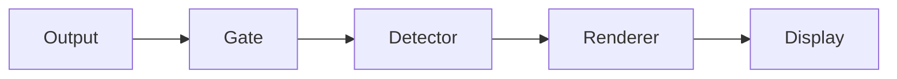

# ptymark

<!--
@dependency-start
contract design
responsibility Provides the user-facing entrypoint for ptymark installation, engine setup, configuration, WezTerm use, safety guarantees, and development.
upstream design documents/ptymark-design.md defines the pre-display architecture and extension boundary.
upstream design documents/ptymark-installer.md defines installation-time resolution and managed-bundle behavior.
upstream environment docker/ptymark.Dockerfile defines the canonical validation environment.
downstream implementation src/cli.rs and src/install.rs implement the documented command surface.
downstream test tests/cli_contract.rs, tests/install_contract.rs, and GitHub Actions validate the documented behavior.
@dependency-end
-->

`ptymark` is an alpha-stage **pre-display renderer** for terminal output. It detects complete,
explicitly delimited Markdown blocks and replaces only those blocks immediately before bytes are
committed to the terminal display.

```text
child output
  -> terminal safety gate
  -> explicit semantic detector
  -> render decision
  -> engine handoff
  -> independent cache
  -> terminal-safe display bytes
```

It does not replace keyboard input, termios, signal routing, window-size forwarding, mouse reporting,
bracketed paste, or child exit-status handling.

## Current status

Implemented:

- stream and file rendering through `ptymark preview`;
- Mermaid fences and block-math fences;
- byte-exact bypass for ANSI, OSC, DCS-style controls, carriage-return updates, and alternate-screen applications;
- built-in preview and exact-source rendering;
- Mermaid CLI and MathJax rendering;
- terminal-safe ANSI/Unicode presentation;
- one-command Linux, macOS, and Windows setup from a source checkout;
- system-engine preference with a versioned, user-local managed fallback;
- installation-time engine replacement without resetting unrelated user settings;
- bounded in-memory and no-op caches;
- a thin WezTerm launcher plugin and complete platform-aware example;
- Docker plus Linux, macOS, and Windows GitHub Actions validation.

Not implemented yet:

- the interactive child-PTY host behind `ptymark -- COMMAND`;
- WezTerm/Kitty/iTerm2/Sixel pixel placement;
- persistent renderer workers;
- live resize generations and cancellation;
- persistent cache;
- Windows ConPTY hosting.

`ptymark -- COMMAND` currently validates configuration and transparently executes the command. The
command shape is reserved for the later PTY host.

## Install in one command

The alpha installer is run from a repository checkout because release archives are not published yet.
It installs the Rust binary and resolves a complete rendering pipeline.

Prerequisites:

- Git;
- Rust/Cargo 1.97 or newer for the source-based core install;
- network access during the first install unless all required artifacts are already present and
  `--offline`/`-Offline` is used.

### Linux or macOS

```bash
git clone --recurse-submodules https://github.com/iwashita-nozomu/ptymark.git
cd ptymark
bash scripts/install.sh
```

### Windows PowerShell 7+

```powershell
git clone --recurse-submodules https://github.com/iwashita-nozomu/ptymark.git
Set-Location ptymark
pwsh -File scripts/install.ps1
```

The ordinary setup does not require a prior Node.js, npm, Mermaid, MathJax, Chafa, Chromium, or Edge
installation. Existing compatible commands are preferred. Missing slots are supplied by an isolated
managed bundle.

## Default renderer selection

The installer resolves each role in this order:

```text
1. explicit installer option
2. existing valid selection when re-running without --reprobe
3. compatible command already available on PATH
4. ptymark-managed user-local default
5. built-in textual preview when managed installation is disabled
```

The managed defaults are pinned as one tested set:

| Role | Managed default |
| --- | --- |
| Mermaid layout | `@mermaid-js/mermaid-cli` 11.16.0 |
| TeX block math | MathJax 4.1.3 |
| JavaScript runtime | Node.js 24.18.0 |
| Browser bridge | Puppeteer 25.2.1 |
| Terminal presentation | ptymark browser-backed ANSI/Unicode presenter |

The managed presenter accepts the fixed Chafa-compatible argument subset used by the Rust adapter.
This preserves the existing engine handoff while avoiding a mandatory system package on Windows.

## Where managed components are installed

The fallback bundle is versioned and private to ptymark. It does not write to a global npm prefix and
does not add anything to `PATH`.

```text
Linux
  ${XDG_DATA_HOME:-~/.local/share}/ptymark/renderer-bundles/<bundle-id>/

macOS
  ~/Library/Application Support/ptymark/renderer-bundles/<bundle-id>/

Windows
  %LOCALAPPDATA%\ptymark\renderer-bundles\<bundle-id>\
```

Each bundle contains:

```text
bundle.toml                 validated launcher manifest
bundle.stamp                lock/runtime/launcher identity
app/                        lockfile-resolved JavaScript packages and fixed entrypoints
runtime/                    private Node runtime only when exact system Node is unavailable
cache/                      private npm and browser cache
bin/mmdc[.exe]              native ptymark alias for Mermaid
bin/tex2svg[.exe]           native ptymark alias for MathJax
bin/chafa[.exe]             native ptymark alias for ANSI presentation
```

The aliases are copies or hard links of the native `ptymark` binary. They invoke Node directly with a
fixed role-specific entrypoint; Markdown, TeX, paths, and renderer arguments are not forwarded through
`sh`, `cmd.exe`, or a generated batch wrapper.

The installer may download at install time:

- an official portable Node archive when exact Node 24.18.0 is unavailable;
- lockfile-pinned npm packages inside the managed bundle;
- Puppeteer's private compatible browser when no browser is explicitly selected.

The Node archive is checked against the official release checksum list. npm dependencies are installed
with `npm ci` from the committed lockfile. No package manager, browser downloader, or network request is
started during normal rendering.

## Verify the installation

```bash
ptymark --version
ptymark install status
ptymark config check
ptymark config show
ptymark engine check
```

PowerShell uses the same native commands:

```powershell
ptymark.exe --version
ptymark.exe install status
ptymark.exe config check
ptymark.exe engine check
```

Typical managed result:

```text
config     /home/user/.config/ptymark/config.toml
mermaid    mermaid-cli    ready    /home/user/.local/share/ptymark/renderer-bundles/.../bin/mmdc
math       mathjax-cli    ready    /home/user/.local/share/ptymark/renderer-bundles/.../bin/tex2svg
presenter  chafa-symbols  ready    /home/user/.local/share/ptymark/renderer-bundles/.../bin/chafa
```

The generated runtime configuration contains absolute executable paths, so WezTerm and other GUI
applications do not depend on inheriting the same `PATH` as an interactive shell.

## Control installation behavior

Prefer installed system commands, filling missing roles from the managed bundle. This is the default:

```bash
bash scripts/install.sh --managed auto
```

Force all three roles to the isolated bundle:

```bash
bash scripts/install.sh --managed always
```

```powershell
pwsh -File scripts/install.ps1 -Managed always
```

Disable managed downloads and use built-in preview for unresolved roles:

```bash
bash scripts/install.sh --managed never
```

```powershell
pwsh -File scripts/install.ps1 -Managed never
```

Use an existing browser and prohibit a private browser download:

```bash
bash scripts/install.sh \
  --browser /usr/bin/chromium \
  --skip-browser-download
```

```powershell
pwsh -File scripts/install.ps1 `
  -Browser 'C:\Program Files (x86)\Microsoft\Edge\Application\msedge.exe' `
  -SkipBrowserDownload
```

Re-probe system commands and then managed fallbacks after an upgrade:

```bash
bash scripts/install.sh --reprobe
```

```powershell
pwsh -File scripts/install.ps1 -Reprobe
```

Use only already-installed bundle/runtime files and make no download attempt:

```bash
bash scripts/install.sh --offline
```

```powershell
pwsh -File scripts/install.ps1 -Offline
```

Select or replace one role explicitly:

```bash
bash scripts/install.sh --mermaid /opt/homebrew/bin/mmdc
bash scripts/install.sh --math /absolute/path/to/tex2svg
bash scripts/install.sh --presenter /usr/local/bin/chafa
bash scripts/install.sh --math source
bash scripts/install.sh --mermaid preview
```

Explicit paths must resolve successfully. `preview` and `source` never require an external executable.
Re-running preserves unrelated detection, rendering, and cache settings unless `--reset`/`-Reset` is
specified.

## Installer destinations

Default runtime configuration:

```text
Linux/macOS  ~/.config/ptymark/config.toml
Windows      %APPDATA%\ptymark\config.toml
```

Default installation state:

```text
Linux        ${XDG_STATE_HOME:-~/.local/state}/ptymark/install.toml
macOS        ~/.local/state/ptymark/install.toml
Windows      %LOCALAPPDATA%\ptymark\state\install.toml
```

Overrides:

```text
PTYMARK_CONFIG
PTYMARK_INSTALL_STATE
XDG_CONFIG_HOME
XDG_STATE_HOME
APPDATA
LOCALAPPDATA
```

The configuration is user-owned runtime policy. The state file records the selected backend,
resolution origin, requested path, resolved path, and readiness for diagnostics.

## Installer options

Linux/macOS:

```text
bash scripts/install.sh [OPTIONS]

--root DIR                Cargo installation root
--binary PATH             installed ptymark binary to invoke
--skip-core               skip cargo install; requires --binary
--config PATH             configuration destination
--state PATH              installation-state destination
--mermaid VALUE           auto | keep | preview | source | EXECUTABLE
--math VALUE              auto | keep | preview | source | EXECUTABLE
--presenter VALUE         auto | keep | EXECUTABLE
--managed MODE            auto | always | never
--managed-root DIR        managed bundle destination
--browser PATH            existing Chromium-compatible browser
--skip-browser-download   prohibit Puppeteer browser download
--offline                 prohibit downloads and npm install
--force-managed           rebuild the managed app and aliases
--reprobe                 search system commands again, then managed fallbacks
--reset                   start from built-in settings
--dry-run                 print the resolution plan without writing config/state
```

Windows uses equivalent PowerShell parameters:

```text
pwsh -File scripts/install.ps1 \
  [-Root DIR] [-Binary PATH] [-SkipCore] [-Config PATH] [-State PATH] \
  [-Mermaid VALUE] [-Math VALUE] [-Presenter VALUE] \
  [-Managed auto|always|never] [-ManagedRoot DIR] [-Browser PATH] \
  [-SkipBrowserDownload] [-Offline] [-ForceManaged] [-Reprobe] [-Reset] [-DryRun]
```

The lower-level resolver remains available after installation:

```text
ptymark install resolve [OPTIONS]
ptymark install status [--state PATH]
```

The full contract is in [documents/ptymark-installer.md](documents/ptymark-installer.md).

## Use `preview`

````bash
cat <<'EOF' | ptymark preview
ordinary output



$$
E = mc^2
$$
EOF
````

Common options:

```bash
ptymark preview --source README.md
ptymark preview --no-cache README.md
ptymark preview --columns 100 README.md
ptymark --config /absolute/path/config.toml preview README.md
```

The initial detector recognizes only complete, line-bounded forms:

````markdown


$$
E = mc^2
$$

```latex
\frac{-b \pm \sqrt{b^2 - 4ac}}{2a}
```
````

Inline `$...$`, headings, lists, and other ambiguous Markdown are intentionally not detected in
interactive output.

## Configuration

The installer writes a strict TOML file. A simplified configuration is:

```toml
schema_version = 1

[detection]
mermaid = true
math = true
max_block_bytes = 1048576

[rendering]
mode = "preview" # preview | source
strict = false
columns = 80

[cache]
enabled = true
max_entries = 128
max_bytes = 33554432

[engines.mermaid]
backend = "mermaid-cli" # preview | source | mermaid-cli
path = "/absolute/path/to/mmdc"

[engines.math]
backend = "mathjax-cli" # preview | source | mathjax-cli
path = "/absolute/path/to/tex2svg"

[engines.presenter]
path = "/absolute/path/to/chafa-compatible-presenter"
```

Engine paths accept an absolute path or a bare executable name. Working-directory-relative paths such
as `tools/mmdc` are rejected. The installer stores absolute paths; manually written bare names remain
supported for explicit user configurations.

## Safety and failure behavior

The renderer may change only a complete recognized semantic block.

```text
keyboard input ------------------------------> child process
signals / termios / resize ------------------> child process
child output:
  safe text ---------------------------------> detector
  ANSI / OSC / DCS / CR / alternate screen -> byte-exact passthrough
```

For each semantic block, the display pipeline commits exactly one result:

1. cached final display bytes;
2. newly rendered and presented bytes;
3. exact original source after a non-strict failure;
4. an error before replacement bytes in strict mode.

External processes are invoked with fixed argument protocols. The managed aliases use the native
ptymark launcher and Node directly. No arbitrary shell command, pipe, redirect, or argument template is
accepted from the renderer configuration.

Initial bounds:

```text
process timeout       5 seconds
layout artifact       8 MiB
terminal output       8 MiB
diagnostic output    64 KiB
```

## Cache

`ArtifactCache` is independent from detection, routing, engine execution, and display commit. Current
implementations are `MemoryCache` and `NoopCache`.

The complete key includes renderer identity, semantic kind, exact source bytes, terminal columns,
color permission, and theme fingerprint. Only successful final display bytes are cached. Persistent
cache is deferred until the interactive PTY path is measured.

## WezTerm

Run the platform installer, then use [`examples/wezterm.lua`](examples/wezterm.lua):

```bash
cp examples/wezterm.lua ~/.wezterm.lua
```

```powershell
Copy-Item examples/wezterm.lua $HOME/.wezterm.lua
```

The example chooses the platform-specific binary, config, and shell defaults. `PTYMARK_BINARY` and
`PTYMARK_CONFIG` override those paths. The plugin appends one launch-menu entry and one
`CTRL|SHIFT+P` binding; it does not replace existing entries.

```lua
local wezterm = require 'wezterm'
local config = wezterm.config_builder()
local ptymark = wezterm.plugin.require(
  'https://github.com/iwashita-nozomu/ptymark'
)

ptymark.apply_to_config(config, {
  binary = '/absolute/path/to/ptymark',
  config_file = '/absolute/path/to/config.toml',
})

return config
```

The plugin is currently a launcher. Interactive interception becomes active after the PTY host is
implemented.

## Extension boundaries

Installation-time executable lookup is behind `ProgramResolver`. The managed native alias dispatcher
is versioned by `bundle.toml`. Render selection and execution remain behind `RenderDecider` and
`EngineHandoff`. Adding a new resolver or managed source must not change the terminal safety gate,
semantic detector, cache, or display commit contract.

This is intentionally not a dynamic plugin registry. A new engine slot requires a concrete input/output
protocol, installation route, integrity policy, exact-source fallback, dependency ownership, and
Linux/macOS/Windows tests.

## Development and CI

The repository retains its AgentCanon and project-template workspace. `GNUmakefile` includes the
inherited `Makefile` and project-local `ptymark.mk`.

Canonical environment:

```bash
make ptymark-build
make ptymark-check
make ptymark-dev
```

GitHub Actions is the formal pull-request evidence. It runs:

- Rust formatting, Clippy, and all tests on Ubuntu, macOS, and Windows;
- a real managed-bundle install on Windows using pinned Node and installed Edge;
- Mermaid and MathJax rendering through the managed native aliases on Windows;
- canonical Docker tests and isolated managed-engine smoke;
- shell syntax, ShellCheck, PowerShell parse checks, and Node syntax checks;
- WezTerm plugin plus Linux/Windows example checks;
- inherited repository and Docker-pack checks.

## Design documents

- [pre-display architecture](documents/ptymark-design.md)
- [installer and managed engine resolution](documents/ptymark-installer.md)
- [example configurations](examples/README.md)
