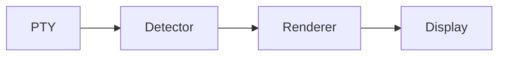

# ptymark

<!--
@dependency-start
contract design
responsibility Human-facing entrypoint for ptymark installation, use, architecture, and development.
upstream design AGENTS.md agent runtime entrypoint
upstream design documents/architecture.md ptymark pre-display renderer contract
upstream design documents/ui-design.md terminal UI, resize, and cache contract
upstream environment docker/ptymark.Dockerfile canonical ptymark product environment
downstream design QUICK_START.md shortest setup path
@dependency-end
-->

`ptymark`は、子プロセスの端末出力を**表示前**に受け取り、明確に閉じた意味ブロック
だけを既存レンダリングエンジンへ渡し、端末向け表示へ差し替える
**pre-display renderer**です。

```text
shell / CLI
    ↓ child PTY output
ptymark pre-display renderer
    ├─ ordinary / ambiguous output → byte-for-byte passthrough
    ├─ Mermaid block               → Mermaid engine adapter
    └─ block math                  → KaTeX / Typst adapter
    ↓ display bytes
terminal emulator
```

WezTermプラグインは`ptymark`を新しいタブで起動する薄い統合層です。検出、cache、
fallback、既存エンジンの安全な起動、将来のPTY proxyはRustコアに置きます。

## 現在の状態

現在は`0.1.0-alpha.1`のbootstrapです。

実装済み:

- `ptymark preview`による表示前ストリーム処理
- Mermaid fenceと`$$` blockのbounded detector
- ordinary outputのlossless passthrough
- renderer failure時のsource fallbackとstrict mode
- transform/bypass mode切替
- 既存エンジン用のbounded stdio adapter
- viewport、resize判定、theme/width-aware render key
- entry数/byte数を制限するin-memory LRU cache
- WezTerm launcher plugin
- Dockerで固定したMermaid CLI、KaTeX、Typst、Chromium環境
- 基本設計に対応するunit/integration/plugin/renderer smoke tests

未実装:

- 対話shellを包むchild PTY host
- ANSI/alternate-screen observer
- Mermaid CLI / KaTeX / Typst wrapperのCLI既定選択
- terminal image protocolへの配置
- live resize generation、画像再配置、persistent cache

`ptymark -- zsh -l`は現在、公開CLI形を固定する透過`exec`です。
`ptymark preview`では表示前レンダラーを実際に利用できます。未実装のUI runtimeは
[Issue #3](https://github.com/iwashita-nozomu/ptymark/issues/3)で追跡します。

## 配布形態

利用者向け配布は次の三層を想定します。

1. GitHub ReleasesのOS/architecture別archive
2. `cargo install`によるsource install
3. repository cloneからのdeveloper install

release archiveには次だけを入れます。

```text
ptymark
README.md
LICENSE
plugin/init.lua
```

Mermaid CLI、KaTeX、Typst、Chromiumはarchiveへ同梱しません。外部renderer backendを
有効にした利用者だけが該当エンジンを導入します。

> [!NOTE]
> このalpha bootstrapの公開releaseはまだありません。release作成前は
> 「Sourceからインストール」を使用してください。

## インストール

### Sourceからインストール

Rust toolchainをホストへ導入済みなら、crateだけをインストールできます。

```bash
git clone --recurse-submodules https://github.com/iwashita-nozomu/ptymark.git
cd ptymark
cargo install --locked --path .
ptymark --version
```

mainから直接インストールする場合:

```bash
cargo install --locked \
  --git https://github.com/iwashita-nozomu/ptymark.git \
  ptymark
```

更新:

```bash
cargo install --locked --force \
  --git https://github.com/iwashita-nozomu/ptymark.git \
  ptymark
```

repository全体の正式検証はDocker必須ですが、利用者向けネイティブbinaryのbuildは
Cargoで行えます。

### GitHub Release archiveからインストール

release公開後は、OSとarchitectureに合う
`ptymark-v<version>-<target>.tar.gz`と`.sha256`を取得します。

```bash
tar -xzf ptymark-v<version>-<target>.tar.gz
cd ptymark-v<version>-<target>
install -m 0755 ptymark "$HOME/.local/bin/ptymark"
ptymark --version
```

checksum確認例:

```bash
sha256sum --check ptymark-v<version>-<target>.tar.gz.sha256
```

macOSでは`shasum -a 256`で同じ値を確認できます。

## WezTermプラグインを導入する

`ptymark` binaryを先に`PATH`へ入れ、`~/.wezterm.lua`へ追加します。

```lua
local wezterm = require 'wezterm'
local config = wezterm.config_builder()

local ptymark = wezterm.plugin.require(
  'https://github.com/iwashita-nozomu/ptymark'
)

ptymark.apply_to_config(config, {
  binary = 'ptymark',
  key = {
    key = 'P',
    mods = 'CTRL|SHIFT',
  },
})

return config
```

これにより次が追加されます。

- launch menuの`ptymark shell`
- `CTRL|SHIFT+P`で新しいタブを開くkey binding
- `ptymark -- "$SHELL" -l`相当の起動

binaryが`PATH`にない場合:

```lua
ptymark.apply_to_config(config, {
  binary = '/absolute/path/to/ptymark',
})
```

任意コマンドを直接指定する場合:

```lua
ptymark.apply_to_config(config, {
  command = {
    '/absolute/path/to/ptymark',
    'demo',
    '--color',
  },
  label = 'ptymark demo',
})
```

ローカルplugin開発ではHTTPS URLの代わりに`file://` URLを使います。

```lua
local ptymark = wezterm.plugin.require(
  'file:///absolute/path/to/ptymark'
)
```

plugin更新後はWezTerm Debug Overlayで次を実行します。

```lua
wezterm.plugin.update_all()
```

## 利用方法

### 内蔵デモ

```bash
ptymark demo
ptymark demo --color
```

### 標準入力を表示前レンダリングする

````bash
cat <<'EOF' | ptymark preview
ordinary output



$$
E = mc^2
$$
EOF
````

現在の既定rendererは、意味ブロックをterminal-safeなpreview boxへ変換します。
original sourceをlosslessに確認する場合:

```bash
cat document.md | ptymark preview --source
```

fileから読む場合:

```bash
ptymark preview README.md
```

buffer上限と幅hint:

```bash
ptymark preview \
  --max-buffer-bytes 1048576 \
  --terminal-width 100 \
  document.md
```

renderer failureをfallbackではなくエラーにする開発用モード:

```bash
ptymark preview --strict document.md
```

### Command mode

```bash
ptymark -- zsh -l
ptymark -- codex
```

alpha bootstrapでは対象commandへ透過`exec`します。child PTY outputを
`PreDisplayRenderer`へ接続する実装は後続です。

## 既存レンダリングエンジン

`ptymark`はMermaidや数式のレイアウトを再実装しません。

| 入力 | 既定候補 | ptymarkが担当すること |
| --- | --- | --- |
| Mermaid | Mermaid CLI | 境界検出、timeout、output limit、cache、fallback、表示commit |
| TeX block math | KaTeX | 同上。HTML/MathMLをterminal backendへ渡す |
| Typst-native input | Typst CLI | 同上。SVG/PDF artifactをterminal backendへ渡す |

`ExternalRenderer`は、既存エンジンwrapperへbodyをstdinで渡し、stdoutをartifactとして
受け取るbounded adapterです。Docker checkでMermaid SVG、KaTeX MathML、Typst SVGを
実際に生成します。

## 開発環境

`ptymark`製品コード、plugin、既存renderer engine、release packageの正式検証は
Dockerを必須経路にします。

ホスト側の必須依存:

- Git
- Docker EngineまたはDocker Desktop
- Docker Compose v2
- 実機統合時だけWezTerm

初期セットアップ:

```bash
git clone --recurse-submodules https://github.com/iwashita-nozomu/ptymark.git
cd ptymark
make ptymark-docker-build
make ptymark-check
```

開発shell:

```bash
make ptymark-dev
```

一回だけcommandを実行:

```bash
bash scripts/ptymark-dev-container.sh cargo test --locked --all-targets
bash scripts/ptymark-dev-container.sh lua5.4 tests/plugin_smoke.lua
bash scripts/ptymark-dev-container.sh bash scripts/check-ptymark-renderers.sh
```

固定依存は`docker/ptymark-versions.env`にあります。

```text
Rust 1.97.0
Node.js 24.18.0
Mermaid CLI 11.16.0
KaTeX 0.17.0
Typst 0.15.0
Lua 5.4
Debian Chromium / Noto fonts / ShellCheck
```

## テストとGitHub Actions

`make ptymark-check`はcanonical Docker imageをbuildし、その中で次を実行します。

```text
cargo fmt --check
cargo clippy -D warnings
cargo test --all-targets
release build and archive packaging
pre-display ordering/fallback/bypass contract tests
viewport/resize/cache unit tests
WezTerm plugin smoke
Mermaid CLI SVG smoke
KaTeX MathML smoke
Typst SVG smoke
ShellCheck and dependency-pin consistency
```

GitHub Actionsは次を分離します。

- product Docker CI
- native Linux/macOS compile smoke
- tagged releaseのnative archive/checksum生成
- 既存template/AgentCanon CIと同期workflow

## ローカル作業用テンプレート構造

このrepositoryは`ptymark`製品だけに縮退させません。元のproject-template構造と
AgentCanon submodule/root viewsをローカル作業基盤として維持します。

```text
.
├── Cargo.toml, src/                 # ptymark Rust core/CLI
├── plugin/                          # WezTerm plugin
├── tests/                           # ptymark + template/AgentCanon tests
├── docker/ptymark.*                 # ptymark canonical product environment
├── ptymark.mk, GNUmakefile          # product targets layered over template Makefile
├── documents/                       # project docs + template-owned active contracts
├── vendor/agent-canon/              # shared AgentCanon submodule
├── agents/, .agents/, .codex/       # shared runtime views
├── tools/                           # AgentCanon automation view
├── python/, cmake/, experiments/    # retained local-work profiles
└── Makefile                         # retained template/AgentCanon targets
```

- `Makefile`はtemplate/AgentCanon用の正本として残します。
- `GNUmakefile`が`Makefile`と`ptymark.mk`をincludeし、通常の`make`から両方を使えます。
- AgentCanonの更新・同期・runtime checksは従来targetを使います。
- `ptymark`固有checkは`make ptymark-check`を使います。

## 文書

- [Quick Start](QUICK_START.md)
- [利用方法](documents/usage.md)
- [基本設計](documents/architecture.md)
- [UI設計](documents/ui-design.md)
- [依存関係](documents/dependencies.md)
- [開発環境](documents/development-environment.md)
- [配布](documents/distribution.md)
- [文書索引](documents/README.md)
- [AgentCanon runtime profiles](vendor/agent-canon/documents/runtime-profiles-and-check-matrix.md)

## ライセンス

Apache License 2.0です。詳細は[LICENSE](LICENSE)と
[ライセンス方針](documents/licensing-policy.md)を参照してください。
