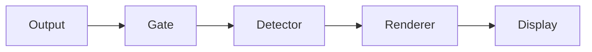

# ptymark

<!--
@dependency-start
contract design
responsibility Provides the task-oriented product entrypoint for installation, usage, safety, and recovery.
upstream design documents/README.md documentation map
upstream design documents/ptymark-design.md architecture contract
upstream design documents/openmath.md structured math input contract
upstream design documents/ptymark-installer.md installation contract
upstream design documents/shell-plugin-compatibility.md coexistence evidence
downstream implementation src/cli.rs command surface
downstream implementation src/install.rs installation state
downstream implementation scripts/installer.sh setup frontend
downstream implementation tests/cli_contract.rs user-facing validation
downstream environment .github/workflows/ptymark-ci.yml acceptance matrix
@dependency-end
-->

`ptymark` is an alpha-stage **pre-display renderer** for terminal output. It recognizes only complete, explicitly delimited semantic blocks and may replace those blocks immediately before bytes are committed to the terminal display.

```text
child output
  -> terminal safety gate
  -> explicit semantic detector
  -> source-format adapter when required
  -> render decision and engine handoff
  -> independent cache
  -> terminal-safe display bytes
```

Keyboard input, signals, shell hooks, prompts, completion, mouse reports, bracketed paste, cursor-addressed interfaces, and alternate-screen applications remain outside semantic rendering. The native PTY/ConPTY host transports interactive bytes and terminal-size changes and restores the parent terminal mode before exit.

## Choose a route

| Goal | Start here | Detailed contract |
| --- | --- | --- |
| Install from source | [Build and install](#build-and-install-from-a-source-checkout) | [Installer design](documents/ptymark-installer.md) |
| Verify or recover | [Verify installation](#verify-installation) and [doctor](#diagnose-and-recover-safely) | [Troubleshooting](documents/troubleshooting.md) |
| Run an interactive command | [Interactive use](#interactive-use) | [PTY/ConPTY session](documents/interactive-session.md) |
| Preview a file or stream | [Use `preview`](#use-preview) | [Architecture](documents/ptymark-design.md) |
| Render OpenMath | [OpenMath example](#openmath) | [OpenMath input contract](documents/openmath.md) |
| Filter a batch command | [Pipe-oriented execution](#pipe-oriented-execution) | [Filtered command contract](documents/filtered-command.md) |
| Configure engines and cache | [Configuration](#configuration) | [Examples](examples/README.md) |
| Integrate with WezTerm | [WezTerm](#wezterm) | [Runnable configuration](examples/wezterm.lua) |
| Develop or review a change | [Development and CI](#development-and-ci) | [Documentation map](documents/README.md) |
| Review the next release trains | [Alpha.5/Beta roadmap](documents/roadmap-alpha5-beta.md) | [Verification catalog](verification/README.md) |

The complete product documentation map is [`documents/README.md`](documents/README.md).

## Current status

Implemented:

- stream and file rendering through `ptymark preview`;
- native Unix PTY and Windows ConPTY sessions through canonical `ptymark shell -- COMMAND`, with `ptymark -- COMMAND` retained as an Alpha compatibility form;
- pipe-oriented command filtering through `ptymark run -- COMMAND`;
- keyboard forwarding, resize propagation, and child exit-status preservation;
- complete Mermaid, TeX block-math, and explicit OpenMath fences;
- bounded local OpenMath XML-to-TeX conversion with generic custom-CD presentation;
- byte-exact bypass for ANSI, OSC, DCS-style controls, carriage-return updates, completion redraws, right prompts, and alternate-screen applications;
- built-in preview and exact-source routes;
- installed Mermaid CLI and MathJax-compatible engines;
- an isolated, versioned managed renderer bundle;
- terminal-safe ANSI/Unicode presentation;
- platform-specific installers for POSIX shells, Windows PowerShell, cmd.exe, and Windows Bash;
- portable named-profile configuration separated from machine-local resolved installation state;
- role-by-role engine replacement without resetting unrelated settings;
- bounded in-memory and no-op caches;
- `ptymark doctor`, versioned redacted JSON/support reports, and stable ready/degraded/unusable status;
- bounded external-renderer deadlines, output limits, ordered exact-source recovery, and process cleanup;
- a thin WezTerm launcher plugin and portable example;
- shell coexistence contracts for Bash, Zsh, Fish, PowerShell, and Nushell;
- product-owned Docker plus Ubuntu, macOS, and Windows GitHub Actions validation without inherited template suites.

Not implemented yet:

- WezTerm/Kitty/iTerm2/Sixel pixel placement;
- guided first-run rendering and generated WezTerm setup;
- complete CJK/grapheme-width and screen-reader-oriented presentation;
- persistent renderer workers;
- resize-generation cancellation and persistent cache;
- supported upgrade, rollback, uninstall, purge, or an approved signed binary/package-manager channel;
- OpenMath JSON, `OMR` reference graphs, remote Content Dictionary lookup, or semantic CD validation.

## Distribution policy: source-only

Ptymark does **not** publish project-built native executables, installer archives, renderer bundles, or executable-bearing GitHub Actions artifacts for end-user installation. GitHub Releases retain an immutable tag, release notes, and GitHub-generated source-code archives only.

The GitHub `Source code (zip)` and `Source code (tar.gz)` links are source snapshots, not prebuilt executables. Build locally from a reviewed tag or commit. This avoids presenting unsigned and unnotarized downloads as an operating-system-trusted channel; it does not make a local build automatically safe.

Executable assets originally uploaded for `v0.1.0-alpha.1` and `v0.1.0-alpha.2` have been withdrawn. Their tags, release notes, and source history remain. See [`documents/release.md`](documents/release.md) for the complete policy and requirements for any future signed channel.

## Build and install from a source checkout

Source installation requires Git and Rust/Cargo 1.97 or newer.

### Linux, macOS, or WSL

```bash
git clone https://github.com/iwashita-nozomu/ptymark.git
cd ptymark
bash scripts/installer.sh
```

WSL is treated as Linux. It installs the Linux binary and renderer bundle inside the WSL distribution; it does not reuse Windows `.exe` renderers implicitly.

### Windows PowerShell

PowerShell 7+:

```powershell
git clone https://github.com/iwashita-nozomu/ptymark.git
Set-Location ptymark
pwsh -File scripts/installer.ps1
```

Windows PowerShell 5.1:

```powershell
powershell -ExecutionPolicy Bypass -File scripts/installer.ps1
```

### Windows cmd.exe

```bat
git clone https://github.com/iwashita-nozomu/ptymark.git
cd ptymark
scripts\installer.cmd
```

`installer.cmd` selects `pwsh.exe` or `powershell.exe` and delegates to the shared PowerShell frontend.

### Git Bash, MSYS2, or Cygwin

```bash
git clone https://github.com/iwashita-nozomu/ptymark.git
cd ptymark
bash scripts/installer.sh
```

The Bash frontend detects Windows Bash, converts path-valued options with `cygpath`, disables MSYS argument rewriting for the final call, and delegates to PowerShell. Generated TOML contains native paths such as `C:\Users\...`, not `/c/Users/...`. The former `scripts/install.sh` and `scripts/install.ps1` names remain compatibility wrappers.

## Verify installation

```bash
ptymark --version
ptymark install status
ptymark config check
ptymark config show
ptymark engine check
ptymark doctor
ptymark doctor --json
```

On Windows, use `ptymark.exe` when the executable directory is not already on `PATH`.

A managed installation reports resolved native paths for the Mermaid, math, and presenter roles. Built-in `preview` and `source` roles report no external executable.

## Interactive use

The canonical interactive command is:

```text
ptymark [--config PATH] [--profile NAME] shell [OPTIONS] -- COMMAND [ARG...]
```

Examples:

```bash
ptymark shell -- bash
ptymark shell -- python
ptymark --profile plain shell -- cargo test
ptymark shell --source -- bash
ptymark shell --safe -- bash
ptymark shell --private -- bash
```

The Alpha.3 form remains a compatibility alias in Alpha.4:

```bash
ptymark -- bash
```

The command runs in a native Unix PTY or Windows ConPTY. Ptymark forwards input, propagates size changes, filters only safe child-output regions, and returns the child exit status. Child argv remains an `OsString` sequence after `--`; Ptymark does not build a shell command string.

Session modes change only pre-display policy:

- `--source` keeps explicit block detection but emits each complete block's exact source;
- `--safe` bypasses semantic detection, source-format conversion, engines, presentation, and cache;
- `--private` keeps rendering but disables the process-local artifact cache;
- `--allow-nested` permits deliberate development/debug nesting while accidental nesting remains rejected.

`--source` and `--safe` are mutually exclusive. See [`documents/interactive-session.md`](documents/interactive-session.md).

## Pipe-oriented execution

```bash
ptymark run -- COMMAND [ARG...]
```

This path filters child stdout for batch and log-producing commands while preserving the documented stdin, stderr, and exit-status behavior. It is not a PTY replacement. See [`documents/filtered-command.md`](documents/filtered-command.md).

## Use `preview`

The detector accepts only complete, line-bounded forms. The following example contains Mermaid, TeX, and OpenMath:

````bash
cat <<'EOF' | ptymark preview
ordinary output


```mermaid
flowchart LR
  Output --> Gate --> Detector --> Renderer --> Display
```

$$
E = mc^2
$$

```openmath
<OMOBJ xmlns="http://www.openmath.org/OpenMath" version="2.0">
  <OMA>
    <OMS cd="relation1" name="eq"/>
    <OMA>
      <OMS cd="arith1" name="plus"/>
      <OMV name="x"/>
      <OMI>1</OMI>
    </OMA>
    <OMI>2</OMI>
  </OMA>
</OMOBJ>
```
EOF
````

Common options:

```bash
ptymark preview README.md
ptymark preview --source README.md
ptymark preview --no-cache README.md
ptymark preview --columns 100 README.md
ptymark preview --strict README.md
ptymark --config /absolute/path/config.toml preview README.md
```

Inline `$...$`, headings, lists, raw `OMOBJ` XML, and other ambiguous Markdown are intentionally not detected in interactive output.

### OpenMath

OpenMath is a source format for the existing `math` role. An explicit `openmath` fence is parsed locally with fixed byte, depth, and node limits, converted to deterministic TeX, and sent through the configured math route.

```bash
ptymark preview examples/openmath.md
ptymark preview --source examples/openmath.md
```

Common official Content Dictionary symbols receive readable presentation. Unknown research symbols remain visible as a generic `cd.name` operator; Ptymark never downloads a CD. Malformed or unsupported objects restore exact source in normal mode and fail before replacement in strict mode. `DOCTYPE`, external/custom entities, and `OMR` references are rejected. See [`documents/openmath.md`](documents/openmath.md).

## Diagnose and recover safely

Use one side-effect-free command to inspect configuration, installation state, native host, terminal context, engine/browser/presenter resolution, and effective source/safe/private mode:

```text
ptymark doctor
ptymark doctor --json
ptymark doctor --support-report ./ptymark-support.json
ptymark doctor --config /absolute/path/config.toml
```

Status and exit codes:

| Status | Exit code | Meaning |
| --- | ---: | --- |
| `ready` | `0` | selected configuration is usable |
| `degraded` | `10` | usable through a documented fallback or without an optional capability |
| `unusable` | `20` | selected config, required host, or strict path cannot operate |

Default doctor performs no installation, download, network request, renderer/browser execution, child launch, or mutation. Human, JSON, and support-report output exclude semantic source, child environment, credentials, source-bearing renderer stderr, sensitive path prefixes, and terminal-control bytes by default. Support reports are written atomically and do not overwrite existing files.

Immediate per-session recovery:

```text
ptymark --source -- COMMAND
ptymark --safe -- COMMAND
ptymark --private -- COMMAND
```

See [`documents/troubleshooting.md`](documents/troubleshooting.md).

## Configuration

Alpha.4 uses strict TOML schema v2. The user file records portable intent; resolved engine paths and ownership remain in machine-local installation state.

```toml
schema_version = 2
default_profile = "default"

[profiles.default.session]
mode = "render"             # render | source
strict = false

[profiles.default.detection]
mermaid = true
math = true                 # TeX and OpenMath

[profiles.default.presentation]
mode = "auto"              # auto | symbols | plain | source
color = "auto"             # auto | always | never
fallback_columns = 80

[profiles.default.cache]
backend = "memory"         # memory | none
max_entries = 128
max_bytes = 33554432

[profiles.default.engines.mermaid]
provider = "auto"          # auto | preview | source | managed | external

[profiles.default.engines.math]
provider = "auto"

[profiles.default.engines.presenter]
provider = "auto"          # auto | managed | external
```

Use `provider = "external"` together with an explicit `program` only when the executable choice itself is user intent. Installer-discovered or managed absolute paths are stored in `install.toml`, matched to the normalized user-config digest, and are not emitted by `ptymark config show`.

Named profiles provide the extension boundary for future presentation and engine policy without adding disconnected top-level flags:

```bash
ptymark --profile plain config check
ptymark --profile plain shell -- "$SHELL" -l
```

Schema-v1 files remain readable. Inspect or normalize them explicitly:

```bash
ptymark --config ~/.config/ptymark/config.toml config check
ptymark --config ~/.config/ptymark/config.toml config migrate
ptymark --config ~/.config/ptymark/config.toml config migrate --write
```

Hard renderer deadlines, artifact/output caps, OpenMath limits, terminal-control bounds, process polling, and PTY recovery timing are internal versioned policy. User TOML can choose stricter or lower-cost behavior but cannot weaken that safety floor.

`profiles.<name>.detection.math` governs dollar-sign block math, `math|latex|tex` fences, and `openmath` fences. OpenMath does not add another engine or installer role. See [`examples/README.md`](examples/README.md) and [`documents/alpha4-design.md`](documents/alpha4-design.md).

## Renderer installation and isolation

One setup command:

```text
places or selects the native ptymark executable
  -> inspects explicit and installed renderer commands
  -> installs missing default roles in an isolated managed bundle
  -> records resolved executables in machine-local install state
  -> commits portable config and ownership-scoped state transactionally
  -> runs installation and engine checks
```

Installer frontends own platform and shell concerns. Rust owns engine-selection semantics, configuration merge, validation, state serialization, and status reporting. The installer does not edit `.bashrc`, `.zshrc`, Fish or Nushell configuration, or PowerShell profiles, and it does not add managed aliases to global `PATH`.

Selection order:

```text
1. explicit installer option
2. compatible command visible to the installer shell
3. existing complete ptymark-managed bundle
4. install the pinned managed bundle
5. built-in preview when managed installation is disabled
```

The managed set is pinned and tested together:

| Role | Managed default |
| --- | --- |
| Mermaid layout | `@mermaid-js/mermaid-cli` 11.16.0 |
| TeX and OpenMath layout | MathJax 4.1.3 after local OpenMath-to-TeX conversion |
| JavaScript runtime | Node.js 24.18.0 |
| Browser bridge | Puppeteer 25.2.1 |
| Terminal presentation | Ptymark ANSI/Unicode presenter |

The Rust detector, OpenMath converter, cache, fallback, and terminal-safety gate do not require JavaScript. The optional managed Mermaid and MathJax engines do, so their bundle contains a private Node runtime and lockfile-pinned packages. Users do not need global Node, global npm packages, or renderer aliases on `PATH`.

Normal rendering performs no installation, browser download, package-manager operation, or network request.

Common installer controls:

```bash
bash scripts/installer.sh --managed auto
bash scripts/installer.sh --managed always
bash scripts/installer.sh --managed never
bash scripts/installer.sh --offline
bash scripts/installer.sh --reprobe
bash scripts/installer.sh --math source
```

```powershell
pwsh -File scripts/installer.ps1 -Managed auto
pwsh -File scripts/installer.ps1 -Managed always
pwsh -File scripts/installer.ps1 -Managed never
pwsh -File scripts/installer.ps1 -Offline
pwsh -File scripts/installer.ps1 -Reprobe
pwsh -File scripts/installer.ps1 -Math source
```

Use explicit `--mermaid`, `--math`, and `--presenter` values to change one profile role while preserving unrelated user settings. Resolved paths remain inspectable through `install status`, `engine check`, and `doctor`. See [`documents/ptymark-installer.md`](documents/ptymark-installer.md) for destinations, browser selection, offline behavior, and replacement semantics.

## Safety and failure behavior

The renderer may change only a complete recognized semantic block found in safe text:

```text
keyboard input ------------------------------> child process
signals / terminal mode / resize ------------> child process
child output:
  safe text ---------------------------------> explicit detector
  ANSI / OSC / DCS / CR / alternate screen -> byte-exact passthrough
```

For each block, the display pipeline commits exactly one result:

1. cached final display bytes;
2. newly converted/rendered/presented bytes;
3. exact original source after a non-strict failure;
4. an error before replacement bytes in strict mode.

External processes use fixed argument protocols. Configuration cannot contain an arbitrary shell command, pipe, redirect, or argument template. OpenMath conversion runs in-process but has no file, network, external-entity, or remote-CD surface.

Initial bounds:

```text
semantic source       1 MiB
OpenMath nesting      128 levels
OpenMath elements     8192
render attempt        10 seconds across engine and presentation
layout artifact        8 MiB
terminal output        8 MiB
pending later output   1 MiB per unresolved semantic block
diagnostic output     64 KiB, sanitized and source-redacted
```

The architecture and extension rules are in [`documents/ptymark-design.md`](documents/ptymark-design.md).

## Cache

`ArtifactCache` is independent from detection, conversion, routing, engine execution, and display commit. Current implementations are `MemoryCache` and `NoopCache`. The key includes the complete renderer/adapter identity, semantic kind, exact source bytes, terminal columns, color permission, and theme fingerprint. Only successful final display bytes are cached.

## Shell and rich-plugin coexistence

The installer and launcher do not source, replace, or reorder shell plugins. Compatibility is checked by emitted terminal behavior rather than brand-specific code. The inventory tracks twenty integrations for each of Bash, Zsh, Fish, PowerShell, and Nushell.

| Behavior | Verification |
| --- | --- |
| ANSI/SGR prompts and glyph-rich output | byte-exact preservation |
| OSC shell integration, title, and cwd markers | byte-exact raw path |
| right prompts and cursor save/restore | byte-exact raw path |
| autosuggestions, syntax highlighting, and line redraw | byte-exact raw path |
| completion menus and cursor movement | byte-exact raw path |
| carriage-return progress output | byte-exact raw path |
| fzf/history/file-browser alternate screen | full bypass until exit |
| environment and directory hooks | profile files unchanged; environment preserved |

The full inventory, evidence levels, and limitations are in [`documents/shell-plugin-compatibility.md`](documents/shell-plugin-compatibility.md).

## WezTerm

Run the platform installer, then copy the complete minimal example:

```bash
cp examples/wezterm.lua ~/.wezterm.lua
```

```powershell
Copy-Item examples/wezterm.lua $HOME/.wezterm.lua
```

For an existing configuration, copy the `wezterm.plugin.require(...)` and `ptymark.apply_to_config(...)` blocks rather than replacing the file. The plugin appends one launch-menu entry and one `CTRL|SHIFT+P` binding. It remains a thin launcher; the spawned native process owns PTY/ConPTY hosting, validation, detection, conversion, rendering, fallback, and session modes.

`PTYMARK_BINARY` and `PTYMARK_CONFIG` override platform defaults. See [`examples/README.md`](examples/README.md#wezterm).

## Extension boundaries

Installation-time lookup is behind `ProgramResolver`. Render selection and execution remain behind `RenderDecider` and `EngineHandoff`. Structured source conversion is a separate renderer adapter with its own identity.

A new source format, resolver, decision rule, engine, handoff, or presenter must not weaken terminal classification, explicit detection, exact-source fallback, cache identity, or one-time display commit. A new source format requires a bounded parser, no hidden I/O, deterministic adapter ID, normal/strict/source/safe evidence, documentation, and a runnable example. A new engine role additionally requires installation, integrity, dependency ownership, and Ubuntu/macOS/Windows tests.

## Development and CI

```bash
make ptymark-build
make ptymark-check
make ptymark-dev
```

Build a local package for developer/CI verification after a release build. These outputs are not an official distribution channel:

```bash
cargo build --release --locked
bash scripts/package-release.sh target/release/ptymark dist
```

```powershell
cargo build --release --locked
.\scripts\package-release.ps1 `
  -Binary .\target\release\ptymark.exe `
  -OutputDir .\dist
```

GitHub Actions is the formal pull-request evidence. It runs:

- Rust formatting, Clippy with warnings denied, and all tests on Ubuntu, macOS, and Windows;
- terminal safety, detector, OpenMath parser/adapter, pipeline, routing, cache, configuration, and installer contracts;
- real Unix PTY and Windows ConPTY tests;
- shell-integration inventories and terminal behavior profiles;
- unchanged Unix and Windows shell-profile checks and hook environment propagation;
- PowerShell, cmd.exe, and Git Bash installer entrypoints;
- managed Mermaid, MathJax, presenter, and strict end-to-end smoke;
- canonical Docker, ShellCheck, WezTerm, and package-local verification;
- Linux, macOS, and Windows local package assembly whose executable outputs are deleted rather than uploaded;
- inherited repository and Docker-pack checks.

## Documentation

- [task-oriented documentation map](documents/README.md)
- [pre-display architecture](documents/ptymark-design.md)
- [OpenMath input and safety contract](documents/openmath.md)
- [interactive PTY and ConPTY session](documents/interactive-session.md)
- [filtered command execution](documents/filtered-command.md)
- [troubleshooting and support reports](documents/troubleshooting.md)
- [installer and managed engine resolution](documents/ptymark-installer.md)
- [release and recovery contract](documents/release.md)
- [shell and rich-plugin compatibility](documents/shell-plugin-compatibility.md)
- [verification catalog](verification/README.md)
- [examples](examples/README.md)
