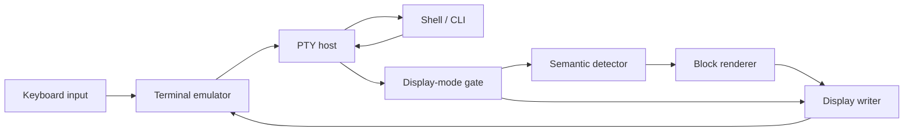

# ptymark 基本設計

## 位置づけ

`ptymark` の中心責務は、**端末エミュレータが文字列を表示する直前に、子プロセスの
出力ストリームを受け取り、確実に識別できる意味ブロックだけを表示用バイト列へ
差し替えること**です。

この文書では、この製品境界全体を **pre-display renderer** と呼びます。
コード上の `BlockRenderer` は、その中で一つの意味ブロックを変換する部品です。
両者を混同しません。

`ptymark` は次のものではありません。

- ターミナルエミュレータ
- WezTerm の画面描画エンジン
- コマンド終了後だけに動く Markdown viewer
- すべての `$` や `#` を推測で Markdown とみなすフィルター
- alternate screen を使う TUI の画面を書き換える仕組み

## 表示前境界



子プロセスが書いたバイト列は、端末エミュレータへ届く前に
`PreDisplayRenderer` を通ります。通常出力は同じ順序でそのまま流れ、完成した
意味ブロックだけが `BlockRenderer` の結果へ置き換わります。

## 構成要素と責務

### 1. PTY host

PTY host は端末と子プロセスの対話性を保つ入出力アダプターです。

責務:

- 子 PTY の生成と子プロセス起動
- キーボード入力の子 PTY への転送
- 子 PTY 出力の pre-display renderer への供給
- `SIGWINCH`、終了状態、シグナルの転送
- terminal mode の観測結果を display-mode gate へ通知

非責務:

- Markdown 判定
- Mermaid や数式の描画
- 表示用レイアウト

PTY host はまだ未実装です。現在の `ptymark -- COMMAND` は公開 CLI 形を固定する
透過ランチャーで、後続変更でこの責務を内部へ追加します。

### 2. display-mode gate

表示前変換を実行してよい状態かを決めます。

- `Transform`: 意味検出とレンダリングを許可する通常状態
- `Bypass`: 入力を無加工で display writer へ送る状態

将来の PTY host は alternate screen、バイナリ的な出力、または安全に解析できない
端末状態を検出したときに `Bypass` を選びます。

`Transform` から `Bypass` へ移るときは、detector が保留中の未完成ソースを先に
そのまま表示へ戻します。切替によって文字列を隠しません。

### 3. `SemanticDetector`

`SemanticDetector` はバイトストリームを次のどちらかへ分けます。

```text
StreamItem::Passthrough(bytes)
StreamItem::Semantic(SemanticBlock)
```

責務:

- チャンク境界をまたぐ構文境界の保持
- 完全に閉じた Mermaid fence とブロック数式の検出
- 元ソースとレンダラーへ渡す body の保持
- バッファ上限の強制
- 未完成、過大、曖昧な入力の lossless passthrough

非責務:

- 描画
- ANSI 色の選択
- 端末への書き込み

最初の detector は行境界を持つ次の記法だけを高確度で扱います。

````markdown


$$
E = mc^2
$$
````

インライン `$...$` や Markdown らしさの推測は、シェル変数・金額・コメントとの
誤判定を避けるため初期設計に含めません。

### 4. `BlockRenderer`

`BlockRenderer` は一つの `SemanticBlock` を表示用バイト列へ変換する純粋な
変換境界です。

```text
SemanticBlock + RenderContext -> Result<Vec<u8>, RenderError>
```

責務:

- block kind と body に応じた表示表現の生成
- 端末幅、色、バックエンド設定の利用
- 外部 Mermaid / Typst renderer を呼ぶ実装では timeout と出力上限を守ること

非責務:

- ストリーム境界の検出
- PTY 制御
- stdout への直接書き込み
- 失敗時に元ソースへ戻すかどうかの決定

現在は依存なしで動く `PreviewRenderer` と、元ソースを返す `SourceRenderer` を
実装しています。Mermaid CLI と Typst は Docker 環境で固定・smoke test し、
実際の外部 renderer adapter は後続実装でこの境界へ追加します。

### 5. display writer

コード上では `std::io::Write` が表示直前の commit point です。

責務:

- passthrough bytes または rendered bytes を受け取った順に書く
- 部分書き込みを `write_all` で完了させる
- 終了時に flush する

構文解析や再描画判断は行いません。端末へ一度書いた内容を後からカーソル操作で
消して置換する設計も採用しません。

### 6. fallback と report

非 strict モードでは renderer が失敗したブロックの元ソースを表示し、診断を
`PreDisplayReport` に残します。

strict モードでは renderer error を呼び出し元へ返し、失敗したブロックを
表示へ commit しません。

report は少なくとも次を分離して数えます。

- input bytes
- ordinary passthrough bytes
- semantic blocks
- rendered blocks
- fallback blocks
- bypass bytes
- diagnostics

### 7. WezTerm plugin

`plugin/init.lua` は pre-display renderer 本体ではなく、ホストネイティブの
`ptymark` を WezTerm の新しいタブから起動する薄い統合層です。

責務:

- launch menu entry
- key binding
- binary、shell、cwd、environment の設定
- `SpawnCommandInNewTab` の構築

PTY、検出、レンダリングは Rust コアに置き、WezTerm 以外の端末からも同じ
バイナリを使えるようにします。

## 現在の実装範囲

| 境界 | 状態 |
| --- | --- |
| public CLI (`ptymark -- COMMAND`) | 実装済み。現在は透過 `exec` |
| `ptymark preview` | 実装済み |
| bounded fenced detector | 実装済み |
| pre-display ordering / fallback / bypass API | 実装済み |
| dependency-free preview/source renderer | 実装済み |
| WezTerm launcher plugin | 実装済み |
| Docker dependency and renderer smoke | 実装済み |
| child PTY host | 未実装 |
| ANSI / alternate-screen observer | 未実装 |
| Mermaid CLI adapter | 未実装 |
| Typst math adapter | 未実装 |
| terminal image backend | 未実装・任意拡張 |

## 不変条件

実装とレビューは次を基本設計の受入条件にします。

1. ordinary output は byte-for-byte、同じ順序で表示される。
2. semantic source は block が閉じるまで display writer へ commit しない。
3. block が閉じた場合、source または rendered result のどちらか一方だけを commit する。
4. 未完成・過大・曖昧な入力は元ソースへ戻る。
5. renderer failure は既定で元ソースへ戻る。
6. `Bypass` へ切り替える前に保留ソースを失わず flush する。
7. chunk の分割方法によって最終表示が変わらない。
8. WezTerm plugin を使わなくても Rust コアは同じ動作をする。
9. 端末へ表示済みの文字列を後から脆いカーソル操作で置換しない。
10. バッファ、外部プロセス時間、外部出力サイズには上限を設ける。

## テスト対応

| 設計項目 | 主なテスト |
| --- | --- |
| detector の chunk 非依存性 | `detector::tests`, `tests/predisplay_contract.rs` |
| ordinary passthrough | `ordinary_output_reaches_display_byte_for_byte` |
| 表示前置換 | `complete_semantic_block_is_replaced_before_display` |
| renderer failure fallback | `renderer_failure_restores_original_source_by_default` |
| strict error | `strict_mode_surfaces_renderer_error` |
| unfinished / over-limit losslessness | `incomplete_block_is_never_hidden`, `buffer_limit_degrades_to_lossless_passthrough` |
| alternate-screen 向け bypass API | `bypass_mode_flushes_pending_source_before_direct_display` |
| CLI stdout 契約 | `tests/cli_contract.rs` |
| WezTerm integration shape | `tests/plugin_smoke.lua` |
| Mermaid / Typst 実行環境 | `scripts/check-ptymark-renderers.sh` |

## 今後の実装順

1. Unix PTY host と resize/signal forwarding
2. ANSI parser と alternate-screen observer
3. `PreDisplayRenderer` を子 PTY 出力経路へ接続
4. Mermaid CLI adapter と Typst adapter
5. cache、timeout、cancellation
6. Kitty / iTerm2 / Sixel など任意の画像 backend

この順序でも `PreDisplayRenderer`、`SemanticDetector`、`BlockRenderer`、display writer
の境界は変更しません。
