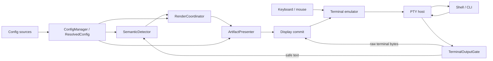

<!--
@dependency-start
contract design
responsibility Defines the ptymark pre-display renderer, terminal-safety, configuration, and runtime ownership boundaries.
upstream design ./configuration.md immutable session configuration contract
upstream design ./renderer-architecture.md engine, coordinator, presenter, and cache abstractions
upstream design ./ui-design.md viewport, resize, theme, and image lifecycle
downstream implementation ../src/terminal.rs terminal output safety gate
downstream implementation ../src/predisplay.rs display interception and commit ordering
downstream implementation ../src/config.rs configuration service
downstream implementation ../src/coordinator.rs rendering orchestration
downstream test ../tests/terminal_compat.rs terminal byte-preservation contract
downstream test ../tests/config_contract.rs configuration-before-child-launch contract
@dependency-end
-->

# ptymark 基本設計

## 位置づけ

`ptymark`の中心責務は、**terminal emulatorが文字列を表示する直前にchild processのoutputを
受け取り、安全に識別できる完成済みsemantic blockだけを表示artifactへ差し替えること**です。
この製品境界を**pre-display renderer**と呼びます。

`ptymark`は次のものではありません。

- terminal emulator
- shell、SSH、tmux、screenの代替
- WezTermの画面描画engine
- input/key/mouse/termios/signal変換layer
- コマンド終了後だけに動くMarkdown viewer
- 任意の`$`や`#`をMarkdownと推測するfilter
- Mermaid、TeX、Typstの新しいlayout/typesetting engine
- committed scrollbackをcursor操作で遡って置換する仕組み

用があるのは**child PTY outputからterminal displayへ向かう一方向**だけです。

## End-to-end boundary



### Input/control plane

次は透過transportの責務であり、rendering configurationの対象外です。

```text
keyboard / paste / mouse  -> child PTY
Ctrl+C / Ctrl+Z / Ctrl+D -> child process / kernel PTY semantics
SIGWINCH / rows / columns -> child PTY
termios / raw / echo      -> kernel PTY
child exit status         -> ptymark exit status
```

### Display plane

child outputだけを次の順で扱います。

```text
raw child bytes
  -> terminal output safety gate
       -> raw control/update region: exact passthrough
       -> safe text region: semantic detector
  -> renderer coordinator
  -> artifact presenter
  -> write_all / flush
```

## 1. Configuration bootstrap

`ConfigManager`はchild launchやterminal mode変更より前に実行します。

```text
built-in defaults
  + user config
  + explicit config
  + profile/session selector
  + CLI override
  -> parse
  -> schema validation
  -> profile resolution
  -> cross-field validation
  -> immutable ResolvedConfig
```

責務:

- source discoveryとtrust/provenance
- strict TOML parse、unknown-key拒否
- `schema_version` boundary
- deterministic mergeとsingle-parent profile inheritance
- typed subsystem policy生成
- unsafe/invalid設定のpre-launch failure

非責務:

- terminalのopen/raw-mode変更
- child process起動
- engine process起動
- output parsing

stream loopはraw TOML tableを読みません。各subsystemは`DetectionPolicy`、`EngineSelectionPolicy`、
`RenderPolicy`、`PresentationPolicy`、`CachePolicyConfig`、`DiagnosticsPolicy`だけを受け取ります。

## 2. PTY host

PTY hostはterminalとchild processの対話性を保つtransport adapterです。

責務:

- child PTY生成とchild process起動
- input bytesのchild PTYへの無加工転送
- child PTY outputの`DisplayInterceptor`への供給
- signal、resize、exit lifecycleの転送
- observed viewport/theme/capabilityのruntime policyへの通知
- failure/exit時のterminal state restoration

非責務:

- Markdown/semantic判定
- diagram/math layout
- cache policy
- artifact presentation
- terminal inputの再解釈

PTY hostは未実装です。現在の`ptymark -- COMMAND`はconfigをpreflightした後の透過`exec`です。

## 3. `TerminalOutputGate`

`TerminalOutputGate`はterminal機能を守る最初の境界です。

```text
child bytes -> OutputSegment::RawTerminalBytes | OutputSegment::SafeText
```

raw passthrough対象:

- ANSI/CSI/SGR
- OSC 8 hyperlink、OSC 133 shell integration、unknown OSC
- DCS、APC、PM、unknown escape sequence
- carriage-return/backspace update region
- cursor-addressed/erase-driven screen output
- alternate-screen region
- binary/unsafe text region

ルール:

- control sequenceをstrip、normalize、再encodeしない
- chunk途中のsequenceを完成までbounded bufferし、original bytesでcommitする
- unsafe state中にsemantic sourceが保留されていればexact sourceを先にflushする
- unknownはtransformではなくpassthroughを選ぶ
- configurationでこのminimum bypass集合を弱められない

現在、pure streaming gateとbyte-exact compatibility testsは実装済みです。PTY runtimeのlive
terminal-state observationとの接続は未実装です。

## 4. `SemanticDetector`

`SemanticDetector`はsafe textだけを次へ分類します。

```text
StreamItem::Passthrough(bytes)
StreamItem::Semantic(SemanticBlock)
```

責務:

- chunk境界をまたぐexplicit syntax boundary
- exact original sourceとengine bodyの保持
- complete Mermaid fenceとblock mathの検出
- line/source byte limit
- unfinished、oversized、disabled kindのlossless passthrough
- ordinary prompt prefixの低遅延release

初期対応:

````markdown


$$
\frac{-b \pm \sqrt{b^2 - 4ac}}{2a}
$$
````

configurationはkindを無効化し、byte limitを厳しくできますが、unsafe terminal regionで強制
transformするoptionはありません。inline mathやgeneral Markdown inferenceは初期runtime対象外です。

## 5. Rendering abstraction

semantic blockのrenderingは次の高位objectへ分離します。

```text
RenderCoordinator
  ├─ EngineSelector
  ├─ EngineRegistry
  ├─ ArtifactCache
  └─ RenderEngine
        -> RenderArtifact
ArtifactPresenter
        -> display bytes / source fallback
```

### `EngineDescriptor` / `RenderEngine`

engineは次を宣言します。

- stable ID/version
- supported semantic kinds
- artifact formats
- layout sensitivity
- execution model: in-process / one-shot / persistent worker

engineはterminal stdoutへ書かず、`RenderArtifact`を返します。

### `RenderCoordinator`

責務:

- typed ordered candidate policy
- presenter accepted formatとのnegotiation
- cache key構築とlookup
- engine attempt/fallback
- artifact identity/format validation
- successful cacheable artifactだけのcache admission
- duration、attempt、fallback、failure metrics

非責務:

- PTY transport
- terminal control parsing
- terminal escape generation
- source fallbackの最終display commit

### Selected existing engines

| Semantic input | Real-time primary | Compatibility/comparator | Artifact |
| --- | --- | --- | --- |
| Mermaid | persistent Mermaid/Puppeteer worker | one-shot Mermaid CLI | SVG |
| TeX block math | persistent MathJax worker | KaTeX | SVG / MathML |
| Typst-native | Typst CLI | source | SVG / PDF |

layout/typesettingは既存engineへ委譲します。`ptymark`はworker lifecycle、timeout、output bound、
cache、fallback、presentationを所有します。

## 6. Independent `ArtifactCache`

cacheはcoordinatorからtraitとして利用し、rendererやUIへ埋め込みません。

```text
ArtifactCache
  ├─ NoopArtifactCache
  ├─ MemoryArtifactCache
  ├─ PersistentArtifactCache   follow-up
  └─ TieredArtifactCache       follow-up
```

key domain:

- semantic source fingerprint/kind
- engine ID/version
- artifact format
- layout sensitivity + relevant viewport geometry
- theme/options fingerprint
- presenter ID/capability fingerprint

invariants:

- failure、timeout、cancel、stale generationをcacheしない
- cache corruptionはmissとして扱う
- no-cache/private backendへ差し替えてもsemantic resultは変わらない
- entry countとtotal bytesをboundedにする
- source bodyをfilename/default logへ出さない

no-opとmemory LRUは実装済みです。disk/tiered backendはIssue #3/#12で追跡します。

## 7. `ArtifactPresenter`

presenterはartifactをactive terminal capabilityへ変換します。

```text
RenderArtifact + TerminalCapabilities + PresentationPolicy
  -> PresentableBytes | source/text fallback
```

責務:

- accepted artifact formats
- verified capabilityによるKitty/iTerm2/Sixel selection
- text/source fallback
- terminal size/themeへのpresentation policy適用
- ptymark-owned image identity/lifecycle

非責務:

- semantic layout
- engine selection
- input/mouse mode
- unverified protocolのforce emission

現在はterminal text/source presenterの骨格を実装済みです。image protocol presenterは未実装です。

## 8. `DisplayInterceptor` / commit point

`DisplayInterceptor`はgate、detector、rendererをordering-preserving pipelineとして接続します。
`std::io::Write::write_all`がterminal display直前のcommit pointです。

commit rule:

1. ordinary/raw bytesは受信順でcommitする。
2. semantic sourceは明示closing boundaryまでcommitしない。
3. closed blockはrendered outputまたはexact sourceの一方だけをcommitする。
4. renderer/presenter failureはdefaultでexact sourceへfallbackする。
5. strict modeはsemantic renderer errorをsurfaceするが、安全分類の不確実性は常にpassthroughする。
6. committed textual scrollbackを遡ってerase/replaceしない。

`PreDisplayReport`はinput、passthrough、semantic、rendered、fallback、bypass、diagnosticsを分離します。

## 9. UI / viewport / resize

`Viewport`はcell geometryとoptional pixel geometryを持ち、engine/artifactは
`LayoutSensitivity`を宣言します。

- `Independent`
- `Columns`
- `Pixels`
- `FullViewport`

uncommitted workは最新viewport generationを使い、stale render resultを破棄します。textとして
committed済みのscrollbackはresizeで書き換えません。image replacementはprotocolがownership、
anchor、delete、pane lifecycleを安全に提供する場合だけ実施します。

pure resize/cache key modelは実装済みです。live generation/debounce/cancellation/image lifecycleは
[Issue #3](https://github.com/iwashita-nozomu/ptymark/issues/3)で追跡します。

## 10. WezTerm plugin

`plugin/init.lua`はthin launcher/capability bridgeです。

責務:

- launch menu/key bindingのappend
- host-native binary/shell/cwdの指定
- `PTYMARK_CONFIG`、`PTYMARK_PROFILE`、`PTYMARK_NO_CONFIG`のsession environment伝達
- `SpawnCommandInNewTab`構築

Rust config schemaをLuaへ複製せず、PTY、detector、engine、cache、presentationをpluginへ置きません。

## 現在の実装範囲

| Boundary | State |
| --- | --- |
| config model/discovery/profile/validation/introspection | 実装済み |
| public command mode preflight + transparent `exec` | 実装済み |
| `ptymark preview` / `demo` | 実装済み |
| terminal output safety gate | pure streaming実装済み |
| explicit bounded detector | 実装済み |
| pre-display ordering/fallback/bypass | 実装済み |
| engine registry/selector/coordinator | 実装済み |
| `RenderArtifact` / text-source presenter | 実装済み |
| no-op / bounded memory artifact cache | 実装済み |
| persistent renderer worker/benchmark harness | 実装済み |
| WezTerm launcher/config selector bridge | 実装済み |
| child PTY host | 未実装 |
| live ANSI/alternate-screen observer connection | 未実装 |
| selected production worker runtime builder | 未実装 |
| terminal image presenters | 未実装 |
| live resize/image lifecycle/persistent cache | Issues #3/#12 |
| project trust/editor schema/migrations | Issues #6/#15 |

## 不変条件

1. input、termios、signal、resize、exit semanticsをrendererが変更しない。
2. terminal control/update outputはoriginal bytes・original orderでcommitする。
3. safety uncertaintyはtransformではなくpassthroughを選ぶ。
4. semantic sourceはcomplete boundaryまでbounded bufferする。
5. closed blockはsourceまたはrendered resultの一方だけをcommitする。
6. unfinished/oversized/unsafe inputはexact sourceへ戻る。
7. renderer/presenter failureはdefaultでexact sourceへ戻る。
8. chunk分割によって最終display bytesが変わらない。
9. WezTerm pluginなしでもRust coreは同じsemantic behaviorを持つ。
10. committed textual scrollbackをcursor trickで置換しない。
11. buffer、process time/output、cache、concurrencyをboundedにする。
12. layout/typesettingを既存engineへ委譲する。
13. engine/version/viewport/theme/presenter capabilityが異なるartifactを同じcache keyで再利用しない。
14. invalid configはchild/terminal mutation前に失敗する。
15. project config/external executableはtrustなしで自動実行しない。

## テスト対応

| Contract | Main tests/checks |
| --- | --- |
| config parse/merge/profile/pre-launch failure | `config::tests`, `tests/config_contract.rs` |
| terminal byte equality/chunk independence | `tests/terminal_compat.rs` |
| detector kind/line/source bounds | `detector::tests` |
| ordinary/pre-display/fallback/bypass | `tests/predisplay_contract.rs` |
| engine selection/fallback/cache | `tests/coordinator_contract.rs` |
| external process timeout/output | `renderer::tests` |
| viewport/cache identity | `ui::tests`, `cache::tests` |
| CLI config/stdout/exit | `tests/cli_contract.rs`, `tests/config_contract.rs` |
| WezTerm selector bridge | `tests/plugin_smoke.lua` |
| engine correctness | `scripts/check-ptymark-renderers.sh` |
| worker/one-shot/cache latency | `scripts/benchmark-ptymark-renderers.sh` |
| canonical environment and all contracts | `.github/workflows/ptymark-ci.yml` |

## 今後の実装順

1. GitHub ActionsでRust 1.97 lock/format/type/test evidenceを確定する。
2. Unix PTY hostとinput/signal/resize transparency testsを実装する。
3. live terminal observerを`TerminalOutputGate`へ接続する。
4. `ResolvedConfig`からengine registry/coordinator/presenter runtimeをbuildする。
5. persistent Mermaid/MathJax worker protocolをproduction adapterへ接続する。
6. generation-aware async queue、cancellation、backpressureを接続する。
7. verified Kitty/iTerm2/Sixel presenterをoptionalに追加する。
8. persistent cache、project trust、source retrieval UIを個別Issueで実装する。

これらを追加しても、configuration、transport、safety gate、detector、coordinator、cache、presenter、
display commitのownership boundaryは維持します。
