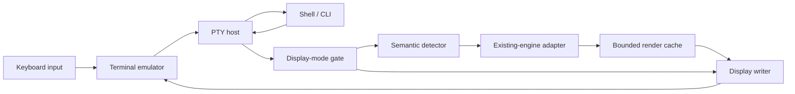

# ptymark 基本設計

## 位置づけ

`ptymark`の中心責務は、**端末エミュレータが文字列を表示する直前に、子プロセスの
出力ストリームを受け取り、確実に識別できる意味ブロックだけを表示用バイト列へ
差し替えること**です。

この製品境界全体を**pre-display renderer**と呼びます。コード上の
`BlockRenderer`は、その中で一つの意味ブロックを変換する部品です。

`ptymark`は次のものではありません。

- ターミナルエミュレータ
- WezTermの画面描画エンジン
- コマンド終了後だけに動くMarkdown viewer
- `$`や`#`を推測でMarkdownとみなす汎用フィルター
- Mermaid、TeX、Typstの新しい組版・レイアウトエンジン
- alternate screenを使うTUIの画面を後から書き換える仕組み

## 表示前境界



子プロセスが書いたバイト列は、端末エミュレータへ届く前に
`PreDisplayRenderer`を通ります。通常出力は同じ順序でそのまま流れ、完成した
意味ブロックだけが`BlockRenderer`の結果へ置き換わります。

## 構成要素と責務

### 1. PTY host

PTY hostは端末と子プロセスの対話性を保つ入出力アダプターです。

責務:

- 子PTYの生成と子プロセス起動
- keyboard inputの子PTYへの転送
- 子PTY outputのpre-display rendererへの供給
- `SIGWINCH`、終了状態、signalの転送
- terminal mode、viewport、theme観測結果の通知

非責務:

- Markdown判定
- Mermaidや数式の組版
- cache policy
- 表示用layout

PTY hostは未実装です。現在の`ptymark -- COMMAND`は公開CLI形を固定する透過
`exec`で、後続変更でこの責務を内部へ追加します。

### 2. Display-mode gate

表示前変換を実行してよい状態かを決めます。

- `Transform`: 意味検出とレンダリングを許可する通常状態
- `Bypass`: 入力を無加工でdisplay writerへ送る状態

将来のPTY hostはalternate screen、バイナリ的出力、または安全に解析できない
terminal stateを検出したときに`Bypass`を選びます。

`Transform`から`Bypass`へ移るときは、detectorが保留中の未完成sourceを先に
そのまま表示へ戻します。切替によって文字列を隠しません。

### 3. `SemanticDetector`

`SemanticDetector`はバイトストリームを次のどちらかへ分けます。

```text
StreamItem::Passthrough(bytes)
StreamItem::Semantic(SemanticBlock)
```

責務:

- chunk境界をまたぐ構文境界の保持
- 完全に閉じたMermaid fenceとblock mathの検出
- original sourceとrenderer bodyの保持
- buffer上限の強制
- 未完成、過大、曖昧な入力のlossless passthrough

非責務:

- 組版・描画
- ANSI色の選択
- 端末への書き込み

初期detectorは行境界を持つ次の記法だけを高確度で扱います。

````markdown


$$
\frac{-b \pm \sqrt{b^2 - 4ac}}{2a}
$$
````

インライン`$...$`やMarkdownらしさの推測は、shell変数・金額・commentとの
誤判定を避けるため初期設計に含めません。

### 4. `BlockRenderer`

`BlockRenderer`は一つの`SemanticBlock`を表示用バイト列へ変換する境界です。

```text
SemanticBlock + RenderContext -> Result<Vec<u8>, RenderError>
```

責務:

- block kindとbodyに応じたdisplay artifact生成
- terminal width、color、backend optionの利用
- existing engine adapterの場合のtimeout、output上限、diagnostic上限

非責務:

- stream境界の検出
- PTY制御
- stdoutへの直接書き込み
- failure時のsource fallback判断
- Mermaid/TeX/Typst layout algorithmの再実装

実装済みrenderer:

- `PreviewRenderer`: dependency-free bootstrap表示
- `SourceRenderer`: original sourceを返すlossless renderer
- `ExternalRenderer`: existing engine wrapper用のbounded stdio adapter

`ExternalRenderer`はbodyをstdinへ渡し、stdoutをartifactとして受け取ります。
renderer ID、block kind、source byte数、color、terminal widthは環境変数でも渡します。
process group、timeout、stdout/stderr上限を管理します。

既存エンジンの初期方針:

| Block | Engine | Candidate artifact |
| --- | --- | --- |
| Mermaid | Mermaid CLI | SVG |
| Markdown/TeX math | KaTeX | HTML / MathML、必要ならChromium image |
| Typst-native input | Typst CLI | SVG / PDF |

### 5. Render cache / viewport

`RenderKey`はsource fingerprint、block kind、renderer ID、viewport、theme、optionを
含みます。

`LayoutSensitivity`:

- `Independent`
- `Columns`
- `Pixels`
- `FullViewport`

`RenderCache`はprocess-localのbounded LRUです。entry countとtotal bytesの両方を
制限し、theme/renderer単位でinvalidateできます。failure/timeout/cancelled resultは
cacheしません。

live resize generation、image placement、persistent cacheは
[Issue #3](https://github.com/iwashita-nozomu/ptymark/issues/3)で追跡します。
詳細は[UI設計](./ui-design.md)を参照してください。

### 6. Display writer

コード上では`std::io::Write`が表示直前のcommit pointです。

責務:

- passthrough bytesまたはrendered bytesを受け取った順に書く
- 部分書き込みを`write_all`で完了させる
- 終了時にflushする

構文解析や再描画判断は行いません。端末へ一度書いた内容を後からcursor操作で
消して置換する設計も採用しません。

### 7. Fallbackとreport

non-strict modeではrendererが失敗したblockのoriginal sourceを表示し、diagnosticを
`PreDisplayReport`へ残します。

strict modeではrenderer errorを呼び出し元へ返し、失敗したblockを表示へcommit
しません。

report:

- input bytes
- ordinary passthrough bytes
- semantic blocks
- rendered blocks
- fallback blocks
- bypass bytes
- diagnostics

### 8. WezTerm plugin

`plugin/init.lua`はpre-display renderer本体ではなく、host-native `ptymark`を
WezTermの新しいtabから起動する薄い統合層です。

責務:

- launch menu entry
- key binding
- binary、shell、cwd、environment設定
- `SpawnCommandInNewTab`構築

PTY、検出、cache、existing-engine adapterはRustコアに置きます。

## 現在の実装範囲

| Boundary | State |
| --- | --- |
| public CLI (`ptymark -- COMMAND`) | 実装済み。現在は透過`exec` |
| `ptymark preview` / `demo` | 実装済み |
| bounded fenced detector | 実装済み |
| pre-display ordering/fallback/bypass | 実装済み |
| preview/source renderer | 実装済み |
| bounded external-engine adapter | 実装済み |
| viewport/resize decision | 実装済み |
| bounded memory render cache | 実装済み |
| WezTerm launcher plugin | 実装済み |
| Mermaid/KaTeX/Typst Docker smoke | 実装済み |
| child PTY host | 未実装 |
| ANSI/alternate-screen observer | 未実装 |
| engine-specific runtime wrappers | 未実装 |
| terminal image backend | 未実装・任意拡張 |
| live resize/image lifecycle/disk cache | Issue #3 |

## 不変条件

1. ordinary outputはbyte-for-byte、同じ順序で表示される。
2. semantic sourceはblockが閉じるまでdisplay writerへcommitしない。
3. closed blockはsourceまたはrendered resultのどちらか一方だけをcommitする。
4. 未完成・過大・曖昧な入力は元sourceへ戻る。
5. renderer failureは既定で元sourceへ戻る。
6. `Bypass`へ切り替える前に保留sourceを失わずflushする。
7. chunk分割方法によって最終表示が変わらない。
8. WezTerm pluginなしでもRustコアは同じ動作をする。
9. 表示済み文字列を後から脆いcursor操作で置換しない。
10. buffer、外部process時間、外部output、cache memoryには上限を設ける。
11. 図・数式layoutは既存エンジンに委譲する。
12. viewport/theme/renderer optionが異なるartifactを同じcache keyで再利用しない。

## テスト対応

| Design contract | Main tests |
| --- | --- |
| detector chunk independence | `detector::tests`, `tests/predisplay_contract.rs` |
| ordinary passthrough | `ordinary_output_reaches_display_byte_for_byte` |
| pre-display replacement | `complete_semantic_block_is_replaced_before_display` |
| renderer fallback/strict | `renderer_failure_restores_original_source_by_default`, `strict_mode_surfaces_renderer_error` |
| unfinished/over-limit losslessness | `incomplete_block_is_never_hidden`, `buffer_limit_degrades_to_lossless_passthrough` |
| bypass transition | `bypass_mode_flushes_pending_source_before_direct_display` |
| existing-engine process safety | `renderer::tests` timeout/output/stdio tests |
| viewport/cache | `ui::tests` |
| CLI stdout/exit contract | `tests/cli_contract.rs` |
| WezTerm integration shape | `tests/plugin_smoke.lua` |
| Mermaid/KaTeX/Typst environment | `scripts/check-ptymark-renderers.sh` |

## 今後の実装順

1. Unix PTY hostとresize/signal forwarding
2. ANSI parserとalternate-screen observer
3. `PreDisplayRenderer`を子PTY output経路へ接続
4. Mermaid CLI、KaTeX、Typst wrapper/adapters
5. generation-aware async queue/cancellation
6. Kitty/iTerm2/Sixelなどoptional image backend
7. Issue #3のpersistent cacheとsource retrieval UI

この順序でも`PreDisplayRenderer`、`SemanticDetector`、`BlockRenderer`、display writerの
境界は変更しません。
