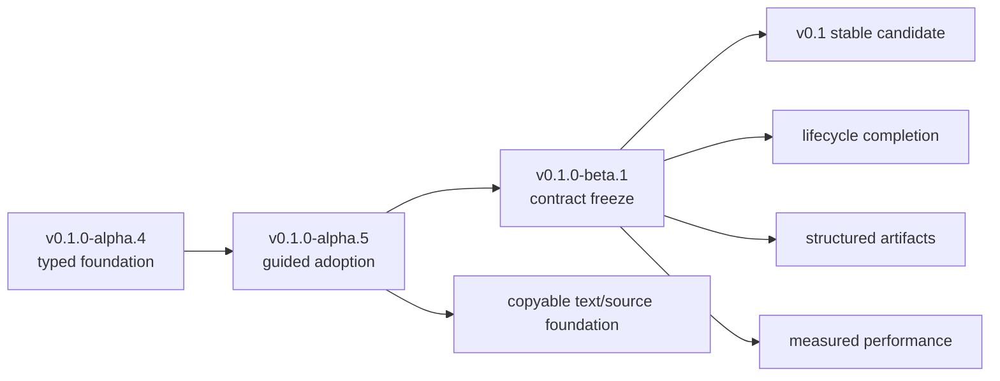

# Roadmap from v0.1.0-alpha.4 to Beta

<!--
@dependency-start
contract roadmap
responsibility Defines the bounded Alpha.5 and Beta release trains after the typed Alpha.4 foundation.
upstream design ../README.md product status and source-only distribution
upstream design ./alpha4-design.md typed configuration and internal-policy separation
upstream design ./release.md immutable source-only publication
downstream implementation ../verification/manifest.toml merge and release evidence phases
@dependency-end
-->

## Baseline: v0.1.0-alpha.4

Alpha.4 establishes the implementation foundation used by both later trains:

- schema-v2 user configuration with named profiles and deterministic schema-v1 migration;
- portable user intent separated from machine-local installation state;
- canonical `ptymark shell -- COMMAND` with the Alpha.3 form retained as a compatibility alias;
- maintained CLI, serialization, XML, path, temporary-file, and LRU infrastructure;
- bounded terminal-control parsing and structural artifact validation;
- transactional configuration/install-state publication;
- product-owned CI without inherited repository-template or agent-runtime gates.

Alpha.4 remains a source-only prerelease. The release does not promise signed packages, lifecycle mutation, persistent workers/cache, or terminal image protocols.

## Release train



## v0.1.0-alpha.5 — guided adoption and text-first usability

### Product goal

A new user can build from reviewed source, complete one deterministic setup/self-test, launch a named-profile session, render real Mermaid and math, diagnose failures, and recover exact source without manually reconstructing configuration or installation-state paths.

### Committed scope

1. **Fresh-source acceptance**
   - add one isolated Linux/WSL-style end-to-end path from source installer to real PTY rendering;
   - use a fresh home and isolated config/data/state/cache directories;
   - prove that no global Node.js command or pre-existing Ptymark state is required;
   - retain bounded, redacted failure evidence.

2. **Guided setup and self-test**
   - provide one explicit setup/check command or equivalent bounded flow;
   - keep read-only checking network-free;
   - identify the exact failed stage and remedy;
   - never overwrite an existing user configuration or terminal integration silently.

3. **Configuration and installation-state usability**
   - expose selected config/state paths and matching status clearly;
   - document and test `PTYMARK_CONFIG`, `PTYMARK_INSTALL_STATE`, and named-profile precedence;
   - add canonical minimal, private, source/SSH, and deterministic-CI examples;
   - preserve the schema-v2 portability boundary introduced in Alpha.4.

4. **WezTerm onboarding**
   - generate or document a collision-safe named-profile launcher;
   - preserve existing keys and launch-menu entries;
   - validate binary/config/profile argv across Linux, macOS, WSL, and Windows;
   - keep Lua as a thin launcher rather than a second policy engine.

5. **Text/plain/CJK and source retrieval foundation**
   - make `auto`, `symbols`, `plain`, and `source` behavior deterministic;
   - respect monochrome and `NO_COLOR` operation;
   - add grapheme-safe clipping/wrapping fixtures for Japanese/CJK, combining characters, emoji, and ambiguous width;
   - specify a bounded in-memory exact-source retrieval contract without automatic clipboard mutation or default disk persistence.

6. **Surface and compatibility cleanup**
   - define the supported Rust library surface and reduce accidental public exports;
   - assign an owner and removal release to Alpha compatibility entrypoints;
   - prevent CI/docs from preserving obsolete wrappers indefinitely.

### Explicit non-goals

- rich Kitty/iTerm2/Sixel image placement;
- persistent renderer workers or disk cache;
- automatic project-local configuration trust;
- signed/notarized/package-manager distribution;
- complete upgrade/rollback/uninstall/purge lifecycle;
- the full multi-variant structured-artifact redesign.

### Alpha.5 exit criteria

- all merge-phase verification is green on Ubuntu, macOS, Windows, and canonical Docker;
- the fresh-source acceptance passes from an isolated home;
- a user can discover the active config/state/profile and run a real self-test;
- Japanese/CJK/plain/source fixtures have deterministic expected output;
- no user-owned file, shell profile, terminal config, or global `PATH` is modified without an explicit command;
- release metadata, changelog, docs, and issue tracker identify the exact shipped scope;
- the GitHub prerelease has zero project-uploaded executable assets.

## v0.1.0-beta.1 — lifecycle completion and contract freeze

### Product goal

Ptymark becomes feature-complete for the intended v0.1 stable line: users can install, inspect, use, recover, upgrade, roll back, and remove it under a frozen public contract while structured content remains copyable and terminal safety remains byte-exact.

### Committed scope

1. **Lifecycle completion**
   - dry-run/check, atomic upgrade, failed-upgrade recovery, offline rollback, owned-file uninstall, and explicit purge;
   - versioned install-state ownership and migration;
   - no deletion of unrelated files and no silent shell-profile/global-`PATH` mutation.

2. **Configuration contract freeze**
   - freeze discovery, precedence, named profiles, session overrides, migration, and introspection semantics for the v0.1 line;
   - add source spans/key paths where practical and machine-readable editor schema;
   - define project-local trust before allowing executable-affecting configuration;
   - preserve one immutable resolved snapshot per active session.

3. **Copyable structured-artifact minimum**
   - introduce a typed multi-variant artifact boundary with a legacy byte adapter;
   - retain exact TeX, OpenMath, and Mermaid source identity after successful presentation;
   - provide a copyable terminal-cell/plain representation for the supported math subset;
   - add bounded session-owned source lookup and explicit source/copy actions;
   - keep SVG/image variants optional and never the only surviving representation.

4. **Measured runtime performance**
   - define representative cold, warm, and cache-hit fixtures;
   - add persistent workers only where measurements justify the added lifecycle complexity;
   - publish p50/p95 targets and cancellation/recycle behavior;
   - keep one-shot paths as bounded fallbacks.

5. **Compatibility and accessibility matrix**
   - qualify direct terminals, SSH, tmux, WSL, Windows ConPTY, macOS, monochrome, narrow terminals, and screen-reader/plain paths;
   - distinguish contract fixtures from live upstream-version evidence;
   - require exact-source fallback for every unsupported capability.

6. **Release-channel decision**
   - keep source-only as the default until signing, notarization, package ownership, incident response, revocation, and support responsibility are approved together;
   - Beta may ship source-only, but the stable-release channel decision must be explicit and documented.

### Explicit non-goals for Beta.1

- claiming universal terminal image support;
- unbounded or default-persistent source history;
- automatic clipboard writes during rendering;
- remote rendering services or network engines;
- silently loading executable project configuration;
- declaring stable status before the lifecycle and compatibility gates pass.

### Beta.1 entry criteria

- Alpha.5 has been released and its adoption/self-test path has real evidence;
- all compatibility aliases have an explicit Beta/stable disposition;
- the structured-artifact public behavior is reviewed before implementation;
- lifecycle ownership and rollback formats are versioned;
- no open correctness or terminal-safety regression is classified release-blocking.

### Beta.1 exit criteria

- lifecycle commands pass destructive-operation tests in isolated Linux, macOS, and Windows environments;
- configuration and install-state migrations are recoverable and documented;
- copyable math/source retrieval works through real PTY and ConPTY sessions without hidden scrollback payloads;
- merge and release verification phases are green on the exact release commit;
- dependency, CodeQL, installer, managed renderer, package smoke, and source-only metadata checks pass;
- the remaining stable-release work is limited to documented defects, performance tuning, and approved distribution-channel tasks rather than missing core lifecycle contracts.

## Dependency order

```text
Alpha.4 release
  -> fresh-source acceptance and path/state UX
  -> guided setup + WezTerm onboarding
  -> text/plain/CJK + bounded source retrieval foundation
  -> Alpha.5 release
  -> lifecycle mutation and rollback
  -> configuration/public-contract freeze
  -> typed structured-artifact minimum
  -> measured worker/performance decisions
  -> Beta.1 release
```

## Governance

- release trackers own immutable version checklists; narrow issues own implementation and tests;
- roadmap items are not marked complete until merged, tagged, and independently verified;
- terminal byte preservation, exact-source fallback, child argv boundaries, PTY/ConPTY behavior, privacy, deadlines, and output bounds remain non-negotiable across both trains;
- image protocols, persistence, and trusted binary channels require separate evidence and cannot bypass the copyable/source path;
- scope changes must update this document, the canonical roadmap issue, and the relevant release tracker in the same reviewed change.
