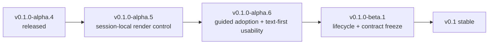

<!--
@dependency-start
contract reference
responsibility Defines the bounded release sequence from the released Alpha.4 baseline through Beta.1.
upstream design ../README.md user-facing product status
upstream design ./release.md immutable source-only release contract
upstream design ./interactive-session.md transient rendering-control contract
downstream environment ../.github/workflows/ptymark-ci.yml merge evidence
downstream environment ../.github/workflows/ptymark-release.yml source prerelease publication
downstream implementation ../tests/render_toggle_contract.rs cross-platform session evidence
@dependency-end
-->

# Ptymark release roadmap: Alpha.5, Alpha.6, and Beta.1

## Released baseline: v0.1.0-alpha.4

`v0.1.0-alpha.4` was published on 2026-08-03 from reviewed main commit
`c8d96846bcd968d3b55d39c995b2afbd130240a7`.

The baseline includes:

- native Unix PTY and Windows ConPTY hosting;
- explicit Mermaid, TeX block-math, and OpenMath detection;
- exact-source, safe, and private session modes;
- terminal-control and alternate-screen byte preservation;
- typed TOML schema v2 and machine-local installation state;
- transactional configuration/state publication;
- bounded renderer, parser, artifact, and pending-output policy;
- source-only GitHub prereleases with no project-uploaded executable assets.

Release trackers and narrow issues remain the operational source of truth. This document records
release boundaries and dependency order; it does not mark work complete by itself.

## Release sequence

## v0.1.0-alpha.5: session-local rendering control

Canonical tracker: #147. Feature contract: #151.

### Objective

Allow a user to pause and resume semantic rendering inside one active `ptymark shell` session
without changing user TOML, machine-local install state, shell profiles, or the child process.

### Committed scope

1. **Private input control**
   - reserve the exact four-byte UTF-8 encoding of private-use scalar `U+10FFFD`;
   - consume only an exact match;
   - recognize the sequence across arbitrary read boundaries;
   - forward partial and mismatching prefixes byte-for-byte;
   - forward Escape immediately and keep all input except the reserved scalar byte-exact.
2. **Safe display transition**
   - start each session with rendering enabled;
   - discard the transient state when the session exits;
   - restore any partially detected block as exact source when rendering is disabled;
   - bypass semantic replacement while disabled but retain the terminal safety gate;
   - resume only at a valid logical-line boundary;
   - allow a renderer already executing at the time of the key press to finish.
3. **WezTerm integration**
   - append a `CTRL|SHIFT|ALT+R` toggle binding by default;
   - allow a custom `render_toggle_key` table or `false` to disable it;
   - retain all existing `config.keys` and `config.launch_menu` entries;
   - keep Lua limited to sending `U+10FFFD`; native Rust owns policy and state.
4. **Evidence**
   - input-filter unit tests for every split point, mismatch, EOF prefix, and repeated toggle;
   - display-pipeline tests for disable, exact-source restoration, safe resume, and mid-line protection;
   - real Unix PTY and Windows ConPTY transition evidence;
   - executable WezTerm Lua smoke coverage;
   - synchronized README, design, examples, changelog, and release notes.

### Non-goals

- persistent or project-level rendering state;
- runtime mutation of configuration files;
- a general terminal command protocol;
- status injection into child output;
- guided setup, CJK completion, lifecycle commands, structured-artifact redesign, or image protocols.

### Exit gates

- all selected product checks pass on the exact candidate commit;
- formatting and Clippy pass with warnings denied;
- Ubuntu, macOS, and Windows Rust/test matrices pass;
- canonical Docker, WezTerm, installer, managed-renderer, shell-coexistence, CodeQL,
  dependency, package-smoke, and release-metadata checks pass;
- immutable tag `v0.1.0-alpha.5` and matching source-only prerelease are verified;
- the prerelease has zero project-uploaded assets and the temporary release branch is removed.

## v0.1.0-alpha.6: guided adoption and text-first usability

Canonical tracker: #152.

The broader adoptability work previously proposed for Alpha.5 moves here so that the small session
control can be reviewed and released independently.

### Planned scope

- bounded setup/self-test and collision-safe WezTerm guidance;
- read-only, network-free check mode with exact failed stage and remedy;
- effective configuration, path, profile, engine provenance, and install-state inspection;
- deterministic auto/symbols/plain/source behavior;
- `NO_COLOR`, monochrome, CJK, grapheme, combining-character, emoji, and ambiguous-width coverage;
- SSH, tmux, narrow terminal, redirected log, and screen-reader/plain qualification;
- explicit Beta disposition for Alpha compatibility aliases;
- continued dead-code and speculative-abstraction reduction with call-site evidence.

Alpha.6 must preserve the Alpha.5 transient-control contract and all earlier byte-exact, fallback,
privacy, deadline, and PTY/ConPTY guarantees.

## v0.1.0-beta.1: lifecycle completion and contract freeze

Canonical tracker: #148.

Beta.1 begins only after Alpha.6 is published and verified. Its required outcomes are:

- dry-run/check, atomic upgrade, failed-upgrade recovery, offline rollback, uninstall, and purge;
- versioned ownership and migration formats;
- a frozen v0.1 configuration and compatibility contract;
- the minimum copyable structured-artifact boundary from #124;
- measured renderer/cache performance and justified worker lifecycle;
- a complete compatibility/accessibility matrix;
- an explicit source-only versus approved signed-channel decision.

After Beta.1, the stable-line backlog should contain defects, measured tuning, compatibility
qualification, and approved distribution work—not missing core install/use/recovery contracts.

## Cross-release principles

1. Preserve child and terminal bytes unless a complete explicit semantic block is safely recognized.
2. Keep transient session state separate from portable user intent and machine-local installation state.
3. Never silently edit shell profiles, global `PATH`, terminal configuration, or clipboard contents.
4. Keep source/copyable output a normal path; image protocols cannot become the sole representation.
5. Prefer maintained libraries when they delete generic custom infrastructure without weakening bounds.
6. Introduce abstractions only for multiple real implementations or an accepted near-term second use.
7. Do not call a release complete until merge, tag, prerelease, zero-asset state, and release cleanup are verified.
8. Release tags are immutable; every correction uses a higher version.
