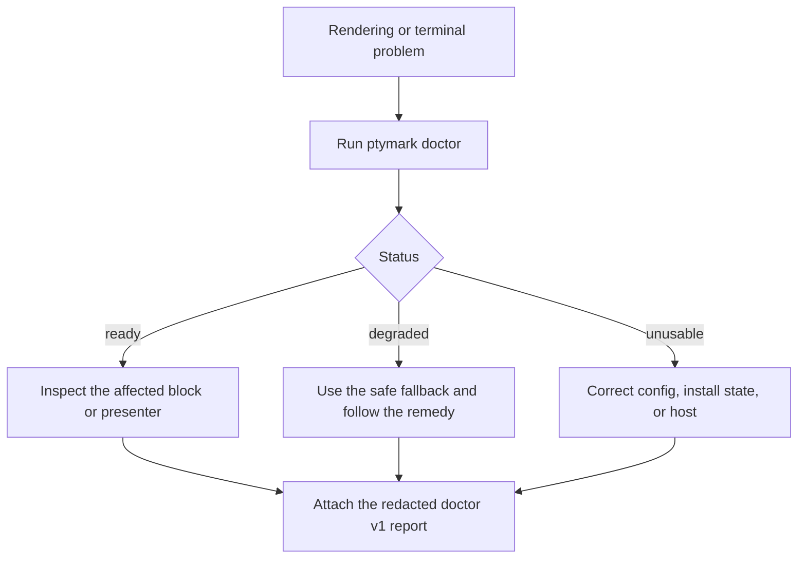

<!--
@dependency-start
contract reference
responsibility Documents public-safe diagnosis, recovery, and support-report handling for doctor v1 and bounded renderer failures.
upstream implementation ../src/doctor.rs implements doctor and support-report behavior
upstream implementation ../src/render.rs enforces bounded rendering and exact-source recovery
downstream environment ../.github/ISSUE_TEMPLATE/bug-report.yml routes redacted public support intake
@dependency-end
-->

# Troubleshooting and public-safe support reports

`ptymark 0.1.0-alpha.2` adds one side-effect-free diagnosis path:

```text
ptymark doctor
ptymark doctor --json
ptymark doctor --support-report PATH
ptymark doctor --config PATH
```

Default doctor inspection does not install or download dependencies, use the network, launch a renderer or browser, start a PTY/ConPTY child, or mutate configuration, installation state, cache, shell profiles, terminal configuration, or other user files.

## Status and exit codes

| Status | Exit code | Meaning |
| --- | ---: | --- |
| `ready` | `0` | The selected configuration is usable. |
| `degraded` | `10` | Ptymark remains usable through an explicit fallback or without an optional capability. |
| `unusable` | `20` | The selected configuration, required host, or strict path cannot operate. |

Syntax and CLI usage errors retain exit code `2`.

## Diagnosis flow



## Redaction contract

The JSON root schema is `ptymark.doctor.v1`. Public-by-default human, JSON, and support-report output excludes or redacts:

- semantic source and excerpts;
- child environment and command history;
- credentials, tokens, cookies, and configured secret values;
- raw renderer stderr that may echo source;
- home, XDG, and platform application-data prefixes where practical;
- terminal control bytes and invalid byte sequences.

Do not paste an unrestricted environment dump or raw renderer stderr to compensate for omitted data. Security vulnerabilities or accidental credential exposure belong in the private GitHub Security Advisory flow.

## Immediate recovery modes

These modes retain the real PTY/ConPTY host while changing only rendering policy for the invocation:

```text
ptymark --source -- COMMAND   # detect blocks, display exact source
ptymark --safe -- COMMAND     # bypass semantic detection and external rendering
ptymark --private -- COMMAND  # keep rendering, disable cache/persistent diagnostics
```

The same options work with `preview` and the pipe-oriented `run -- COMMAND` path where applicable. `--source` and `--safe` are mutually exclusive; `--private` may be combined with either.

## Bounded renderer recovery

Each external render/presentation attempt has a ten-second monotonic hard deadline and bounded output. Later terminal output held behind one unresolved semantic block is limited to one MiB. In non-strict mode, timeout, output-limit, process, invalid-artifact, or presentation failure restores exact source and then releases later output in original order. Failed or cancelled results are not cached.

Given:

```text
ordinary A
semantic block B
ordinary C
```

visible order remains:

```text
A
rendered result or exact source for B
C
```

A renderer timeout never terminates the user's PTY/ConPTY child process.

## Attaching a report

Generate a new report path; existing files are not overwritten:

```bash
ptymark doctor --support-report ./ptymark-support.json
```

```powershell
ptymark doctor --support-report .\ptymark-support.json
```

Review the report before attaching it. When doctor cannot start, report the exact `ptymark --version`, operating system/architecture, invocation path, and a safe minimal reproduction instead.
