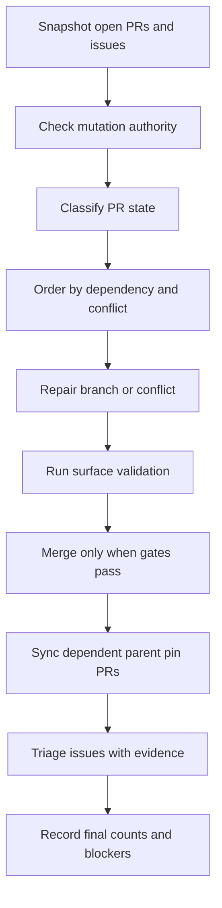

# pr-processing
<!--
@dependency-start
contract skill
responsibility Documents PR Processing Skill for this repository.
upstream design ../canonical/skills.md skill canon registry
upstream design ../workflows/pr-queue-cleanup-workflow.md AgentCanon source and parent pin PR cleanup workflow
upstream design ../workflows/agent-canon-pr-workflow.md AgentCanon source PR workflow
upstream design ../../documents/agent-canon-update-route.md AgentCanon source PR versus parent pin route
upstream design result-artifact-writeout.md run-local result artifact writeout contract
upstream implementation ../../tools/agent_tools/bootstrap_agent_run.py creates run-local report bundles
upstream implementation ../../tools/agent_tools/github_publish.py publishes PRs and writes summary artifacts
downstream implementation ../../.agents/skills/pr-processing/SKILL.md exposes this workflow as a runtime skill
downstream implementation ../../tools/agent_tools/check_convention_compliance.py validates PR Essence workflow markers
@dependency-end
-->

## Reader Map

- Purpose: process GitHub PR and Issue queues with authority, validation,
  evidence, and AgentCanon source/parent-pin separation.
- Section path: Purpose, Use When, and Boundary define scope; Processing Graph
  shows the high-level flow; PR Log Report Contract and Procedure define
  operational evidence; AgentCanon Queue covers source/pin coordination.
- Use when: a user asks to inventory, repair, merge, publish, ready, or triage
  PRs/issues with durable run-bundle and PR Essence evidence.
- Boundary: this skill fixes PR/Issue order and evidence; code repair is routed
  to the relevant implementation or review skill.

## Purpose

GitHub PR と Issue queue を、権限・検証・証跡を省いた直接 merge ではなく、
inventory、authority、conflict、validation、merge、Issue 処理、closeout evidence の順に
処理します。

この skill は、PR / Issue 処理の実行順と証跡を固定します。個別のコード修正は
対象 surface に応じて `python-review`、`cpp-review`、`md-style-check`、
`agent-canon-update` などへ接続します。

## Use When

- user が PR を処理、merge、conflict 解消、queue cleanup、ready 化するよう求めた
- open PR の依存順、merge 順、branch protection、required checks を整理する
- AgentCanon source PR と template / derived repo の parent pin PR を連動処理する
- GitHub Issue と local issue ledger の stale / duplicate / resolved 判定を行う
- PR body、evidence comment、run bundle に merge 判断の証跡を残す
- PR Essence として problem / user request、design intent、canonical owner、
  behavior or contract delta、evidence route を PR body と run bundle に残す

## Boundary

- GitHub / repo の mutation authority は、この skill が勝手に作りません。merge、
  close、ready 化、branch delete、review dismissal は current user request または
  tracked maintainer policy が必要です。
- conflict 解消の実装そのものは通常の task workflow の責務です。この skill は、
  どの PR をどの順番で直し、どの validation を通してから merge するかを固定します。
- AgentCanon source PR と parent pin PR がつながっている場合は、
  `agent-canon-update` と `pr-queue-cleanup-workflow.md` を使い、source merge と
  parent pin 同期を分けます。

## Processing Graph

## PR Log Report Contract

PR 作成 / 更新は、GitHub 上の PR body だけでなく run-local report も同時に
更新します。active run bundle が無い場合は、PR 操作前に
`python3 tools/agent_tools/bootstrap_agent_run.py --task "<task>" --owner codex --workspace-root "$PWD"`
を実行し、bootstrap output の `RUN_ID`、`REPORT_DIR`、
`AGENT_CANON_PREFLIGHT_*` を `work_log.md` または `workflow_monitoring.md`
に残します。

run bundle には次を置きます。

- `pr_body.md`: agent が確認した最終 PR body
- `pr_body.md` の `PR Essence`: problem / user request、design intent、
  canonical owner、behavior or contract delta、evidence route
- `github_publish.json`: `github_publish.py publish-pr --summary-out` の機械可読結果
- `pr_checks.*` または `workflow_monitoring.md`: `gh pr checks` / `github_publish.py checks` の要約
- `work_log.md` または `pr_processing_log.md`: PR number / URL、branch、head SHA、mutation authority、check summary、Issue action、blocker、次 action

PR body を更新したら、同じ内容または要約を run bundle にも反映します。
run bundle に無い判断を PR body だけに置かず、PR body に無い validation /
authority 判断を chat だけで完了扱いにしません。

`PR Essence` は validation list とは別枠です。PR body と run bundle の同じ
section に、user が求めた問題、採用した design intent、正本として更新した
canonical owner、behavior or contract delta、検証や Issue へ接続する evidence
route を短く書きます。

## Procedure

1. Run bundle と PR log report を固定します。
   - 既存の `REPORT_DIR` または `reports/agents/.active_run` を確認する
   - 無ければ `bootstrap_agent_run.py` で作る
   - `work_log.md` に bootstrap output、routing declaration、PR task summary を残す
   - `pr_body.md` と `github_publish.json` の path を決める
   - `pr_body.md` の `PR Essence` に problem / user request、design intent、
     canonical owner、behavior or contract delta、evidence route を書く
1. Queue snapshot を作ります。
   - `gh pr list --state open --json number,title,headRefName,baseRefName,isDraft,mergeable,reviewDecision,statusCheckRollup,updatedAt`
   - `gh issue list --state open --json number,title,labels,updatedAt,url`
   - 必要な PR は `gh pr view <n> --json ...` と `gh pr checks <n>` で詳細を見る
1. Mutation authority を分けます。
   - read inspection
   - branch update / conflict repair
   - PR body or comment update
   - mark ready
   - merge
   - issue close / reopen / label update
1. PR を状態分類します。
   - `ready`: mergeable、green、non-draft、blocking review なし
   - `behind`: strict checks のため base 追随が必要
   - `conflicting`: head branch 上で conflict 解消が必要
   - `draft`: ready 化 authority と evidence が必要
   - `checks-failing`: failure log と修正 surface が必要
   - `review-blocked`: requested changes / review request が残っている
   - `dependent-pin`: source PR merge 後の parent pin / root view PR
   - `stale`: base、目的、Issue、既存 main との差分を再判定する
1. `checks-failing` または branch repair 後の validation failure では、修正前に
   `failing_contract`、`observation_level`、`cause_classification`、
   `intent_preservation`、`evidence` を PR log または run bundle に記録します。
   pass 目的の単純化、revert、intended behavior / test 削除、oracle weakening、
   validation downscope は、この分類なしに merge gate へ進めません。implementation
   bug は PR Essence の intent を保持して修復し、oracle / spec、fixture /
   environment / stale artifact、unrelated failure、approved-design / user-request
   conflict は owner route、residual、または escalation に分けます。
1. requested-change review や rejecting review は、head branch の修正 signal
   であり、PR Essence、user request、または design intent を戻す権限ではありません。
   branch repair は元の意図を保持して行い、slice を revert / discard する場合は
   撤回、置換、owner 外、unsafe replacement、または escalation の evidence を
   PR log または run bundle に残します。
1. PR diff intake を固定し、必要な差分修正を取り込み前に行います。
   - target base に対する head diff を確認する
   - diff を PR Essence、user request、canonical owner、validation route と照合する
   - missing、stale、unintended、over-broad な diff entry は head branch 上で修正する
   - 修正した path、保持した差分、取り込まない差分と理由を PR log または run bundle に記録する
   - parent pin PR では source PR 取り込み後の pin / root-view 差分も同じ diff intake に通す
1. Merge order を決めます。
   - shared source PR を先に処理する
   - AgentCanon source PR は parent pin PR より先に merge する
   - 同じ root/runtime surface に触る PR は一つずつ main に取り込む
   - conflict は、先に入れる PR が確定してから後続 PR の head branch で解く
1. Conflict repair は head branch 上で行います。
   - `git fetch origin`
   - `git switch <head-branch>`
   - `git merge origin/<base>` または repo の標準 update route
   - conflict は `ours` / `theirs` の機械選択ではなく、semantic integration として扱う
   - merge base、head branch の意図、incoming base 側の意図、owning contract、validation surface を確認する
   - 各 side から保持する clause、書き換える clause、意図的に捨てる clause と理由を PR log または run bundle に記録する
   - conflict file は両 branch の意図と owning contract を統合して直し、対象 validation を rerun する
   - force push は explicit authority がある場合だけ使う
1. Merge gate を確認します。
   - PR is open
   - PR is not draft
   - mergeable
   - required checks pass
   - blocking review なし
   - PR Essence と validation evidence が PR body、comment、または run bundle にある
   - `documents/BRANCH_SCOPE.md` の範囲分割契約に従い、PR が一つのレビュー単位であること、または複数の差分単位の範囲表と分割判断が PR body、comment、または run bundle にある
   - repo の GitHub automation authority fields が必要なら visible になっている
1. Issue を処理します。
   - resolved: merge PR / commit / policy reference を書いて close
   - duplicate: canonical issue を示して close
   - obsolete / not planned: なぜ現在の責務に残さないかを書く
   - active: residual work、owner、next validation を追記して open のまま残す
   - local issue ledger は削除せず、`issues/closed/` など正本の lifecycle に従う
1. Closeout を残します。
   - PR action table
   - Issue action table
   - merge SHA
   - remaining blockers
   - validation commands
   - bootstrap report dir
   - PR body artifact
   - publish / checks summary artifact
   - final open PR count
   - final open Issue count

## AgentCanon Queue

AgentCanon source PR と template / derived PR が連動している場合は、次を固定します。

1. Source PR を先に green にする。
1. Source PR を merge する。
1. Parent repo で `make agent-canon-ensure-latest` を実行する。
1. `bash tools/sync_agent_canon.sh link-root` と `check` を通す。
1. Parent pin / root-view diff を PR Essence と source PR の最終差分に照合し、必要な差分修正を head branch 上で行う。
1. Parent pin / root-view PR を作るか更新する。
1. Parent PR gate を通してから ready / merge 判断を行う。

この細部は `agents/workflows/pr-queue-cleanup-workflow.md` を正本にします。
