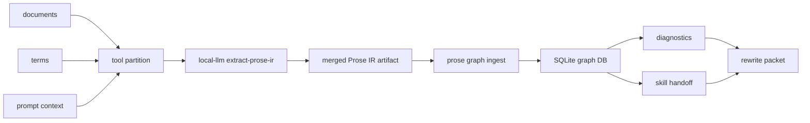
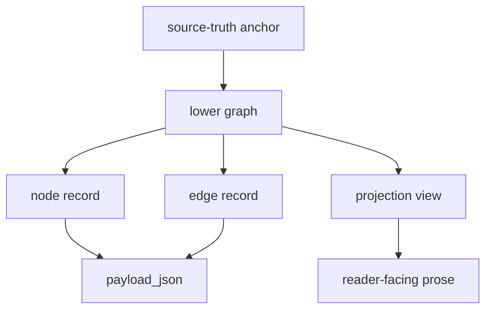

# Local LLM Analysis Design

<!--
@dependency-start
contract reference
responsibility Documents local LLM responsibility review, implementation-surface routing, prose IR extraction, graph handoff, and result-surface boundaries.
coverage local_llm_design_trace requires command surface; result surface; authority boundary; prompt contract; implementation surface routing; Prose IR|intermediate representation; graph DB|SQLite|nodes table; skill integration
upstream design responsibility-scope-management.md responsibility scope policy
upstream design rust-agent-tool-migration.md compiled tool installation boundary
upstream design prose-reasoning-graph/dsl-spec.md prose graph DSL and IR vocabulary
upstream design search-coordination.md local LLM search provider routing
upstream design ../CONTAINER_OPERATIONS.md devcontainer and Dockerfile ownership boundary
downstream environment ../.devcontainer/post-create.sh installs llama.cpp under AGENT_CANON_TOOLS_HOME
downstream implementation ../rust/agent-canon/src/local_llm.rs runs the Rust CLI local LLM commands
downstream implementation ../tools/agent_tools/prose_reasoning_graph.py consumes LocalLLM prose IR
downstream implementation ../tools/agent_tools/file_responsibility_llm.py keeps the Python compatibility prompt helper
downstream implementation ../tests/agent_tools/test_prose_reasoning_graph.py validates LocalLLM prose IR ingestion
downstream implementation ../tests/agent_tools/test_file_responsibility_llm.py tests compatibility prompt limits
@dependency-end
-->

この文書は `agent-canon local-llm` の設計正本です。
Local LLM は advisory な抽出器です。repo policy、依存 closure、CI、
PR readiness、citation approval、document acceptance を決める authority
ではありません。

Local LLM は CPU-only runtime です。AgentCanon の一般的な実験 / 数値計算
profile は GPU を使えますが、`agent-canon local-llm` と互換 Python helper は
llama.cpp を CPU-only build にし、subprocess 実行時にも CUDA / NVIDIA container /
HIP / ROCr device を隠します。`AGENT_CANON_LLAMA_CPP_CUDA=auto|1|cuda` は
互換入力として受け付けますが、GPU build や GPU 実行を有効化しません。
`AGENT_CANON_LLAMA_CPP_CMAKE_ARGS` から GPU accelerator を有効化する CMake
flags を渡した場合も、installer は失敗させます。

## この文書の読み方

この設計は、local LLM がどの reader / agent を支援し、どの責務を持ち、どの system flow と command surface で Prose IR や graph へ接続するかを説明します。読者、設計原則、責務を先に読み、実装や運用では System Flow、Command Surface、Prose IR Contract、Part 分割と Merge、Prompt Contract、Graph 接続へ進みます。Result Surface、Runtime、Prohibited Use、Validation、Compatibility は、出力の扱いと禁止境界を確認するときに使います。

## 読者

- 実装者:
  Rust CLI、prompt、IR schema、prose graph 連携を変更するときに読みます。
- tool / skill 設計者:
  Local LLM の出力をどこまで信頼し、どこから graph checker や reviewer に渡すかを確認します。
- runtime agent:
  通常はこの文書を読みません。runtime agent は `$prose-reasoning-graph` skill
  と tool の compact result surface を通じて black box として使います。

## 設計原則

- 決定論的に規定できる処理は agent task ではなく tool task です。
- Local LLM は source document や corpus term を直接正本化せず、structured IR を返します。
- 実装前の置き場所判定は、agent の印象ではなく tool が責務候補を構造化し、Local LLM はその候補を advisory に解釈します。
- tool stdout は stats と artifact path に絞り、巨大 JSON や graph 全体を chat に流しません。
- corpus 管理と既存文書からの DSL seed 抽出は、固定辞書ではなく Local LLM task です。
- Local LLM の候補は prose graph DSL、dependency header、structured-analysis、
  reviewer の verification route で検証します。
- 未確定の論理接続は settled claim に変換しません。diagnostic candidate と verification
  route として残します。

## 責務

Local LLM command surface が担う責務は 3 つです。

- `classify-responsibility`:
  単一 file の責務記述を advisory に確認します。
- `route-implementation-surface`:
  実装前に、repo / directory / tool / skill / workflow / root instruction /
  document / report surface のどこを primary owner とするかを構造化します。
  llama.cpp が使えない場合は環境構築ミスとして error schema を返し、
  implementation path の選択へ進ませません。
- `extract-prose-ir`:
  複数 document と複数 term から Prose IR を抽出し、graph seed と corpus hint を返します。

責務外の処理は次です。

- repo-wide ownership の確定。
- dependency closure の確定。
- 実装承認、PR readiness、merge 判断。
- prose graph diagnostics の採否。
- rewrite の採否。
- reviewer / workflow の承認判断。

## System Flow



この流れでは、Local LLM output は `merged_ir` までです。graph DB に入った後の
node、edge、diagnostic、edit operation、projection view は
`prose_reasoning_graph.py` と DSL spec の責務です。

## Command Surface

### classify-responsibility

```bash
agent-canon local-llm classify-responsibility path/to/file.py
```

prompt inspection:

```bash
agent-canon local-llm classify-responsibility \
  --print-prompt \
  path/to/file.py
```

この command は単一 file だけを受けます。stdout は
`FILE_RESP_LLM_SCOPE=single_file`、対象 file、model、prompt hash、status を
出します。advisory Markdown は責務 summary、ownership mismatch 候補、
protecting tool / issue evidence の不足候補、deterministic follow-up check を
述べます。

### extract-prose-ir

```bash
agent-canon local-llm extract-prose-ir \
  --root vendor/agent-canon \
  --json-out /tmp/local_llm_prose_ir.json \
  --llm-jobs 4 \
  --term DSL \
  --term corpus \
  documents/tools/prose_reasoning_graph.md \
  documents/prose-reasoning-graph/dsl-spec.md
```

この command は複数 document と複数 term を受けます。単語 list ではなく、
後続 tool が扱える intermediate representation を返します。
document / term batch から作った part prompt は、`llama-cli` が見つかる場合に
`--llm-jobs` 個まで bounded parallel に model invocation されます。
`llama-cli` が見つからない場合は part ごとに
`skipped_llama_cli_not_found` を記録し、deterministic IR artifact の生成を続けます。

### search / build-index / eval

`search` と `build-index` は search-coordination の provider routing に従います。
`eval` は prompt と compatibility surface の確認用です。これらは
`extract-prose-ir` の DSL authority ではありません。

### route-implementation-surface

```bash
agent-canon local-llm route-implementation-surface \
  --request-file reports/agents/<run-id>/query.txt \
  --format text
```

長い request は `--request-file` または `--request-stdin` で渡します。
この command は編集前に primary implementation owner と secondary update
surface を切り分けます。出力は compact text または JSON です。

text mode は次の machine-readable keys を返します。

```text
IMPLEMENTATION_SURFACE_ROUTER=pass
IMPLEMENTATION_SURFACE_ROUTER_STATUS=local_llm_advisory
PRIMARY_SURFACE=agentcanon_local_llm_tool
PRIMARY_PATHS=rust/agent-canon/src/local_llm.rs | tools/catalog.yaml | ...
FORBIDDEN_PATHS=...
REQUIRED_PRE_EDIT_CHECKS=...
```

LocalLLM advisory は `LOCAL_LLM_ROUTE_ADVISORY_BEGIN` /
`LOCAL_LLM_ROUTE_ADVISORY_END` に JSON advisory として出ます。agent は
primary surface、forbidden paths、required checks を実装前の source packet
として使い、同じ判定を広い文書読解や subagent に再実行させません。

`llama-cli` が見つからない場合は、編集前 routing を止めずに deterministic
candidate fallback を返します。この出力は LocalLLM advisory ではありませんが、
`PRIMARY_*` / `FORBIDDEN_PATHS` / `REQUIRED_PRE_EDIT_CHECKS` を source packet
seed として使えます。

```text
IMPLEMENTATION_SURFACE_ROUTER=pass
IMPLEMENTATION_SURFACE_ROUTER_STATUS=deterministic_candidate_fallback
PRIMARY_SURFACE=...
FORBIDDEN_PATHS=...
REQUIRED_PRE_EDIT_CHECKS=...
```

prompt 生成、model invocation、または advisory parsing 自体の失敗は error surface
のままです。

#### Numerical iterative algorithm route

`route-implementation-surface` は、反復法、solver、optimizer、収束、残差、
停止条件、KKT、preconditioner、`lax.while_loop` などを含む実装 request を
`numerical_iterative_algorithm_contract` へ寄せます。この surface の責務は、
実装候補を選ぶ段階で、`$computational-optimization` の optimization contract と
`documents/algorithm-implementation-boundary.md` の Boundary Map を source packet
にすることです。

この route の `PRIMARY_PATHS` は、少なくとも次を含みます。

- `agents/skills/computational-optimization.md`
- `.agents/skills/computational-optimization/SKILL.md`
- `documents/algorithm-implementation-boundary.md`
- `documents/conventions/python/15_jax_rules.md`
- `documents/coding-conventions-testing.md`

`REQUIRED_PRE_EDIT_CHECKS` は、algorithm contract checker、test-design
checker、convention compliance を候補にします。これにより、tool-side の
反復法実装は、`Step_impl`、`R_impl`、state、stopping policy、failure semantics、
既存 solver / library reuse を固定してから実装へ進みます。

## Prose IR Contract

`extract-prose-ir` の JSON artifact は
`agent_canon.local_llm.prose_ir.v1` です。

| Field | Meaning |
| ----- | ------- |
| `schema` | IR schema name. |
| `task_owner` | Always `local_llm`. |
| `status` | Tool status for the extraction run. |
| `model` | Local model name used for extraction. |
| `prompt_sha` | Stable prompt digest. |
| `document_count` | Number of input documents. |
| `term_count` | Number of input terms. |
| `part_count` | Number of partitioned prompt parts. |
| `llm_execution` | Per-part model invocation status, job count, and pass/fail/skip counts. |
| `partition` | Document and term batch settings. |
| `parts[]` | Per-part extraction summaries, prompt hash, model output, and unresolved items. |
| `documents[]` | Per-document responsibility, section role, and coverage cues. |
| `terms[]` | Term contexts grounded in document spans. |
| `corpus_hints[]` | Domain calibration hints with evidence. |
| `analysis_intents[]` | Applicability judgements such as `experiment_plan`, with status and basis. |
| `dsl_seed` | Candidate graph nodes and typed relations. |

`corpus_hints[]` は echo ではありません。domain、source path、supporting snippet、
confidence、basis を持ち、retrieval や writing norm の calibration に使います。

## Part 分割と Merge

`extract-prose-ir` は document と term を一度に巨大 prompt へ入れません。

```bash
--document-batch-size <N>
--term-batch-size <N>
--llm-jobs <N>
```

各 part は `part:d<document-batch>:t<term-batch>` という id を持ちます。
part prompt は、その part に入っていない document や term を推測してはいけません。
未解決の関係は unresolved item として残し、merge stage が `parts[]` と
`dsl_seed` を統合します。

Local LLM 実行は part 単位です。tool は part prompt を元順に保持しながら
bounded parallel に実行し、JSON artifact の `parts[]` は常に元の part order に戻します。
`parts[].llm_output` は LLM stdout が JSON として parse できる場合は JSON value、
parse できない場合は `{ "raw": "..." }` として保持します。model output は
graph seed であり、source-truth record や reviewer decision ではありません。

この分割は tool responsibility です。agent が chat 上で document chunk や
term chunk を手作業で管理してはいけません。

## Prompt Contract

Local LLM prompt は、次の抽出を要求します。

- command surface:
  command 名、flag、default path、stats key、generated artifact。
- result surface:
  stdout に出る compact stats と、file / SQLite に保存される大型 artifact の区別。
- authority boundary:
  tool が診断することと、skill / reviewer が決めること。
- partition boundary:
  part 内だけで判断することと、merge stage に残すこと。
- graph seed:
  source/form/concept/argument/evidence/empirical-plan/presentation の candidate。
- analysis intent:
  `experiment_plan` が actual plan assignment なのか、profile vocabulary explanation なのかを区別する。
- typed relation:
  contains、follows、supports、requires、refines、generalizes、concludes、
  mentions、verifies などの candidate edge。
- diagnostic candidate:
  unsupported claim、weak bridge、missing artifact contract、unresolved boundary。
- presentation candidate:
  list、table、figure、equation へ射影した方が読みやすい箇所。

dependency-header boilerplate、code fences、Markdown mechanics は、それ自体が
responsibility、coverage、command、result surface を述べる場合だけ抽出対象です。

## Graph 接続

Local LLM IR は prose graph の正本ではありません。正本 graph は source text から
materialize された source/form node、typed edge、diagnostic、edit operation、
projection view です。



DSL spec との対応は次です。

- source-truth anchor:
  sentence または EDU anchor が source-truth です。
- lower graph:
  lower text unit 間の typed relation を保持します。
- projection view:
  macro-claim、subtopic、reader-state、rhetorical role は lower graph からの
  derived projection view です。
- node record:
  実装では `nodes table` に id、layer、kind、text、source span、
  `payload_json` を持ちます。
- edge record:
  実装では `edges table` に kind、from/to node、confidence、`payload_json` を持ちます。

Local LLM の `dsl_seed.nodes[]` と `dsl_seed.edges[]` はこの object model への
candidate です。source span、profile、diagnostic route、structured-analysis の結果と
照合してから graph layer に反映します。

## Skill 接続

文章作成 skill の大枠は同じです。

1. 既存文書または draft を DSL / graph に構造化する。
1. graph diagnostics を出す。
1. DSL 表現のまま graph の拡充、削除、再編を行う。
1. Finding が残る場合は verification route を展開する。
1. Finding がなくなったら DSL から prose へ射影する。
1. prose 再解析で Finding が出る場合は、DSL から文章へ射影する prompt の問題として扱う。

Local LLM は 1 の構造化と corpus hint 抽出を助けます。4 の再帰展開では、
queue、visited、depth、downstream selection、child finding 生成は skill 側の責務です。
Local LLM は unresolved item と candidate route を返すだけです。

`analysis_intents[]` が無い旧 artifact または LocalLLM 失敗時は、receiving tool が
`local_llm_experiment_plan_ir_missing` diagnostic を出し、LocalLLM IR の再生成を
要求します。語彙検索や非 LLM 判定で settled LocalLLM judgement を代替しません。

## Result Surface

根拠として、`prose_reasoning_graph.py` の `--stats-out` contract と
`$prose-reasoning-graph` skill の bounded artifact contract があるため、
runtime agent が読むべき最小 output は command stats と artifact path です。

| Command | Compact stdout / stats | Large artifact |
| ------- | ---------------------- | -------------- |
| `classify-responsibility` | scope, file, model, prompt hash, status | optional prompt or advisory Markdown |
| `extract-prose-ir` | JSON path, document count, term count, part count, prompt hash | `local_llm_prose_ir.json` |
| `prose_reasoning_graph.py ingest` | DB path and LocalLLM IR path | SQLite graph DB and LocalLLM IR JSON |
| `prose_reasoning_graph.py check-document` | stats and report paths | diagnostics, explanation, integration, handoff, combined report |

full projection、diagnostics、integration、handoff、IR JSON は artifact として開きます。
chat には compact summary だけを出します。

## Runtime

devcontainer は llama.cpp を次へインストールします。

```text
${AGENT_CANON_TOOLS_HOME:-$HOME/.tools}/bin/llama-cli
${AGENT_CANON_TOOLS_HOME:-$HOME/.tools}/bin/llama-server
```

既定 model は次です。

```text
ggml-org/SmolLM3-3B-GGUF:Q4_K_M
```

model output がなくても、Rust CLI は同じ command surface で deterministic な
IR artifact を作ります。これにより post-create、unit test、local validation は
model availability に依存しません。

## Prohibited Use

- Local LLM output を repo-wide ownership label として使わない。
- dependency review、structured-analysis、prose graph diagnostics を置き換えない。
- model output だけで CI、PR readiness、citation approval、policy change を決めない。
- `extract-prose-ir` の JSON 全体を chat や stdout に流さない。
- chunk 分割を agent の手作業に戻さない。
- fixed keyword dictionary で corpus 管理を復活させない。
- unsupported claim を prompt 内で settled claim に変換しない。

## Validation

設計に対応する確認 route は次です。

```bash
cargo test --manifest-path rust/agent-canon/Cargo.toml local_llm
python3 -m unittest tests/agent_tools/test_prose_reasoning_graph.py
tools/bin/agent-canon docs check
```

prompt contract を変える場合は、`local_llm.rs` の prompt regression test を更新し、
`extract-prose-ir --print-prompt` で command surface、result surface、
authority boundary、verification route、partition boundary が prompt に入ることを
確認します。

## Compatibility

`tools/agent_tools/file_responsibility_llm.py` は compatibility helper です。新しい
runtime entrypoint は Rust CLI の `agent-canon local-llm ...` です。旧 helper を呼ぶ
場所は、呼び出し元を特定して migration warning を出し、Rust CLI へ移行します。
