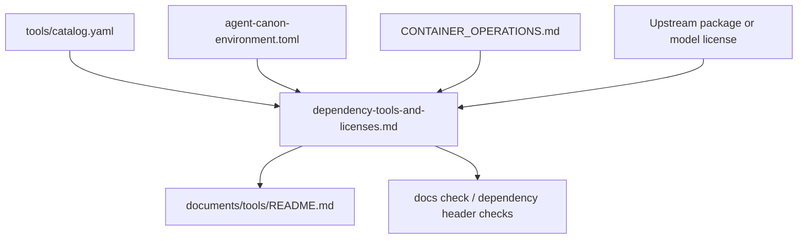

<!--
@dependency-start
contract reference
responsibility Documents AgentCanon dependency-related tools, external runtime tools, and license evidence.
upstream design README.md tool documentation placement policy
upstream design ../SHARED_RUNTIME_SURFACES.md shared documents ownership policy
upstream design ../runtime-profiles-and-check-matrix.md runtime profile and validation routing
upstream design ../../CONTAINER_OPERATIONS.md devcontainer and Docker ownership boundary
upstream design ../../tools/catalog.yaml structured AgentCanon tool catalog
upstream environment ../../agent-canon-environment.toml machine-readable environment and compiled tool contract
upstream implementation ../../rust/agent-canon/Cargo.toml AgentCanon Rust CLI crate license and dependency manifest
downstream implementation ../../tools/agent_tools/tool_catalog.py validates catalog and docs consistency
downstream implementation ../../tools/agent_tools/tool_drift.py validates tool and documentation trace links
downstream implementation ../../tools/agent_tools/check_convention_compliance.py validates shared convention wiring
@dependency-end
-->

# Dependency Tools And Licenses

この文書は、AgentCanon が依存関係の解析、環境構築、検証で使う主な
tool を人間向けにまとめます。機械可読の正本は次のままです。

- AgentCanon 内部 tool の正本: `tools/catalog.yaml`
- 外部 toolchain / compiled tool の正本: `agent-canon-environment.toml`
- Docker / devcontainer への配置責務: `CONTAINER_OPERATIONS.md`

この文書は license advice ではありません。配布、再配布、商用利用、
container image 公開、model weight 共有を行う前に、該当 version の
package metadata、upstream license、distro copyright file、model card を再確認
してください。

## Reader Map

Use this document to answer which dependency-related tools and external runtime
tools AgentCanon summarizes for readers, and where license evidence must be
rechecked. Start with Source Relationship and Verification Policy, then read
Staleness Risk before relying on a snapshot. The remaining sections group
AgentCanon-owned dependency tools, runtime/environment tools, Rust crate
snapshots, boundaries, and upstream license evidence.

## Source Relationship

この図は、文書がどの正本を読者向けの一覧へ射影しているかを示します。
図は license authority を主張せず、source の責務境界だけを表します。



## Verification Policy

- `local` は AgentCanon source tree 内の metadata で確認できる license です。
- `upstream` は 2026-06-11 に upstream project / official package page で確認した
  license です。
- `distro` は Debian / Ubuntu などの package が持つ copyright file を確認する
  必要がある license です。
- `model-card` は software license ではなく、model artifact の card / repository が
  authority です。
- `unresolved` は local source だけでは license を断定しない entry です。

再確認コマンドの例:

```bash
cargo metadata --manifest-path rust/agent-canon/Cargo.toml --format-version 1 \
  | jq -r '.packages[] | [.name, .version, (.license // "NOASSERTION")] | @tsv'

dpkg-query -L <debian-package> | rg '/copyright$'
sed -n '1,160p' /usr/share/doc/<debian-package>/copyright
```

## Staleness Risk

License information is a time-bound snapshot, not a permanent fact. Treat this
table as stale and rerun the verification policy when any of these events occur:

- a tool version, install source, default model selector, package manager, or
  container base changes;
- AgentCanon starts distributing a compiled binary, container image, packaged
  archive, or bundled model artifact;
- a PR changes `.devcontainer/post-create.sh`, `agent-canon-environment.toml`,
  `tools/install_llama_cpp.sh`, `tools/rebuild_agent_tools.sh`, or
  `rust/agent-canon/Cargo.toml`;
- an upstream license, model card, distro package copyright file, or package
  metadata source is unavailable, inconsistent, or moved.

The closeout rule for those changes is: refresh the relevant row in this
document, record the source URL or local metadata path used, and state whether
the license was verified from `local`, `upstream`, `distro`, `model-card`, or
left `unresolved`. Do not claim license compatibility from this document alone.

## AgentCanon-Owned Dependency Tools

この表の tool は AgentCanon repository 内の実装です。license は repository
license の `LICENSE` と、Rust crate については `rust/agent-canon/Cargo.toml`
を根拠にします。

| Tool | Command | Purpose | Writes | License Status |
| --- | --- | --- | --- | --- |
| `run-repo-dependency-review` | `bash tools/agent_tools/run_repo_dependency_review.sh` | dependency manifest の scan、format、graph review をまとめて実行します。 | no | local: Apache-2.0 |
| `scan-dependency-headers` | `bash tools/agent_tools/scan_dependency_headers.sh` | text file に `@dependency-start` manifest があるか棚卸しします。 | no | local: Apache-2.0 |
| `check-dependency-header-format` | `bash tools/agent_tools/check_dependency_header_format.sh` | manifest marker、field、path、kind、placement を検証します。 | no | local: Apache-2.0 |
| `check-dependency-headers` | `python3 tools/agent_tools/check_dependency_headers.py` | changed file に required dependency manifest があるか検証します。 | no | local: Apache-2.0 |
| `check-dependency-graph` | `bash tools/agent_tools/check_dependency_graph.sh` | dependency manifest graph、self reference、cycle、edit-scope expansion を検証します。 | no | local: Apache-2.0 |
| `scan-code-dependencies` | `bash tools/agent_tools/scan_code_dependencies.sh` | Python import、C/C++ include、shell source など code-level dependency edge を抽出します。 | no | local: Apache-2.0 |
| `check-design-doc-claims` | `python3 tools/agent_tools/check_design_doc_claims.py` | design document の claim、dependency header evidence、implementation text、parent document alignment を検査します。 | no | local: Apache-2.0 |
| `render-dependency-manifest-graph` | `python3 tools/agent_tools/render_dependency_manifest_graph.py` | dependency graph TSV から Markdown / DOT review artifact を生成します。 | yes | local: Apache-2.0 |

## AgentCanon Runtime And Environment Tools

この表は shared devcontainer や AgentCanon local tooling が利用する外部 tool を
まとめます。`agent-canon-environment.toml` と `.devcontainer/post-create.sh`
に現れる tool を中心にしています。

| Tool | Purpose | AgentCanon Surface | License Status |
| --- | --- | --- | --- |
| `agent-canon` Rust CLI | docs check、local LLM route、semantic index、structured analysis などの統一 CLI。 | `rust/agent-canon/Cargo.toml`, `tools/bin/agent-canon` | local: Apache-2.0 |
| Rust toolchain: `rustup`, `cargo`, `rustc`, `rustfmt`, `clippy`, `rust-analyzer` | AgentCanon Rust CLI の build、format、lint、editor support。 | `agent-canon-environment.toml`, `.devcontainer/post-create.sh` | upstream: Apache-2.0 OR MIT for official Rust projects; verify component repository |
| `jq` | JSON / JSONL の compact extraction と CI evidence 整形。 | `agent-canon-environment.toml`, `.devcontainer/post-create.sh` | upstream: MIT for `jq`; docs are CC BY 3.0 |
| Node.js | `npm` と Codex CLI install の runtime。 | `.devcontainer/post-create.sh` | upstream: MIT for Node.js core, with bundled third-party notices |
| `npm` CLI | `@openai/codex` の install に使う JavaScript package manager。 | `.devcontainer/post-create.sh` | upstream: Artistic-2.0 |
| Codex CLI: `@openai/codex` | local Codex runtime entrypoint。 | `.devcontainer/post-create.sh` | upstream: Apache-2.0 |
| GitHub CLI: `gh` | GitHub repo 確認、branch publish、PR evidence 作成。 | `.devcontainer/post-create.sh`, `tools/agent_tools/github_publish.py` | upstream: MIT |
| `gitleaks` | secret scanning。 | `.devcontainer/post-create.sh`, `tools/ci/scan_secrets.sh` | upstream: MIT |
| `trufflehog` | secret discovery / verification。 | `.devcontainer/post-create.sh`, `tools/ci/scan_secrets.sh` | upstream: AGPL-3.0 |
| `detect-secrets` | current tree / baseline 型の secret scanning。 | `.devcontainer/post-create.sh`, `tools/ci/scan_secrets.sh` | upstream: Apache-2.0 |
| `llama.cpp`, `llama-cli`, `llama-server` | local LLM による single-file responsibility analysis。 | `tools/install_llama_cpp.sh`, `agent-canon-environment.toml` | upstream: MIT |
| Default GGUF model: `ggml-org/SmolLM3-3B-GGUF` | AgentCanon local LLM の default model selector。 | `agent-canon-environment.toml` | model-card: apache-2.0 on Hugging Face, verify before model redistribution |
| `git` | source checkout、submodule、branch / PR workflow。 | `.devcontainer/post-create.sh`, update tools | upstream: GPL-2.0 |
| `cmake` | `llama.cpp` build。 | `tools/install_llama_cpp.sh` | upstream: BSD-3-Clause |
| `curl` | installer、release asset、license source fetch。 | `.devcontainer/post-create.sh`, `tools/install_llama_cpp.sh` | upstream: curl license |
| `python3`, `python3-pip` | Python helper execution and `detect-secrets` install. | `.devcontainer/post-create.sh` | upstream: Python Software Foundation License for Python; package licenses vary |
| `tar`, `xz-utils`, `ca-certificates`, `build-essential`, `pkg-config` | archive extraction, package bootstrap, native build support。 | `.devcontainer/post-create.sh` | distro: verify package copyright files |
| TeX Live packages, `latexmk`, pdfLaTeX, XeLaTeX | academic-writing PDF / TeX rendering support。 | `.devcontainer/post-create.sh` | mixed free software; `latexmk` is GPL-2.0; verify TeX Live package notices |
| `dvisvgm` | DVI / EPS / PDF to SVG conversion for document assets。 | `.devcontainer/post-create.sh` | upstream: GPL-3.0-or-later |
| `ghostscript` | PDF / PostScript processing support。 | `.devcontainer/post-create.sh` | upstream: AGPL or commercial license |
| `poppler-utils` | PDF inspection / conversion helper tools。 | `.devcontainer/post-create.sh` | distro: mixed GPL / LGPL / MIT package metadata; verify exact package |

## Rust Crate Dependency Snapshot

The AgentCanon Rust CLI declared its own license as Apache-2.0 in
`rust/agent-canon/Cargo.toml`. On 2026-06-18, `cargo metadata` for
`rust/agent-canon/Cargo.toml` reported these license families in direct and
transitive crates:

- Apache-2.0
- MIT
- MIT OR Apache-2.0 / MIT/Apache-2.0
- (Apache-2.0 OR MIT) AND BSD-3-Clause
- BSD-2-Clause OR Apache-2.0 OR MIT
- Unlicense OR MIT
- Zlib
- Unicode-3.0, through `unicode-ident`

The direct Rust CLI dependency `yaml-rust2` was added for catalog-backed YAML
routing metadata parsing and reports `MIT OR Apache-2.0` in `cargo metadata`.

The exact crate set is lockfile- and registry-dependent. Regenerate the snapshot
with the command in [Verification Policy](#verification-policy) before publishing
a binary distribution or container image.

## Boundary

- This document may summarize license evidence, but it does not replace
  upstream license files or distro package metadata.
- `tools/catalog.yaml` remains the structured catalog for AgentCanon-owned
  tools. Do not copy every catalog entry into this page.
- `agent-canon-environment.toml` remains the machine-readable source for shared
  toolchain and compiled-tool expectations.
- Project-specific dependencies belong in the derived repository's own
  `docker/README.md`, package manifest, or environment documentation.

## Upstream License Evidence Checked

- Rust license policy: <https://www.rust-lang.org/policies/licenses/>
- rustfmt license: <https://github.com/rust-lang/rustfmt>
- rust-analyzer license: <https://github.com/rust-lang/rust-analyzer>
- jq license: <https://github.com/jqlang/jq>
- Node.js license: <https://github.com/nodejs/node/blob/main/LICENSE>
- npm CLI package metadata: <https://github.com/npm/cli/blob/latest/package.json>
- Codex CLI license: <https://github.com/openai/codex>
- GitHub CLI license: <https://github.com/cli/cli>
- gitleaks license: <https://github.com/gitleaks/gitleaks/blob/master/LICENSE>
- TruffleHog license: <https://github.com/trufflesecurity/trufflehog/blob/main/LICENSE>
- detect-secrets license: <https://github.com/Yelp/detect-secrets/blob/master/LICENSE>
- llama.cpp license: <https://github.com/ggml-org/llama.cpp/blob/master/LICENSE>
- SmolLM3 GGUF model card: <https://huggingface.co/ggml-org/SmolLM3-3B-GGUF>
- Git license: <https://git-scm.com/about>
- CMake license: <https://cmake.org/licensing/>
- curl license: <https://curl.se/docs/copyright.html>
- Python license: <https://docs.python.org/3/license.html>
- TeX Live copying policy: <https://www.tug.org/texlive/copying.html>
- latexmk package page: <https://ctan.org/tex-archive/support/latexmk>
- dvisvgm package page: <https://ctan.org/pkg/dvisvgm/>
- Ghostscript licensing: <https://ghostscript.com/licensing>
