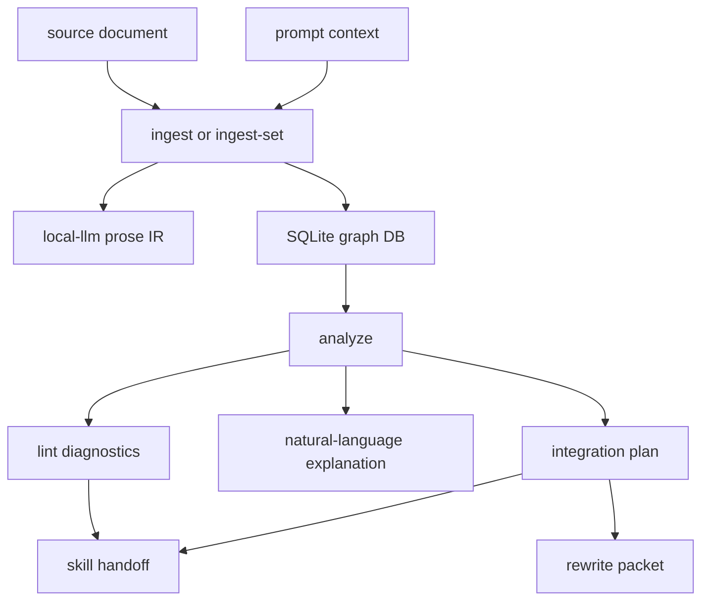

<!--
@dependency-start
contract reference
responsibility Documents prose_reasoning_graph.py usage and contract.
upstream design ../prose-reasoning-graph/dsl-spec.md normative graph and DSL contract
upstream design ../structured-analysis/graph-dsl.md shared Graph DSL Core storage contract
upstream implementation ../../tools/agent_tools/prose_reasoning_graph.py builds SQLite-backed prose reasoning graphs
upstream implementation ../../rust/agent-canon/src/structured_analysis.rs checks document responsibility gaps for tool docs
upstream design ../../agents/workflows/workflow-references.md discourse, argument, and writing prior art
upstream design ../../agents/skills/prose-reasoning-graph.md prose graph skill contract
downstream implementation ../../tests/agent_tools/test_prose_reasoning_graph.py validates CLI behavior
@dependency-end
-->

# prose_reasoning_graph.py

`prose_reasoning_graph.py` は、Markdown または plain text を一時的な
SQLite-backed prose reasoning graph に変換する文章解析ツールです。
根拠として graph DB は中間解析 artifact であり、したがって source document や DSL spec の代替ではありません。
この文書は Graph DSL Core や prose adapter DSL を再定義せず、tool の責務、
command surface、result surface、verification route、skill handoff を説明します。

## この文書の読み方

この tool reference は、Prose Reasoning Graph の根拠 surface、読者と責務境界、graph visualization owner、graph contract、runtime flow、command surface、result surface、document responsibility check、profiles、verification route、skill handoff、writing loop を順に説明します。実行入口を探すときは Command Surface へ進み、出力や責務境界を確認するときは Graph Contract と Result Surface を先に読みます。DSL の正本は `documents/prose-reasoning-graph/dsl-spec.md` です。

## 根拠 Surface

- DSL と graph contract:
  [Prose Reasoning Graph DSL Specification](../prose-reasoning-graph/dsl-spec.md)
- Shared graph storage:
  [Graph DSL Core](../structured-analysis/graph-dsl.md)
- CLI behavior:
  [tools/agent_tools/prose_reasoning_graph.py](../../tools/agent_tools/prose_reasoning_graph.py)
- expected behavior:
  [tests/agent_tools/test_prose_reasoning_graph.py](../../tests/agent_tools/test_prose_reasoning_graph.py)
- result split:
  source surface と test surface が command behavior を検証するため、この文書は tool result を
  compact stats、artifact、verification route に分けて説明します。

## 読者と責務境界

- maintainer / reviewer:
  DB schema、diagnostic rule、edit operation、structured-analysis 接続を確認します。
- skill designer:
  graph result を `$long-form-writing`、`$report-writing`、`$paper-writing` などへ渡す境界を確認します。
- runtime agent:
  通常はこの文書を読みません。runtime agent は
  [prose-reasoning-graph skill](../../agents/skills/prose-reasoning-graph.md)
  の result contract に従い、compact stats と artifact path だけを見ます。

この tool は source text を graph DB に materialize し、projection、diagnostics、
explanation、integration plan、skill handoff、rewrite packet を export します。
この tool は source document の編集、citation approval、paper acceptance、PR merge、
repository policy change を判断しません。finding の解釈、verification route の展開、
rewrite の採否は skill、reviewer、workflow の責務です。

## Graph Visualization Owner

AgentCanon の generic graph storage contract は
[Graph DSL Core](../structured-analysis/graph-dsl.md) が持ちます。Prose-specific
projection and source anchoring are owned by
[Prose Reasoning Graph DSL Specification](../prose-reasoning-graph/dsl-spec.md)。
`prose_reasoning_graph.py` は source-anchored graph、projection
payload、presentation feature、adapter metadata、diagnostic / verification route
を保持する共通入口です。

Dependency manifest graph、Algorithm Expansion IR / LemmaGraph flowchart、
semantic-provider comparison HTML、runtime dashboard evidence flow は、source
extractor または domain checker を持つ adapter surface です。これらの viewer は
Graph DSL Core projection を読む、または Graph DSL Core object model に lossless mapping できる adapter
payload を読む形へ寄せます。domain checker の pass / fail authority は元 tool に残し、
HTML、DOT、Mermaid、SVG は review projection artifact として扱います。

## Graph Contract

この tool の graph は source-anchored です。source span、form、concept、phase、
discourse relation、argument claim、evidence、experiment planning、presentation order、
diagnostics、edit operations、natural-language explanation、projection metadata を層として持ちます。

### Presentation Recommendation Evidence

| Feature | Graph evidence | Projection result |
| ------- | -------------- | ----------------- |
| `relational_topology` | Concept relation subgraph. | Figure candidate. |
| `aligned_attribute_set` | Phase or experiment nodes. | Table candidate. |
| `formal_constraint` | Formal relation signal on a source anchor. | Equation candidate. |
| Materialization | `presentation` / `feature` nodes and `has_feature` edges. | `projection_views[].recommended_format` reads the feature subgraph. |

### Claim Support Evidence

| Evidence source | Materialized node | Support rule |
| --------------- | ----------------- | ------------ |
| Source text evidence cue. | `evidence` node. | Nearby claim or overlapping claim concepts receive a `supports` edge. |
| Dependency manifest `responsibility` entry. | `document_responsibility` evidence node. | Matching responsibility concepts receive a `supports` edge. |
| Dependency manifest `upstream` / `downstream` entry. | `dependency_manifest` evidence node. | Matching dependency concepts receive a `supports` edge. |
| Missing support edge. | `diagnostics` record. | `unsupported_claim` is emitted. |

次は、この feature subgraph を含めて、source-anchored graph の層構成を DSL spec の語彙へ対応させると
次の通りです。

- source-truth anchor:
  sentence または EDU が source-truth anchor です。
- lower graph:
  lower text unit 間の typed relation を保持します。
- projection view:
  macro-claim、subtopic、reader-state transition、rhetorical role は lower graph からの
  derived projection view です。
- selected ordering:
  `project` は全文 sentence anchor を、選択された ordering subgraph の priority topological sort として
  `selected_ordering.ordered_anchors` に出します。`hard_before` は topo constraint、
  `adjacency_preferred` は soft priority として扱い、hard cycle は diagnostic に出します。
  writing LLM はこの順序を DSL-to-prose input sequence として使います。
- node record:
  `nodes table` は id、document id、layer、kind、text、source span、confidence、
  `payload_json` を保持します。
- edge record:
  `edges table` は kind、from/to node、ordering metadata、confidence、optional evidence、
  `payload_json` を保持します。
- diagnostic record:
  document、node record、edge record のいずれかを target にし、rule、severity、
  message、suggested action を保持します。

この対応により、graph DB は DSL spec の materialized view として扱います。
source file は authoring surface のまま残り、graph DB は削除または再生成できます。

## Runtime Flow



この図の `local_ir` は `agent-canon local-llm extract-prose-ir` 由来の
`local_llm_prose_ir` metadata です。corpus hint と既存文書からの DSL seed は
固定 keyword 辞書ではなく、この LocalLLM task から入ります。LocalLLM output は seed であり、
graph DB の source-truth record ではありません。
`extract-prose-ir` は document / term fragment ごとの part prompt を持ち、
`llama-cli` が使える場合は part を `--local-llm-jobs` 由来の bounded parallelism で実行します。
graph tool は part order を変更せず、LocalLLM IR の `parts[]` と `llm_execution` を
metadata として保存します。

この LocalLLM output と graph DB の境界に加えて、同じ LocalLLM IR の `analysis_intents[]` は、本文が実験計画を述べているのか、
profile 語彙を説明しているだけなのかを区別します。graph 側はこの intent status を読み、
`experiment_plan` が `present` の場合に experiment layer と experiment diagnostics を起動します。
ただし `--profile experiment` は明示的な completeness check 指示なので、LocalLLM IR が active
plan を検出しない文でも experiment diagnostics を起動できます。

LocalLLM IR が無い旧 DB や障害時は、graph 側が
`local_llm_experiment_plan_ir_missing` diagnostic を出し、LocalLLM IR の再生成を
要求します。語彙検索や非 LLM 判定で experiment-plan applicability を代替しません。

## Command Surface

DB 作成 command は、`--db` が省略された場合に
`${AGENT_CANON_PROSE_GRAPH_HOME:-$HOME/.cache/agent-canon/prose-reasoning-graph}`
配下へ `prose_graph.sqlite` を作ります。根拠として、この default path は
`test_ingest_defaults_db_to_user_home_cache` で検証します。run-local artifact として DB path を
固定する workflow では `--db <path>` を渡します。

この graph DB default と command boundary を前提に、単一 document の文章構造と document-canon responsibility coverage を同時に見る入口は
`check-document` です。

```bash
python3 tools/agent_tools/prose_reasoning_graph.py check-document vendor/agent-canon/documents/tools/prose_reasoning_graph.md \
  --out-dir reports/agents/<run-id>/prose_tool_doc_check \
  --profile all \
  --llm-jobs 4 \
  --stats-out reports/agents/<run-id>/prose_tool_doc_check.stats.json
```

`check-document` と `ingest` / `ingest-set` は `--local-llm-jobs` と
Rust LocalLLM と同じ `--llm-jobs` を同じ bounded parallelism option として扱います。

通常の分割実行では、`ingest` 後に stats JSON の
`.fields.PROSE_REASONING_GRAPH_DB` を後続 command へ渡します。

```bash
python3 tools/agent_tools/prose_reasoning_graph.py ingest notes/draft.md \
  --prompt-file reports/agents/<run-id>/user_request_contract.md \
  --local-llm-jobs 4 \
  --stats-out reports/agents/<run-id>/prose_ingest.stats.json
GRAPH_DB="<PROSE_REASONING_GRAPH_DB from stats JSON>"
python3 tools/agent_tools/prose_reasoning_graph.py analyze --db "$GRAPH_DB" --profile all \
  --stats-out reports/agents/<run-id>/prose_analyze.stats.json
python3 tools/agent_tools/prose_reasoning_graph.py lint --db "$GRAPH_DB" --profile all \
  --out reports/agents/<run-id>/prose_diagnostics.md \
  --stats-out reports/agents/<run-id>/prose_lint.stats.json
python3 tools/agent_tools/prose_reasoning_graph.py integrate --db "$GRAPH_DB" --profile all \
  --out reports/agents/<run-id>/prose_integration.md \
  --stats-out reports/agents/<run-id>/prose_integrate.stats.json
python3 tools/agent_tools/prose_reasoning_graph.py skill-handoff --db "$GRAPH_DB" --profile all \
  --out reports/agents/<run-id>/prose_handoff.md \
  --stats-out reports/agents/<run-id>/prose_handoff.stats.json
```

複数 source document を 1 DB に入れる report / design packet では `ingest-set` を使います。
各 file は別々の `documents` row として残り、form node id は file ごとに prefix されます。

```bash
python3 tools/agent_tools/prose_reasoning_graph.py ingest-set documents/structured-analysis \
  --prompt-file reports/agents/<run-id>/user_request_contract.md \
  --stats-out reports/agents/<run-id>/ingest_set.stats.json
GRAPH_DB="<PROSE_REASONING_GRAPH_DB from stats JSON>"
python3 tools/agent_tools/prose_reasoning_graph.py analyze --db "$GRAPH_DB" --profile report
```

`integrate` が split、merge、bridge、reorder などの concrete operation id を返す場合だけ
`rewrite-packet --op <operation-id>` を使います。operation count が `0` の DB では
diagnostic route を検証または修正し、checker を rerun します。

## Result Surface

runtime agent が最初に読む surface は stats JSON です。stdout は pass marker と stats path のための
compact channel として扱います。projection、diagnostics、explanation、integration、handoff、
rewrite packet の本文は file artifact として開きます。

| Surface | Command | 用途 |
| ------- | ------- | ---- |
| DB path and counts | `--stats-out` | DB path、output path、compact status を確認する。 |
| Diagnostics | `lint --out <file>` | active finding、severity、target、verification route を見る。 |
| Integration plan | `integrate --out <file>` | rewrite candidate と recursive verification route を見る。 |
| Skill handoff | `skill-handoff --out <file>` | receiving skill へ bounded graph evidence を渡す。 |
| Document check | `check-document --out-dir <dir>` | prose diagnostics と target document-canon findings を同じ report へ出す。 |
| Projection | `project --out <file>` | full graph layers、source anchors、`selected_ordering.ordered_anchors`、projection views、diagnostics、edit operations を inspection する。 |
| Explanation | `explain --out <file>` | claim path、gap、recommended next edits を自然言語で読む。 |
| Rewrite packet | `rewrite-packet --op <id> --out <file>` | 1 つの edit operation を preserve / do-not rule 付きで渡す。 |

## Document Responsibility Check

`check-document` は prose graph path と Rust `structured-analysis` document-canon path を同時に走らせます。
Rust 側は `document-canon` graph layer を生成し、target document の
`document_responsibility_gap` を同じ report に入れます。Python parser はこの layer を直接作らず、
structured-analysis output を import します。

この structured-analysis import boundary により、document-canon coverage rule の責務は upstream design に残り、
この guide は DSL spec を `upstream design` として参照します。DSL spec は
`dsl_design_trace` と `graph_format_trace` の coverage rule を宣言しています。そのため、この guide は
source-truth anchor、lower graph、typed relation、derived projection view、node record、
edge record、`payload_json` を説明対象に含めます。

checker は見出し名や図の有無だけでは warning を出しません。downstream document が coverage rule
付き upstream design を参照している場合に、その coverage group を検査します。不足は
`missing_responsibility_coverage=<coverage-id>` の reason として記録します。

`document_responsibility_gap` の suggested action は
`verification_route=document_responsibility_verification` です。この route は upstream coverage rule、
downstream span、rerun command を持ちます。recursive expansion は skill loop の責務です。

## Profiles

- `writing`:
  long-form section と paragraph flow。
- `logic`:
  claim support、bridge、logic-gap triage。
- `experiment`:
  hypothesis、metric、baseline、expected result、report readiness の語彙を扱う profile。
- `report`:
  evidence traceability と reader-facing report structure。
- `academic`:
  notation、logic、citation を意識した scholarly prose。
- `paper`:
  paper section contract と citation-evidence review。
- `all`:
  graph layers と handoff routes をまとめて見る profile。

profile は analysis surface の選択です。profile 名や verification-route 語彙を説明する文は、
active experiment plan そのものではありません。この区別は語彙検索ではなく、
LocalLLM IR の `analysis_intents[].intent=experiment_plan` と `status` で受け取ります。

LocalLLM IR が無い場合は `local_llm_experiment_plan_ir_missing` finding として扱い、
graph 側だけで applicability を確定しません。

## Verification Route

diagnostics が verification route を持つ場合、rewrite の前に route を実行します。
route は inference validity、external evidence、formal proof obligation、
experiment-plan fields、discourse connection、presentation format candidate を該当 skill /
reviewer へ渡します。

| Route | 発火条件 | 主 verifier | 再帰展開 |
| ----- | -------- | ------------ | -------- |
| `claim_support_verification` | unsupported claim または missing evidence layer。 | `logic-gap-review`, `$literature-survey`, `citation-evidence-review`; proof-like claim では `$formal-proof-workflow`。 | claim を assumptions、warrants、atomic support requirements に分解する。 |
| `connection_verification` | weak paragraph bridge、missing warrant、unclear reader-state transition。 | `$structure-planning`, `logic-gap-review`; bridge が external support に依存する場合は `$literature-survey`。 | relation を分類し、missing premise と external bridge claim を検証する。 |
| `experiment_plan_verification` | hypothesis、metric、baseline、expected result の欠落。 | `$experiment-lifecycle`, `$report-writing`。 | empirical claim、measurement contract、report prose と result / limitation の対応を検証する。 |
| `presentation_format_verification` | projection view が prose ではなく list / table / figure / equation を推奨している。 | `$structure-planning`, `$report-writing`。 | feature subgraph、renderer contract、reader-state 改善を検証し、採用・却下・併用を決める。 |
| `document_responsibility_verification` | downstream document が coverage rules 付き upstream design を参照しているが、coverage group を欠いている。 | `$prose-reasoning-graph`, `structured-analysis`, owning document workflow。 | coverage rule を展開し、missing responsibility を担う downstream span を選び、structured-analysis rerun で閉じるか保持する。 |

recursive verification は route の `recursive_max_depth` と closure condition で bounded です。
leaf が閉じない場合は、owner、route、missing evidence、next verification command を持つ
unresolved blocker または warning として記録します。

## Skill Handoff

`skill-handoff` は `$long-form-writing`、`$report-writing`、`$academic-writing`、
`$paper-writing`、`$literature-survey`、`$structure-planning`、`$formal-proof-workflow`、
`logic-gap-review`、`citation-evidence-review`、`$experiment-lifecycle`、
`$result-artifact-writeout` への entry を出します。

次は、skill-handoff entry の result surface です。これらの entry は receiving skill が読む
bounded packet であり、presentation format candidate も他の diagnostics と同じ bounded evidence
として渡します。

handoff entry は次の fields を receiving skill に渡します。

- DB path
- projection command
- diagnostics command
- natural-language explanation
- verification routing
- rewrite planning command
- `corpus_hints`
- `projection_views[].recommended_format`
- `projection_views[].format_reason`
- feature-subgraph-backed `presentation_format_candidate` diagnostics

ただし、この packet 境界の外側では、receiving skill が自分の review gate に対して authority を持ちます。graph diagnostic は
unsupported claim や weak transition を示しますが、paper approval、citation settlement、
PR merge、repository policy change は判断しません。

## Writing Loop

writing workflow では、draft readiness を次の順で判断します。

1. source document を graph DB に materialize する。
1. `lint` と `integrate` を実行する。
1. verification route を leaf が verified、limited、explicitly unresolved になるまで辿る。
1. structure contract、source packet、graph-backed rewrite packet、または draft source を更新する。
1. graph diagnostics を rerun する。
1. selected profile の active fix-now finding が無い状態で reader-facing prose を書く。

この loop は DSL / graph を先に直し、その後に prose へ射影するための runtime discipline です。
prose 再解析で新しい finding が出る場合は、DSL から文章へ射影する prompt または rewrite pass を見直します。
