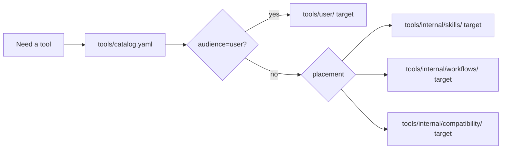

# tools
<!--
@dependency-start
contract tool
responsibility Documents tools for this repository.
upstream design ../AGENTS.md shared canon runtime contract
upstream design ../documents/prose-reasoning-graph/dsl-spec.md shared graph visualization projection and adapter contract
downstream design catalog.yaml structured AgentCanon tool catalog
downstream design ../documents/tools/tool-docs.toml same-named tool documentation map
downstream implementation agent_tools/tool_catalog.py validates catalog/docs consistency
downstream implementation agent_tools/tool_drift.py validates tool/convention trace contracts
downstream implementation agent_tools/responsibility_scope.py validates responsibility scopes and protecting tools
downstream implementation agent_tools/issue_sync.py validates local issue sync state
downstream implementation agent_tools/eval_accumulation_check.py validates eval result accumulation
downstream implementation agent_tools/runtime_log_archive_git.py manages mounted hook/eval/report log archive branches
downstream implementation agent_tools/generated_artifact_guard.py rejects regenerated report outputs left in source tree
downstream implementation agent_tools/check_design_doc_claims.py validates design-document evidence claims
downstream implementation ../rust/agent-canon/src/local_llm.rs runs local LLM CLI commands
downstream implementation ../rust/agent-canon/src/semantic_index.rs runs semantic vector index commands
downstream implementation ../rust/agent-canon/src/structured_analysis.rs runs structured-analysis cache build, document inventory, and DB import commands
downstream implementation agent_tools/file_responsibility_llm.py keeps the Python local LLM compatibility helper
downstream implementation agent_tools/search.py coordinates purpose-based search providers
downstream implementation agent_tools/search_index.py builds repo-local semantic search cards
downstream design user/README.md defines stable user-facing tool entrypoint migration target
downstream design internal/README.md defines skill, workflow, and compatibility helper migration targets
downstream implementation agent_tools/review_backlog_scan.sh generates integrated review backlog artifacts
downstream implementation agent_tools/compare_agent_run_paths.py compares run-bundle route efficiency
downstream implementation agent_tools/evaluate_report_quality.py runs report quality evals
downstream implementation agent_tools/prose_reasoning_graph.py builds prose graph projections and handoff packets
downstream implementation agent_tools/formal_proof.py builds formal-proof scaffold plans
downstream implementation agent_tools/lean_proof_env.py creates Lean proof-search, theorem-search, and counterexample environments
downstream implementation agent_tools/tool_proof_coverage.py reports tool proof-obligation coverage
downstream implementation agent_tools/jit_canonical_ir.py extracts StableHLO-derived JIT-canonical IR and backend traces
downstream implementation agent_tools/cpp_source_canonical_ir.py extracts C++ source-canonical IR into thin operational IR
downstream implementation agent_tools/operational_ir_to_lean.py renders thin operational IR into Lean evidence definitions
downstream implementation agent_tools/cpp_template_to_lean.py fully expands C++ template source roots into Lean evidence
downstream implementation ../rust/agent-canon/src/jit_ir_to_lean.rs lowers JIT-canonical IR into Lean evidence modules
downstream implementation ../rust/agent-canon/src/test_design.rs runs test design resilience diagnostics
@dependency-end
-->


Root `tools/` is a symlink view into `vendor/agent-canon/tools/`. The root path
is the stable command surface for template and derived repositories; the
vendored AgentCanon path is the canonical implementation source. These two
paths must not become separate ownership surfaces.

Shared agent helper, CI/check, container runner, experiment helper, Markdown
maintenance, and validation tools live in `vendor/agent-canon/tools/` and are
called through `tools/...` from parent repositories. Project-local automation
that is not reusable AgentCanon capability belongs in project-owned paths such
as `scripts/`, package-local modules, or repo-specific CI files. Do not add
project-specific files under root `tools/`; it is an AgentCanon-owned runtime
view.

When a change is generic, edit `vendor/agent-canon/tools/...`, open or merge an
AgentCanon change, update the parent repo submodule pin, and repair the root
view with `bash tools/sync_agent_canon.sh link-root`. When a command or test log
mentions `tools/...`, read it as the root execution path for AgentCanon-owned
tooling unless the path is explicitly project-owned elsewhere.

## Reader Map

- Owns the shared AgentCanon tool surface, placement rules, audience split, and
  catalog/documentation relationship for `tools/`.
- Main path: Tool Catalog, Tool Audience And Placement, Evidence And Assumption
  Ledger, included/excluded tool families, update path, repo-local import
  policy, result/log/eval/search helpers, proof/IR tools, and related docs.
- Read this before adding, moving, documenting, or invoking shared tools from a
  template or derived repository.
- Boundary: project-specific automation belongs outside root `tools/` unless it
  is reusable AgentCanon capability.

## Tool Catalog

`tools/catalog.yaml` is the structured AgentCanon tool catalog. It separates
canonical shared tools and compatibility wrappers without turning README prose
into a second registry. Use it to check whether a tool is callable by default,
wired into CI / PR validation, covered by tests, or documented by the
same-named tool-doc map.

`documents/tools/tool-docs.toml` maps selected tool entrypoints to one
reader-facing Markdown file each. The tool and document basenames must match
so the catalog can be enumerated mechanically.

## Tool Audience And Placement

`tools/catalog.yaml` owns two separate classifications for every effective
catalog entry:

- `audience` says who should call the tool directly: `user`, `agent`, `skill`,
  `workflow`, `maintainer`, or `internal`.
- `placement` says where the implementation or wrapper belongs after
  migration: `user_entrypoint`, `skill_helper`, `workflow_helper`,
  `validation_checker`, `ci_gate`, `compatibility_wrapper`, or
  `support_library`.

Family defaults keep the catalog compact; mixed families override individual
entries. `tool_catalog.py` validates that every entry has an effective
audience and placement, and that `status: compatibility_wrapper` entries use
`placement: compatibility_wrapper`.



The new directories are migration targets, not duplicate registries. Existing
tool paths stay stable until the catalog entry, tests, docs, and workflow
callers move together.

Common execution routes:

| Need | Command |
| --- | --- |
| Catalog shape, docs wiring, and retired legacy paths | `python3 tools/agent_tools/tool_catalog.py` |
| Tool / workflow / PR checklist drift | `python3 tools/agent_tools/tool_drift.py` |
| Runtime profile and path-risk routing | `python3 tools/agent_tools/classify_path_risk.py` |
| Markdown, links, math, Mermaid, and docs drift | `tools/bin/agent-canon docs check` |
| Implementation-surface routing before edits | `agent-canon local-llm route-implementation-surface --request-file reports/task.txt` |
| Bounded search route selection | `agent-canon local-llm search --purpose "<purpose>"` |
| Document inventory and document-canon cleanup | `agent-canon structured-analysis document-inventory --root .` |
| Runtime log archive state | `python3 tools/agent_tools/runtime_log_archive_git.py status` |
| Generated report roots left in source tree | `python3 tools/agent_tools/generated_artifact_guard.py` |
| Design-doc claim evidence against code and dependency headers | `python3 tools/agent_tools/check_design_doc_claims.py <design-doc>` |
| SOLID-sensitive Python diff evidence coverage | `python3 tools/agent_tools/check_solid_evidence.py --changed --evidence <oop-readability-report>` |
| Test-design resilience diagnostics | `agent-canon test-design check tests` |

Use `documents/tools/README.md` for reader-facing tool-family guidance and
`tools/catalog.yaml` for the complete structured registry. Do not expand this
table into a second catalog.

For agent-facing diagnostics, prefer structured artifact options over detailed
stdout: `evaluate_skill_workflow_prompts.py --compact-out <path>.json`,
`evaluate_codex_agent_roles.py --compact-out <path>.json`, and
`eval_accumulation_check.py --compact-out <path>.json` write structured summary
statistics for the agent to read before drilling into full reports.

`tool_catalog.py` validates catalog shape, path existence, per-entry summaries,
docs/tests, default wiring, retired legacy paths, and tool-doc one-to-one
mapping. Use
`--format markdown` when you need the catalog crosswalk as a reader-facing
tool table.
`tool_drift.py` uses dependency manifests plus the catalog to
detect stale tool/convention links, missing required PR-flow checks, and
retired legacy tool reintroduction.
`responsibility_scope.py` validates top-level `responsibility-scope.toml`
so each durable surface has an owner class, path coverage, protecting tools,
and linked operational issues.
`parent_repo_readiness.py` validates that a template / derived parent repo has
the expected AgentCanon submodule shape, shared root views, parent-owned
document contracts, update state, MCP launcher, and Docker/devcontainer
environment surfaces before an agent treats the repo as ready.
`repo_structure_contract.py` runs `tree -a -J` and compares the observed
directory / file layout with `documents/repo-structure-contract.toml`.
The TOML contract owns profiles, ignored generated paths, required paths, and
unexpected top-level severity.
`render_dependency_manifest_graph.py` turns a dependency graph TSV from
`check_dependency_graph.sh --graph-tsv` into a repo-local Graph IR JSON,
Markdown, DOT, and a single-file HTML Graph Workbench with a Voronoi-style code
territory map, complete static graph map, dependency tables, inferred directory
containment table, and filtered exploration. It is the dependency-manifest
adapter for the shared graph visualization DSL; `check_dependency_graph.sh`
keeps dependency validation authority.
`check_design_doc_claims.py` compares design-document claim tokens with
dependency-header closure, implementation text, and upstream parent design
documents. Use it before accepting implementation-backed design prose or route
it through `run_repo_dependency_review.sh --check-design-doc-claims`.
`classify_path_risk.py` maps changed paths to runtime profiles and targeted
validation checks; the manual GitHub smoke workflow uses the same classifier.
`formal_proof.py` converts natural-language mathematical claims into
unverified proof plans, existing-proof search queries, target-language theorem
scaffolds, and checker commands. It never upgrades a claim to verified without
proof-assistant evidence.
`lean_proof_env.py` creates a reusable Lean 4 Lake package with Mathlib, Aesop,
Plausible, and LeanSearchClient, then dry-runs or executes `lake update`,
`lake build`, and `lake env lean` checks for proof-search, theorem-search,
counterexample, and generated-stub surfaces. Use it as the AgentCanon-owned
exploratory/fallback proof environment. For an active theorem package, pin
these dependencies once in that package so routine retries use `lake build`
instead of repeating environment setup.
`tool_proof_coverage.py` reports behavior and performance proof-obligation
coverage for every cataloged tool. Normal mode classifies proof frontiers
without claiming Lean verification; `--require-lean-verified` fails until each
behavior and performance claim points at a checked Lean artifact without
`sorry`, `admit`, or unchecked `axiom`.
`issue_sync.py` validates `issues/open|closed/` offline, prints a deterministic
GitHub Issue creation plan for local issues that do not yet have a
`github_issue:` mirror field, and can run read-only GitHub mirror drift checks
for PR summaries.
`eval_accumulation_check.py` validates that hook JSONL, skill prompt eval, and local LLM eval
reports are readable from the mounted runtime log archive. The source tree
must not contain `agents/evals/results/` result artifacts.
`runtime_log_archive_git.py status` validates that the mounted log archive has
a usable Git branch/worktree state before log evidence is pushed.
`runtime_log_archive_git.py archive-agent-report --report-dir
reports/agents/<run-id>` snapshots a run bundle into
`.agent-canon/log-archive/agent-reports/<repo-key>/<run-id>/<snapshot-id>/`
and appends `agent-reports/<repo-key>/index.jsonl`; agents do not hand-generate
archive copies of their reports.
`run_accumulated_agent_evals.py` is the mechanical producer entrypoint for
required eval families. It runs role, skill/workflow prompt, local LLM,
workflow-selection, and report-quality evals with `--accumulate`, captures
their stdout/stderr under `reports/agent-eval-runs/<run-id>/` unless `--log-dir`
is supplied, then leaves `eval_accumulation_check.py` to validate the resulting
archive structure. PR and CI wrappers pass a temp `--log-dir`; they must not
leave regenerated stdout/stderr captures in the source tree.
`generated_artifact_guard.py` fails when regenerated report roots such as
`reports/agent-eval-runs/`, `reports/dependency-review/`,
`reports/agent-runtime-dashboard/`, or `reports/agent-improvement-guide/`
remain tracked, untracked, or ignored in the checkout. Delete those outputs and
rerun the producer, or promote the underlying rule to `documents/`, `agents/`,
or `notes/` with a dependency manifest.
`agent-canon test-design check` scans test-like files for missing oracle,
static-analysis duplicate wrappers, generated execution-only placeholders,
private-detail coupling, exact mock/output/prose assertions, wall-clock
waiting, unseeded randomness, and property/metamorphic candidates. Use it
before writing or rewriting tests; `fix-now` findings are repair targets, while
`review` and `design-hint` findings feed the `$test-design` skill.
`agent-canon local-llm search` accepts a `--purpose` string and coordinates exact text, local LLM
semantic cards, TF-IDF vector search, tool catalog lookup, dependency headers,
and Python code dependency facts into ranked candidates.
`agent-canon local-llm route-implementation-surface` is the pre-edit router for
implementation ownership. Pass the user request or design question with
`--request-file`, `--request-stdin`, or `--request`; the command returns a
primary surface, candidate paths, forbidden paths, required pre-edit checks, and
an environment error when llama.cpp is unavailable.
`python3 tools/agent_tools/route.py --prompt` is the deterministic fast
prompt-to-skill router. It returns the full selected `SKILLS`, current-stage
`ACTIVE_SKILLS`, and later-stage `DEFERRED_SKILLS` so agents do not predeclare
every skill family.
`agent-canon local-llm extract-prose-ir` partitions documents and terms into
part prompts and, when `llama-cli` is available, runs those parts with bounded
parallelism controlled by `--llm-jobs` before writing deterministic prose IR.
`agent-canon local-llm build-index` builds the repo-local ignored semantic-card
index consumed by the LLM provider under `.agent-canon/search-index/`.
`agent-canon local-llm eval` validates the configured single-file local LLM
responsibility prompt boundary and can optionally accumulate prompt-only or
model-backed reports under `.agent-canon/log-archive/eval-results/local-llm-responsibility/`.
`evaluate_report_quality.py` validates the report-writing skill and report
reviewer route against the Report Quality Checklist and can accumulate reports
under `.agent-canon/log-archive/eval-results/report-quality/`.
`prose_reasoning_graph.py` ingests Markdown/plain text into a SQLite-backed
prose structure graph, exports diagnostics and natural-language explanations,
and writes handoff packets for writing, review, literature, experiment, and
artifact skills. DB creation defaults to the user-home prose graph cache and
accepts an explicit `--db` path when a workflow needs one.

## Evidence And Assumption Ledger

- Evidence sources:
  `../documents/structured-analysis/graph-dsl.md`,
  `../documents/prose-reasoning-graph/dsl-spec.md`,
  `../rust/agent-canon/src/structured_analysis.rs`, and
  `agent_tools/render_dependency_manifest_graph.py`.
- Assumption:
  Graph DSL terms in this operator guide describe shared storage and projection
  vocabulary. Native tool contracts remain the authority for pass/fail
  decisions.
- Parent-doc alignment:
  `../documents/structured-analysis/graph-dsl.md` owns Graph DSL Core storage.
  Prose Reasoning Graph owns the prose adapter/profile over that core.

Graph DSL Core owns the shared graph storage and projection contract:
dependency graph HTML/DOT, algorithm Mermaid flowcharts, semantic-provider HTML,
and runtime decision-flow diagrams are adapter projections over core graph
objects rather than independent graph schemas. Prose Reasoning Graph owns the
prose adapter/profile over that core.
`agent-canon structured-analysis build --root . --profile manual` rebuilds the
SQLite intermediate representation from git-visible files into the user-home
structured-analysis cache. It materializes an `artifact` layer and imports
document-canon findings, then writes current warnings to `diagnostics.sqlite`
without rewriting the repository tree. When `--out-dir` is supplied, SQLite DB
files stay in the cache and the report directory receives
`document_inventory.json`, `exports/document_inventory.md`,
`structured_analysis_build.json`, and
`exports/structured_analysis_summary.md`.
`agent-canon structured-analysis graph-contract --db <prose_graph.sqlite>`
checks that the materialized DB satisfies the Graph DSL Core storage contract.
Without `--db`, it emits the contract summary and registered layer set.
The shared graph vocabulary covers source-truth anchor / source span, lower
graph / lower text unit, typed relation, projection view / derived projection,
reader-state, macro-claim, node record / nodes table, edge record / edges
table, and `payload_json` so adapter projections do not introduce independent
graph schemas.
`agent-canon structured-analysis document-inventory --root .` is the canonical
Rust entrypoint for document-canon inventory. It reports runtime mirrors,
generated evidence, closed issue records, missing dependency manifests,
duplicate headings, and stale document names, and can feed those findings into
the structured-analysis SQLite graph through `import-document-inventory`.
`tools/bin/agent-canon docs check` is the canonical Rust Markdown docs checker.
Use `docs format`, `docs fix-math`, and `docs fix-mermaid` for mechanical
repairs; each repair command runs the adjacent check path before completion.
`tools/bin/agent-canon test-design check` is the canonical Rust test-design
diagnostic entrypoint. It emits compact `fix-now`, `review`, and `design-hint`
findings for resilient test planning.

## 含めるもの
- `bin/`
  - `agent-canon` は AgentCanon Rust CLI の stable wrapper です。template /
    derived repo では root `tools/` symlink から呼び、実体 source は
    `vendor/agent-canon/rust/agent-canon/` を使います。devcontainer では
    post-create が release binary を
    `${AGENT_CANON_TOOLS_HOME:-$HOME/.tools}/agent-canon/bin/agent-canon` へ
    install します。権限がある環境では `/usr/local/bin/agent-canon` にも link します。
    wrapper は installed binary が checked-out Rust source より古い場合、
    stale binary ではなく source から `cargo run` します。
    `rust-migration-audit` は DevContainer / Dockerfile 境界を確認し、
    `rust-migration-plan` は固定 policy と hook / skill feedback logs から
    次に Rust 化する tool 候補を出します。派生 repo では
    `agent-canon rust-migration-plan --root vendor/agent-canon` を使います。
    `local-llm classify-responsibility` は単一 file 責務分析の canonical
    Rust CLI です。`route-implementation-surface` は実装前に repo /
    directory / tool / skill / workflow / root instruction / document /
    report surface の primary owner と required check を返します。
    `search`、`build-index`、`eval` も同じ CLI surface から呼び、現在の
    Python engine は内部互換実装として扱います。
    `structured-analysis build` は repo source を書き換えず、user-home
    cache に全ファイルの中間表現 DB と warning DB を再生成します。
    `structured-analysis document-inventory` は document-canon cleanup の
    canonical Rust CLI です。古い Python entrypoint は retired です。
    `python-structure-hash` は normalized AST duplicate、single-caller
    ownership、similar-responsibility caller evidence を Rust で検出します。
    `python-structure-hash-report` は text output を structured JSON に変換し、
    dependency-tree / AST / usage-profile feature から
    `caller_analysis.integration_candidates` を生成します。
- `agent_tools/`
  - task/doc start、waterfall gate、close gate、work log、runtime smoke
  - `task_start.py` と `bootstrap_agent_run.py` は task 入口で `make agent-canon-ensure-latest` preflight を自動実行します。submodule repo では親 repo の無関係な dirty state だけを理由に skip せず、AgentCanon update surface が repairable なら最新化を進めます。unsafe な update surface は machine-readable に route を出します。
  - `agent_canon_update_todos.py` は AgentCanon pin 更新後に親 repo の agent が先に消化する TODO を `documents/agent-canon-update-tasks.toml` から読み、親 repo ローカルの `.agent-canon/update-state.toml` で適用済み boundary を管理します。pending は停止理由ではなく、task-start の `AGENT_CANON_UPDATE_TODO_NEXT=apply_agent_canon_update_todos` として最初の作業に route します。
  - `search.py` は `--purpose` から text / LLM card / vector / tool catalog / dependency header / Python code facts をまとめて検索し、candidate path と provider evidence を返します。tool を探すときは `--providers llm,tool,vector` のように絞れます。
  - `search_index.py` は LLM provider 用の semantic card を `.agent-canon/search-index/` に生成します。生成 index は repo-local ignored state で、commit しません。
  - `vector_search.py` は tools、skills、workflow、documents、MCP surface を標準ライブラリ TF-IDF vector で横断検索します。正確な symbol / path は `rg` を優先し、広い概念や再利用候補探索では responsibility-based semantic / local-LLM search を先に走らせた後の比較 evidence として併用します。
  - `route.py` は長い候補 tool / skill 名を短い routing area へ解決し、`ROUTE`、`AREA`、`NEXT_ACTION`、`COMMANDS`、`EVIDENCE` を出します。検索入口を知らない場合は `python3 tools/agent_tools/route.py --area search` から始めます。候補名をそのまま新規 tool 化せず、まず `python3 tools/agent_tools/route.py --name <candidate>` で既存 route に畳みます。prompt から public skill set を決める場合は `python3 tools/agent_tools/route.py --prompt "<user request>" --format json` で `$agent-orchestration` first の `ACTIVE_SKILLS` / `DEFERRED_SKILLS` を確認します。
  - `skill_tool_commands.py` は `.agents/skills/*/SKILL.md` の `## Tool Commands` 入口を同期し、`show --skill <skill>` で runtime skill と human skill canon から command packet を表示します。
  - `formal_proof.py` は自然言語の数学的 claim、または `--python-symbol path.py::qualname` で指定した Python AST source を `proof_status=scaffold_only_unverified` の plan、既存 proof search query、literature query、proof assistant stub、checker command に分解します。AST route は対象 module を import / execute せず provenance と proof obligation を抽出します。`--out-dir` には Python library 配布に残せる `*_proof_trace.py` module も生成します。外部検索そのものは `$literature-survey` と browser/search tool が担当し、証明 authority は Lean / Isabelle / Coq / SMT の実行 log に残します。
  - `lean_proof_env.py` は Mathlib / Aesop / Plausible / LeanSearchClient を含む Lean 4 Lake 環境を AgentCanon 側に作り、`smoke`、`agent-smoke`、`counterexample-smoke`、`all-smoke`、または `check-file` で proof-search、theorem-search、counterexample、generated proof stub を検査します。active theorem package では依存を一度 pin して `lake build` で再利用し、この tool は探索用・fallback 用の環境確認に使います。個別 proof package に ad hoc な Lean 依存を入れず、環境責務をこの tool に集約します。
  - `tool_proof_coverage.py` は `tools/catalog.yaml` の全 tool に対して behavior / performance の Lean proof obligation を列挙します。通常 mode は coverage を生成し、`--require-lean-verified` は全 tool が checker 済み Lean artifact を持つまで fail します。
  - `jit_canonical_ir.py` は JIT 可能な正本関数を lower し、StableHLO 由来の薄い operational IR、StableHLO text、backend phase trace を生成します。
  - `cpp_template_to_lean.py` は C++ template source root から source envelope、完全展開済み thin operational IR、Lean evidence definitions までを単一 route で生成します。
  - `operational_ir_to_lean.py` は既に展開済みの `agent-canon.thin-operational-ir.v2` と envelope から、StableHLO / backend 非依存の Lean evidence definitions を生成する内部 renderer です。
  - `agent-canon jit-ir-to-lean` は JIT-canonical IR record から Lean の generated evidence definitions と fuel 付き operational evaluator を生成します。
  - graph visualization は `documents/prose-reasoning-graph/dsl-spec.md` の projection contract に寄せます。dependency graph、semantic provider HTML、runtime dashboard などの viewer は source fact を DSL adapter payload として扱い、pass / fail authority は各 domain producer に戻します。
  - `agent-canon test-design check` は既存 test の oracle 不在、static analysis の重複 wrapper、generated execution-only placeholder、private detail 結合、mock call 過指定、全文 output / error prose 固定、sleep、unseeded randomness、property / metamorphic 候補を compact finding として出します。`fix-now` は修正対象、`review` と `design-hint` は `$test-design` の計画入力です。
  - `tool_catalog.py` は `tools/catalog.yaml` と `documents/tools/tool-docs.toml` を検査し、canonical tool、compatibility wrapper、retired legacy path、tool-doc 対応のずれを止めます。
  - `tool_drift.py` は dependency manifest を trace map として使い、tool / workflow / PR checklist / convention docs の抜け漏れを検出します。
  - `responsibility_scope.py` は top-level `responsibility-scope.toml` を検査し、runtime、issues、eval、tooling、GitHub surface、vendor skill の owner class と protecting tool を固定します。
  - `parent_repo_readiness.py` は template / derived parent repo に AgentCanon が期待する submodule shape、root view、parent-owned document contract、update state、MCP launcher、Docker/devcontainer environment surface が揃っているかをまとめて検査します。
  - `repo_structure_contract.py` は top-level から `tree -a -J` で取得した構成を `documents/repo-structure-contract.toml` の profile と比較し、想定 repo 構成、ignore、unexpected top-level を source-code hardcode なしで検査します。
  - `import_responsibility.py` は Python import を AST で読み、未使用 alias、wildcard import、local file に解決できる import の responsibility-scope 越境を検査します。`responsibility-scope.toml` の `[[import_rule]]` が source scope から import 可能な target scope の正本です。repo 全体 scan では Git の `--exclude-standard` view を優先し、`.agent-canon/`、`reports/`、`target/` などの runtime / cache state は検査対象から外します。
  - `issue_sync.py` は `issues/open|closed/` の required field、status、filename、closed issue の `resolved_by`、任意の `github_issue:` mirror field を検査し、GitHub Issue 作成 plan を出します。
  - `eval_accumulation_check.py` は mounted runtime log archive の hook JSONL、skill eval report、local LLM eval report を検査し、duplicate run id、malformed JSONL、ignored evidence path、missing required field を止めます。agent-facing run では `--compact-out` の JSON summary を読み、stdout の finding 全件列挙を避けます。
  - `runtime_log_archive_git.py` は mounted log archive の ensure / status / import / archive-agent-reports / sync / push 操作を担当します。`sync` は hook JSONL、eval reports、Codex runtime summary、`reports/agents/` run bundle を log repo の `logs/<repo-key>` branch にまとめて commit / push する通常経路です。hook path namespace と entry schema の読み取り検査は `eval_accumulation_check.py` に寄せ、旧 log-management checker の互換 wrapper は置きません。
  - `file_responsibility_llm.py` は llama.cpp と小型 GGUF model を使う Python 互換 helper です。operator は `agent-canon local-llm classify-responsibility` を使います。現状の scope は単一 file の責務分析だけで、repo-wide ownership や CI 合否には使いません。
  - `local_llm_eval.py` は `evidence/agent-evals/local_llm_responsibility_eval.toml` を読み、Local LLM の単一 file 責務分析プロンプトと任意の model-backed output を評価する内部 engine です。operator は `agent-canon local-llm eval` を使います。既定は prompt-only で、`--accumulate` のときだけ append-only result を書きます。
  - `evaluate_report_quality.py` は `evidence/agent-evals/report_quality_eval.toml` を読み、reader-facing report の source packet、evidence traceability、limitations、actionability、artifact separation、reviewer routing を評価します。`--accumulate` のときだけ append-only result を書きます。
  - `evaluate_codex_agent_roles.py` は `.codex/agents/*.toml`、`.codex/config.toml`、`agents/agents_config.json`、`agents/task_catalog.yaml` を読み、role ごとの期待動作、禁止動作、model / reasoning 設定、boundary-evidenced routing、optional runtime metric JSONL を評価します。agent-facing run では `--compact-out` の JSON summary を読み、model matrix と finding detail は artifact へ分離します。
  - `reference_materializer.py` は consulted PDF / HTML source を Markdown に変換し、`references/external/` に source URL、content hash、抽出方法、抽出テキストを残します。hook が `references/**/*.md` への登録漏れを検査できるよう、参照 URL は Markdown 内に保持します。
  - `cause_investigation_guard.py` は `PreToolUse` で `apply_patch` や編集系 shell / python が code path を触る直前だけ cause investigation evidence を要求します。普通の相談、read-only search、validation command では block せず、code edit 前の原因仮説と修正 surface 妥当性を JSONL に残します。
  - `file_surface_inventory.py` は root view、submodule pin、AgentCanon source を JSON / Markdown で分類します。
  - `agent-canon structured-analysis document-inventory --root .` は Markdown / text 文書棚卸しの canonical entrypoint です。
  - `helper_function_inventory.py` は Python helper 関数 / クラスを AST/call graph/side effect facts と domain 別の機能ベース rule から列挙し、`auto_helper`、`needs_user_judgment`、`redundant_helper` を分けて JSON / Markdown / text で出します。`redundant_helper` は identity return、pass-through call wrapper、normalized body が重複する helper 実装を表し、`redundancy_rule` と `redundant_with` を出します。
  - `log_surface_inventory.py` は `.codex/hooks/`、`.agents/skills/`、`agents/skills/`、`tools/` から hook / skill / tool が出力する machine-readable field を静的に棚卸しし、`documents/log-surface-inventory.json` との差分を検査します。
  - `tool_rejection_preflight.py` は planned edit path から responsibility_scope、cause investigation、OOP readability、module boundary、library implementation、helper-first、helper inventory、dependency review、GitHub workflow、hook runtime alignment、AgentCanon tool source route、tool catalog、agent protocol convention、log-surface inventory などの予測 reject gate を出し、parent 直編集または write-capable subagent handoff に渡す `TOOL_REJECTION_PREDICTED_GATE` 行を生成します。`responsibility_scope` は `responsibility-scope.toml` の owner scope、class、protecting tools を返します。親 repo の `tools/` symlink view が `vendor/agent-canon/tools/` に解決される場合も、AgentCanon branch / PR と source-root validation へ誘導します。
  - `review_backlog_scan.sh` は file inventory、stale wording search、dependency review、code dependency scan、OOP/readability、`Any`、hardcoded-number、log-helper、convention scans、semantic-index review artifacts、任意の provider-comparison artifact を run bundle へ集約します。
  - `vendor_skill_adapters.py` は `vendor/skills/manifest.toml` を検査し、enabled third-party skill を `.agents/skills/` の runtime adapter symlink として露出します。GitHub 由来の skill は `provider`、`upstream` owner、`vendor/skills/<provider>/<skill-id>/` source path の一致も検査します。
- `ci/`
  - repo check、container runner、server readiness、fresh clone acceptance
  - `python_env_policy.py` は host/container を判定し、container でだけ canonical `.venv` を許可します。
  - `check_github_workflows.py` は GitHub Actions checkout / permissions / concurrency、PR template evidence を検査します。
  - `container_config.py` は standalone AgentCanon では repo-local Docker absence を許容し、template / derived repo では repo-local `docker/Dockerfile` / `docker/packs/*.toml` と AgentCanon-owned `.devcontainer/` の静的整合を検査します。
  - `scan_secrets.sh` は `gitleaks`、`trufflehog`、`detect-secrets` を使って current tracked tree と git history を検査します。公開 repo 化、credential rotation、release 前 security audit で実行します。shared devcontainer の `post-create.sh` はこれら 3 scanner を `${AGENT_CANON_TOOLS_HOME:-$HOME/.tools}/bin` と `/usr/local/bin` に入れます。
- `docs/`
  - Markdown lint、math check、math fixer、link audit、format、mirror sync、design document consolidation helpers
- `data/`
  - JSONL-to-Markdown conversion and compact result-data transforms
- `hlo/`
  - HLO JSONL summary helpers
- `audit/`
  - portable audit-log schema and JSONL writer
- `experiments/`
  - topic scaffold、registry sync、managed run、result branch publication、remote HTML artifact access
- `oop/`
  - `python/` と `cpp/` に分けた OOP readability / inventory entrypoint。共有実装は `oop/shared/` に置き、言語別の default path を機械的に列挙できるようにします。
- `shared/`
  - shared helper
- `validation/`
  - generic validation helper
  - `notebook_quality.py` は notebook を細かい test ではなく、説明付きで部分実行しやすい実用 demo として保つための checker です。
- `static_analysis/`
  - language-organized index for Python, C/C++, and common static-analysis entrypoints. OOP readability implementations are exposed through `oop/python/` and `oop/cpp/`.
- top-level helper
  - `sync_agent_canon.sh`
    - `plan` は derived repo から見た update route を read-only で出します。
    - `ensure-latest` は task 開始時に upstream `agent-canon` と local `vendor/agent-canon` を揃えます。submodule repo では `vendor/agent-canon` の local branch、HEAD、dirty state を先に確認し、`agent_canon_latest_submodule_local_state_checked=yes` を evidence として出します。
    - `agent-canon` remote が未設定なら GitHub canonical remote `https://github.com/iwashita-nozomu/agent-canon.git` を自動追加します。
    - submodule repo では gitlink commit を確認し、必要なら submodule pointer を fast-forward 更新します。
  - legacy subtree repo では subtree metadata / snapshot import route を使います。
  - `update_agent_canon.sh`
    - `plan` は derived repo から `agent-canon` だけ更新するときの route を出します。
    - `latest` は通常の最新化を tool-first に実行する唯一の user-facing 入口です。safe な場合は eval / hook log dirty の退避、`ensure-latest`、root view check、compiled AgentCanon tool rebuild、AgentCanon update TODO routing / acknowledge まで進めます。pending TODO があっても更新コマンド自体は成功終了し、`AGENT_CANON_LATEST_TOOL_RESULT=updated_with_pending_todos` と `NEXT_ACTION=apply_agent_canon_update_todos_then_rerun_latest` を出して親 repo の agent に引き継ぎます。submodule repo では `ensure-latest` の local-state evidence を必須にし、外側の GitHub / PR 照会で latest 判定を再実装しません。local shared-canon branch、dirty runtime source、diverged history、merge conflict は消さず、`AGENT_CANON_LATEST_WORKFLOW` と `NEXT_ACTION=run_agentcanon_conflict_workflow` を出して agent workflow に渡します。
    - eval / hook result dirty state は原則として `.agent-canon/log-archive/` へ移します。legacy `agents/evals/results/` だけが dirty な古い checkout では `runtime_log_archive_git.py import-legacy|import-eval-results --delete-source` で `.agent-canon/log-archive/legacy-import/` へ退避します。新規蓄積は `runtime_log_archive_git.py ensure` 後の archive path を使い、source tree の `agents/evals/results/` を新規作成しません。non-log dirty state は自動退避しません。
    - `apply` は互換用の低レベル入口です。通常の task 開始、PR merge 後の持ち帰り、手動更新は `make agent-canon-ensure-latest` または `make agent-canon-latest` から `latest` に入ります。
    - `rebuild-tools` は現在 checkout されている AgentCanon source から compiled tool cache を作り直します。
      commit SHA が同じでも Rust source が installed binary より新しければ再ビルドします。
    - `merge-main-into-current` は clean な `vendor/agent-canon/` current branch に GitHub `main` を merge し、AgentCanon PR branch を push できる状態へ近づける strict 入口です。
    - `merge-main-into-current-preserve-dirty` は dirty state を明示的に stash 退避し、merge 成功時だけ戻して stash を drop する通常運用向け入口です。merge conflict 時は stash を保持し、出力された stash ref を conflict 解消後に適用します。
    - compatibility commands for local remotes, source refresh, and direct main alignment are intentionally not user-facing.
  - `rebuild_agent_tools.sh`
    - AgentCanon pin 更新後に `${AGENT_CANON_TOOLS_HOME:-$HOME/.tools}` 配下の compiled tools を source commit に合わせます。
    - uncommitted Rust source が installed binary より新しい場合も再ビルドし、作業中の CLI smoke が stale binary を使わないようにします。
    - host で非対話 sudo が使えない場合は `/usr/local/bin` link を `skipped_no_privilege` として続行します。devcontainer や root 実行では link します。
    - Rust CLI は AgentCanon source に依存するため自動 rebuild 対象です。llama.cpp は `tools/install_llama_cpp.sh` が正本で、PostCreate では fetch/build、AgentCanon update 後の rebuild では既存 checkout を再コンパイルします。
  - `install_llama_cpp.sh`
    - llama.cpp を `${AGENT_CANON_TOOLS_HOME:-$HOME/.tools}` 配下に build し、`llama-cli` と `llama-server` を `${AGENT_CANON_TOOLS_HOME:-$HOME/.tools}/bin` へ公開します。
    - Local LLM は CPU-only です。`AGENT_CANON_LLAMA_CPP_CUDA=auto|1|cuda` は互換入力として受け付けますが、GPU build にはせず `-DGGML_CUDA=OFF` などの CPU-only CMake flags を使います。`AGENT_CANON_LLAMA_CPP_CMAKE_ARGS` から GPU accelerator を有効化する CMake flags を渡した場合は失敗させます。
    - `AGENT_CANON_LLAMA_CPP_CMAKE_ARGS` は追加 CMake flags、`AGENT_CANON_LLAMA_CPP_BUILD_JOBS` は build 並列数です。CPU-only build config や CMake flag が変わると、source が新しくなくても再ビルドします。
    - 既定 model selector は `ggml-org/SmolLM3-3B-GGUF:Q4_K_M` です。model weights は llama.cpp/Hugging Face cache に lazy fetch し、repo にはコミットしません。

## AgentCanon Update Path

通常の派生 repo では `update_agent_canon.sh latest` を入口にします。

1. `make agent-canon-update-plan` で route を read-only 確認します。
1. `make agent-canon-latest` または互換 alias の `make agent-canon-ensure-latest` で通常の AgentCanon `main` 更新、eval / hook log parking、root view check、compiled tool rebuild、親 repo update TODO routing / acknowledge を tool に任せます。
1. submodule 内に local branch commit、dirty shared-canon 差分、diverged history、merge conflict がある場合、`latest` は停止ではなく `AGENT_CANON_LATEST_WORKFLOW=agents/workflows/derived-agent-canon-diff-workflow.md` と `AGENT_CANON_LATEST_CONFLICT_COMMAND=bash tools/update_agent_canon.sh merge-main-into-current-preserve-dirty` を出します。その場合は agent が conflict workflow に入り、必要なら `bash tools/update_agent_canon.sh merge-main-into-current-preserve-dirty` で GitHub `main` を current branch に取り込み、AgentCanon branch と PR に出します。
1. AgentCanon PR が merge された後も `make agent-canon-ensure-latest` で template / derived repo へ持ち帰ります。この target は `update_agent_canon.sh latest` を通り、pin 更新後に `tools/rebuild_agent_tools.sh` を走らせます。
1. `python3 tools/agent_tools/agent_canon_update_todos.py plan --write` で、その pin 更新に伴う親 repo TODO を生成します。pending があれば `latest` は成功終了のまま `updated_with_pending_todos` を出し、親 repo の agent が先に適用します。完了なら `complete`、明示的な repo 判断が必要なら `defer --reason ... --owner ...` を記録します。
1. すべての pending TODO が `completed` または `deferred` になったら `python3 tools/agent_tools/agent_canon_update_todos.py acknowledge` で `.agent-canon/update-state.toml` の `tasks_applied_through` を現在 pin へ進めます。
1. `make agent-canon-update` は `make agent-canon-latest` と同じ high-level latest route の互換 alias です。
1. root view が drift した場合だけ `bash tools/sync_agent_canon.sh link-root` を使います。
1. 派生 repo 側の shared canon 差分を upstream に戻す場合は、`vendor/agent-canon/` branch を GitHub に push して AgentCanon PR を使います。

`sync_agent_canon.sh` は低レベル実装です。
日常の update 導線では `pull` や `push` を直接選ばず、Make target または `update_agent_canon.sh plan/latest` から入ります。
submodule 化済み repo では `plan` が `already_current_submodule` / `submodule_update` を返します。
  - `run_comprehensive_review.sh`
  - `run_pytest_with_logs.sh`
  - `docker_dependency_validator.sh`
  - `ci/container_config.py`
  - `check_doc_test_triplet.py`
  - `agent_tools/waterfall_gate_check.py`
  - `agent_tools/evaluate_agent_run.py`
  - `agent_tools/compare_agent_run_paths.py`
  - `agent_tools/goal_loop.py`
  - `agent_tools/evaluate_skill_workflow_prompts.py`
  - `agent_tools/evaluate_report_quality.py`
  - `agent_tools/check_convention_compliance.py`
  - `agent_tools/check_static_any.py`
  - `agent_tools/check_log_helper_names.py`
  - `agent_tools/file_surface_inventory.py`
  - `agent_tools/review_backlog_scan.sh`
  - `agent_tools/check_algorithm_module_nested_contract.py`
  - `agent_tools/agent_update_branch.sh`
  - `agent_tools/vector_search.py`
  - `oop/python/readability.py`
  - `oop/python/rule_inventory.py`
  - `oop/cpp/readability.py`
  - `oop/cpp/rule_inventory.py`

## Repo-Local Tool Import Policy

Repo-local tools discovered in derived repositories are not copied over newer
AgentCanon implementations blindly. Use this order:

1. Compare the repo-local file with the current AgentCanon path.
1. Keep the current AgentCanon implementation when it is newer or broader.
1. Promote unique, repo-neutral capability into the nearest canonical family:
   `agent_tools/`, `ci/`, `docs/`, `data/`, `hlo/`, `audit/`,
   `experiments/`, `oop/`, or `validation/`.
1. Keep project-specific or stale tools in the source repository, or delete
   them after review. Do not add new `tools/legacy/` paths to AgentCanon.
1. Record the disposition in `documents/repo-local-tool-imports.md`.
1. Add or update the corresponding `tools/catalog.yaml` entry.

Current promoted helpers:

- `tools/data/jsonl_to_md.py`
- `tools/hlo/summarize_hlo_jsonl.py`
- `tools/experiments/update_latest_result.py`
- `tools/audit/audit_log_schema.py`
- `tools/audit/audit_logger.py`
- `tools/docs/create_design_template.py`
- `tools/docs/find_redundant_designs.py`
- `tools/docs/find_similar_designs.py`
- `tools/docs/organize_designs.py`
- `tools/docs/tfidf_similar_docs.py`

Legacy tool imports are retired in AgentCanon. Historical disposition remains
in `documents/repo-local-tool-imports.md`; live tooling must be represented as
canonical or compatibility entries in `tools/catalog.yaml`, with reader-facing
docs registered in `documents/tools/tool-docs.toml` when the tool needs a
one-to-one explanation page.

## Result Log And Visualization Tools

Result-log retention is governed by
`documents/result-log-retention-and-visualization.md`.

Canonical helper commands:

```bash
python3 tools/data/jsonl_to_md.py <input.jsonl> <output.md>
python3 tools/hlo/summarize_hlo_jsonl.py <hlo.jsonl> > summary.json
python3 tools/experiments/html_artifact_access.py <report.html>
dot -V
```

Closeout evidence should point to a raw path, a summary/report path, and a
retention decision. Do not leave only raw logs when the user-facing claim relies
on the result.

## Agent Evaluation Tools

`evaluate_agent_run.py` grades one `reports/agents/<run-id>/` bundle before closeout.
It turns workflow monitoring, review, validation, schedule, dependency, and retrospective evidence into `agent_evaluation.md` with a score and fix-now feedback actions.
This is the repo-local counterpart to trace / eval feedback loops: use it to identify missing tooling, guardrails, documentation, prompt policy, skill/config/workflow updates, or run evidence before the user-facing completion report.

```bash
python3 tools/agent_tools/evaluate_agent_run.py \
  --report-dir reports/agents/<run-id> \
  --write
```

`task_close.py` requires `agent_evaluation.md` to report `evaluation_status: pass`, `feedback_actions_resolved: yes`, and `learning_capture_complete: yes`.
`workflow_monitoring.md` is the in-workflow monitoring artifact consumed by the evaluation. Keep it current during the run, not only at closeout.
`workflow_monitor.py` appends signals, interventions, and improvement decisions to `workflow_monitoring.md`.
After evidence is verified, `workflow_monitor.py --closeout-token-preset` records the standard behavior tokens consumed by `evaluate_agent_run.py`; it is a recording shortcut, not a substitute for validation evidence.
`bootstrap_agent_run.py` and `task_start.py` seed routing and preflight signals automatically.
`run_repo_dependency_review.sh` can append evidence when given `--report-dir`
or `AGENT_RUN_REPORT_DIR`.
`compare_agent_run_paths.py` compares two run bundles when agent behavior can take different execution paths. It emits `RUN_PATH_COMPARISON`, `RUN_PATHS_DIFFER`, `SELECTED_INEFFICIENT_ROUTE`, and `STATIC_ANALYSIS_FEEDBACK` tokens for `workflow_monitoring.md` and fails when the selected candidate route is known inefficient.
`compare_codex_token_footprints.py` compares two Codex session JSONL files, emits `TOKEN_FOOTPRINT_*` machine status lines, and can append token-efficiency evidence to `workflow_monitoring.md`.
When a run uses skills, prompt eval evidence is required. Run
`evaluate_skill_workflow_prompts.py --accumulate` and record the emitted
`EVAL_RUN_ID`, `EVAL_STATUS`, and `EVAL_ACCUMULATED_REPORT` as behavior events.
Hook outcomes, accumulated eval reports, and archived agent report snapshots
live in the mounted runtime log archive.
Hook JSONL uses
`.agent-canon/log-archive/hook-runs/<repo-key>/<runtime-namespace>/<hook>.jsonl`
eval reports use `.agent-canon/log-archive/eval-results/<family>/`, Codex runtime
summaries use `.agent-canon/log-archive/codex-runtime/<repo-key>/chats/<conversation-id>/summary.jsonl`
plus `.agent-canon/log-archive/codex-runtime/<repo-key>/index.jsonl`, and agent run
reports use `.agent-canon/log-archive/agent-reports/<repo-key>/<run-id>/` by
default. The archive remote is
`git@github.com:iwashita-nozomu/agent-canon-log.git`; mount, branch, and push
rules live in `documents/runtime-log-archive.md`, and
`tools/agent_tools/runtime_log_archive_git.py` is the normal helper for
`ensure`, `status`, `import-legacy`, `import-eval-results`,
`archive-agent-report`, `archive-agent-reports`, `sync`, and `push`. The Codex Stop hook calls `sync`
best-effort, so normal runtime log and report accumulation does not require an
agent to remember a separate push step.
Temporary local hook output
belongs in `reports/hooks/` only when a task explicitly overrides the destination
with `AGENT_CANON_HOOK_RESULTS_DIR`, `AGENT_CANON_OOP_HOOK_LOG_PATH`, or
`AGENT_CANON_SKILL_LOG_PATH`.
`generate_agent_improvement_guide.py` reads memory notes, skill eval reports,
durable hook results, and `issues/open|closed/` to produce the PR /
branch-push improvement guide artifact; it does not mutate skills, workflows,
tools, or memory.
For skill routing gaps, the guide treats the latest Git commit touching the
affected skill source paths as the cutover point. Older hook JSONL remains
append-only evidence, but pre-cutover skill signals are archived out of current
gap calculations after a repair lands.
`generate_agent_runtime_dashboard.py` is the read-only viewing entrypoint for
that same evidence tree. It writes a Markdown dashboard showing the canonical
log locations, hook namespaces, hook entry counts, skill usage, prompt routing
candidates, per-skill eval failure rates, workflow-attributed hook firing,
prompt/tool-selection evidence, token comparison coverage, human feedback
labels, eval report families, and open/closed issue counts. The standalone
AgentCanon GitHub Actions workflow publishes the dashboard to the workflow Step
Summary and uploads it as an artifact; template and derived repositories do not
publish their own runtime dashboard copies. Pass `--compact-out` to also write
a structured summary for agent log analysis. Agents should use that structured
summary and its generated evidence drilldowns as the normal analysis input; if
the summary lacks a needed detail, extend or rerun the dashboard tool for a more
specific generated summary. Token-use questions should use recent moving
averages and coverage status from the prompt/token trend drilldown instead of
lifetime totals. Raw JSONL is reserved for tool implementation, schema
debugging, or corruption audits with an explicit rationale.
`eval_accumulation_check.py` is the structural gate for that accumulation
surface. It confirms hook JSONL and every eval family registered in
`evidence/agent-evals/eval_result_families.toml` are readable, uniquely identified, and
not hidden by ignore rules before the improvement guide tries to mine them.
PR and CI gates run `run_accumulated_agent_evals.py` before this checker so the
required reports are written by tools, not composed by agents.
`evaluate_workflow_selection.py` checks the prompt-intake classifier against
frozen workflow-routing examples in `evidence/agent-evals/workflow_selection_eval.toml`.
Use `--accumulate` only when the measurement should become durable evidence
under `.agent-canon/log-archive/eval-results/workflow-selection/`.

```bash
python3 tools/agent_tools/workflow_monitor.py \
  --report-dir reports/agents/<run-id> \
  --signal "skills=$agent-orchestration,$codex-task-workflow" \
  --intervention "spawned fresh reviewer" \
  --decision workflow_improvement_decision=applied

python3 tools/agent_tools/workflow_monitor.py \
  --report-dir reports/agents/<run-id> \
  --closeout-token-preset

python3 tools/agent_tools/compare_agent_run_paths.py \
  --baseline-run reports/agents/<run-a> \
  --candidate-run reports/agents/<run-b> \
  --report-out reports/agents/<run-b>/path_comparison.md

python3 tools/agent_tools/compare_codex_token_footprints.py \
  --baseline-session ~/.codex/sessions/<baseline>.jsonl \
  --candidate-session ~/.codex/sessions/<candidate>.jsonl \
  --report-out reports/agents/<run-id>/token_footprint.md
```

## Coordinated Search Tool

Use `rg` first for exact symbol, path, and error-message lookup. Use
`agent-canon local-llm search` when the question is a purpose: "どの tool が dependency graph
を見ているか", "GitHub remote migration に近い文書はどれか", "safe.directory
周りの helper はどこか" のような再利用候補探索です。The Rust CLI coordinates
text, LLM semantic cards, vector search, tool catalog matches, dependency
headers, and Python code facts.

```bash
agent-canon local-llm search --purpose "dependency header graph tool"
agent-canon local-llm search --purpose "github cli validation" --providers llm,tool,vector
agent-canon local-llm search --purpose "alpha dispatch caller target" --providers header-deps,code-deps --format json
agent-canon local-llm build-index --surface tools --surface documents
agent-canon semantic-index build --include documents --include agents
agent-canon semantic-index embed-provider --db reports/semantic-index.sqlite --provider llama-server-embedding --model <embedding-model>
agent-canon semantic-index search --query "AgentCanon latest submodule workflow"
agent-canon semantic-index search --query-file reports/search_query.txt --top-k 20 --format jsonl
agent-canon semantic-index context-pack --query-file reports/search_query.txt --max-cells 12 --max-total-chars 6000 --format text
agent-canon semantic-index responsibility-tree --include documents --include agents --check-directory-coverage --report reports/semantic_index_responsibility_tree.json
agent-canon semantic-index compare-providers --db reports/semantic-index.sqlite --query-file reports/search_query.txt
python3 tools/agent_tools/semantic_provider_html_report.py --compare-json reports/agents/<run-id>/semantic_provider_compare.json --output reports/agents/<run-id>/semantic_provider_compare.html
agent-canon semantic-index natural-relations --top-k 50 --format jsonl
agent-canon semantic-index discourse-relations --profile experiment-report --top-k 50 --format jsonl
agent-canon semantic-index thin-docs --top-k 20 --format text
agent-canon semantic-index eval --fixture tests/fixtures/semantic-index/basic
python3 tools/agent_tools/route.py --area search
```

`agent-canon local-llm build-index` writes `.agent-canon/search-index/llm-cards.jsonl` and
`.agent-canon/search-index/index-state.json`. These files are generated,
repo-local ignored state. Rebuild them after AgentCanon updates or when a repo
adds important tools, skills, workflow docs, or code surfaces.

`vector_search.py` remains available when you only want the dependency-free
TF-IDF provider or its explicit `--context` expansion.

The default index is dependency-free and transient. It scans shared text
surfaces with TF-IDF vectors and does not write embedding artifacts or require
network access.

```bash
python3 tools/agent_tools/vector_search.py --query "dependency header graph"
python3 tools/agent_tools/vector_search.py --surface tools --query "github cli validation"
python3 tools/agent_tools/vector_search.py --query "mcp goal loop" --format json
python3 tools/agent_tools/vector_search.py --surface . --query "solver logging" --context
python3 tools/agent_tools/vector_search.py --surface python --query "initialize info" --context --symbol initialize
```

With `--context`, the tool keeps the TF-IDF search result and also emits
context candidates. `CONTEXT_PATH` rows expand search-hit files through
dependency manifest upstream / downstream edges, while `PYTHON_SYMBOL` and
`PYTHON_EDGE` rows use Python AST definitions and direct calls to show local
function fan-out and reverse caller fan-in. Use `--dependency-depth` to walk
more than one hop and `--context-top` to cap the emitted context pack.

If a repo later adds embedding-backed search, keep it optional: put generated
indices under `reports/` or another ignored artifact path, never commit
embedding vectors, and do not add API keys or model choices to Dockerfile
defaults.

`agent-canon semantic-index` is the Rust-native SQLite-backed candidate
generator for semantic search, bounded context packs, directory responsibility
trees, similar pairs, merge candidates, natural-language responsibility
relations, discourse-connective paragraph edges, thin-document wrappers,
provider comparison, fixture Eval, and output-artifact Eval. Its default
generated cache is
`~/.cache/agent-canon/semantic-index/<repo-key>/index.sqlite`; explicit `--db`
paths are still allowed for run-local artifacts. `search` accepts `--query`,
`--query-file`, or `--query-stdin`; use file/stdin for long user requests and
`--format text` or `--format jsonl` for bounded output that does not require
reading one full JSON array or echoing the long query into context.
`context-pack` is the prompt-handoff path: it reruns provider-scoped search and
emits only capped evidence cells with path, line range, score, responsibility
bucket, and excerpt, bounded by `--max-cells`, `--max-cell-chars`, and
`--max-total-chars`. `responsibility-tree` aggregates stored node vectors into
directory vectors and compares the current indexable repo tree with the DB file
tree; `--check-directory-coverage` returns nonzero for missing or stale
directories. `similar`
may cross code, docs, and config as alignment evidence. `merge-candidates`
keeps full-repo input but only compares nodes inside the same responsibility
scope, surface kind, document topic, and node kind, so code/document matches,
runtime mirrors, and eval/report logs are never reported as merge evidence.
JSONL results include `same_responsibility`, `candidate_bucket`, and per-side
`responsibility_bucket` for review routing. `natural-relations` scores both
directions of a pair as "left is a kind of right" and "right is a kind of
left", persists the result to SQLite, and classifies pairs as `equivalent`,
`unrelated`, or one-way containment. `thin-docs` reports low-content,
high-similarity document wrappers
with advisory actions such as `inline_into_target` or `keep_entrypoint`.
`discourse-relations` scores nearby document blocks with a connective profile
such as `experiment-report`, `academic-argument`, or `refactor-design`. It keeps
relation primitives separate from surface phrases so paired variants such as
`therefore` and `because` can map to the same `reason_to_result` schema while
recording different `surface_order` and `logical_direction`. It persists edges
to SQLite as structure-planning evidence, not as prose or policy authority.
Preserved source/split guide pairs and tiny heading-only sections are filtered
as alignment or low-evidence surfaces. Its results are candidate evidence only;
strict structure/dependency tools remain the authority for safe deletion or
merge decisions. `embed-provider` can add LLM-backed vectors to existing nodes,
and `compare-providers` reports deterministic-vs-LLM provider deltas without
creating labels or ownership decisions.
`semantic_provider_html_report.py` renders that provider-delta JSON as a
self-contained HTML report whose first figure is
`Provider Delta To Shared Candidate Logic`; the HTML remains review evidence and
projects provider deltas over the shared graph visualization DSL. Candidate
logic, `eval-output`, and responsibility checks keep their validation authority.
`eval-output` validates generated JSONL artifacts before reviewers consume
them, including result counts, responsibility metadata, thin-doc actions, and no
full long-query echo in search summaries.

## Log Helper Naming Tool

`check_log_helper_names.py` fails Python functions that look like logging helpers but do not start with `_log`.
Use it when changing logging, report-writing, run-bundle, or JSONL helper code.

```bash
python3 tools/agent_tools/check_log_helper_names.py --changed --exclude vendor --exclude reports
```

## Review Backlog Scan

`review_backlog_scan.sh` is the standard repo-cross inspection entrypoint for
large goal iterations in the standalone AgentCanon repo, this template, and
derived repos that pin AgentCanon as `vendor/agent-canon`. It inspects the
parent/root surface and AgentCanon source as separate scopes, then writes a
machine-readable inventory, a Markdown inventory, semantic-index review
artifacts, tool logs, and a command-status summary under the run bundle.

```bash
make review-backlog-scan ARGS="--report-dir reports/agents/<run-id>/cross_repo_inspection --submodule-aware"
bash tools/agent_tools/review_backlog_scan.sh \
  --report-dir reports/agents/<run-id>/cross_repo_inspection \
  --submodule-aware

bash tools/agent_tools/review_backlog_scan.sh \
  --report-dir reports/agents/<run-id>/cross_repo_inspection \
  --submodule-aware \
  --semantic-query-file reports/agents/<run-id>/review_query.txt
```

Scope flags:

- `--submodule-aware`: scan the template/root surface and `vendor/agent-canon`
  as separate scopes.
- `--root-only`: scan the parent repo surface and exclude submodule internals.
- `--agentcanon-only`: scan AgentCanon source, using `vendor/agent-canon` in a
  derived repo and `.` in the source repo.

Use the `--submodule-aware` form before marking template / derived-repo PRs
ready for review when the change touches shared runtime surfaces, PR templates,
workflow docs, issue storage, tool definitions, dependency manifests, or synced
root views. The run is not a replacement for `make ci`; it is the inspection
bundle that tells reviewers which repo-level surfaces still need edit or
verification.

Minimum evidence to keep with the run bundle:

- `file_surface_inventory.json` and `file_surface_inventory.md` for root,
  submodule pin, symlink/copy views, and AgentCanon source classification.
- `dependency_review_<scope>.txt` artifacts for
  manifest coverage, format, and dependency graph checks.
- `code_dependencies_<scope>.txt` artifacts for
  import/include/source reachability.
- `oop_*_readability_*.md`, `static_any_*.txt`,
  `hardcoded_numbers_*.txt`, and `log_helper_names_*.txt` for mechanical
  implementation review signals.
- `semantic_index_merge_candidates_*.jsonl`,
  `semantic_index_thin_docs_*.jsonl`, and optional
  `semantic_index_search_*.jsonl` for advisory responsibility-duplication,
  consolidation, thin-document, and long-query review signals.
- `semantic_index_output_eval_*.json` and
  `semantic_index_output_eval_*.txt` for structural Eval of those semantic
  review artifacts.
- `semantic_index_provider_compare_*.json` and
  `semantic_index_provider_compare_*.txt` when an LLM embedding provider is
  explicitly configured for deterministic-vs-LLM ranking delta analysis.
- `convention_compliance.txt` and `review_backlog_scan_status.tsv` for
  convention and command-status evidence.

After the run, convert the inventory and dependency graph evidence into an
explicit edit / verification list. A grep hit alone is not enough: each listed
surface should say whether it is AgentCanon-owned source, template/root local
state, a synced copy, a symlink view, a GitHub path-constraint copy, or a
project-owned artifact.

## Goal Loop Tool

`goal_loop.py` manages a top-level `goal.md` contract and repeats a command until explicit exit criteria are checked and `goal_status: achieved` is set.
The default `goal.md` and `goal_loop.py init` include mandatory criteria for dependency review, code dependency extraction, OOP/readability analysis, repo-wide static analysis or CI, and objective-specific evidence.
The default Backlog is an initial first-iteration packet, not a single tiny TODO.
It requires a prompt-to-artifact checklist, reuse / consolidation / deletion survey,
one cohesive implementation slice, task-relevant validation, and immediate continuation
when `NEXT_ACTION=run_next_iteration` remains.
`goal_loop.py init` also writes an `Optional Goal Item Catalog`.
Those catalog entries are non-default: they are visible for humans and agents,
but they do not block closeout or become `GW*` work units until copied into
`Exit Criteria` or `Backlog` for the current objective.
Goal setup also records `pr_mutation_authority`. The default is
`inspect_and_prepare_only`; use `github_pr_automation_when_green` when the user
wants GitHub PR automation to merge after checks pass. This
mode does not authorize local Codex to bypass checks, dismiss reviews, or hide
merge evidence.

```bash
python3 tools/agent_tools/goal_loop.py status --goal-file goal.md
python3 tools/agent_tools/goal_loop.py plan --goal-file goal.md \
  --report-out reports/agents/<run-id>/goal_work_breakdown.md
python3 tools/agent_tools/goal_loop.py run --goal-file goal.md -- <iteration-command>
python3 tools/agent_tools/goal_loop.py init --goal-file goal.md \
  --objective "<objective>" \
  --pr-mutation-authority github_pr_automation_when_green
python3 tools/agent_tools/goal_loop.py mark --goal-file goal.md --criterion G5 --done
```

Use the loop for long-running improvement work where closeout must be blocked until the goal contract is mechanically complete.
Before implementation, run `goal_loop.py plan` and copy every open `GW*` row into the run bundle `schedule.md`; this prevents starting from a bare objective with no explicit work units.
Do not collapse the first iteration to one isolated edit when the objective names multiple surfaces.
Select a coherent slice that can move the checklist, survey, implementation, and validation backlog items together.
For efficiency, follow `agents/workflows/goal-plan-implementation-loop.md`: plan only the next implementation-ready slice, implement it, record evidence, refresh `NEXT_ACTION`, and continue immediately when the loop still has open work.
Do not mark criteria done from intent alone; each checked item needs a report, command output, or run bundle artifact.
When the next open item is blocked by an external event, such as an unmerged
upstream PR, set `goal_status: blocked` and record the blocker in the Loop Log.
`goal_loop.py status` then reports `NEXT_ACTION=wait_for_unblock` instead of
asking the agent to rerun the same iteration. Use `goal_status: stopped` only
when the goal is intentionally abandoned without achievement; it reports
`NEXT_ACTION=stop_goal_loop`.

## Skill And Workflow Prompt Evals

`evaluate_skill_workflow_prompts.py` runs frozen checklist evals for skill and workflow prompt surfaces.
Use it whenever a skill is used, and before and after prompt repair when changing
agent-facing skills or workflows.

```bash
python3 tools/agent_tools/evaluate_skill_workflow_prompts.py \
  --manifest evidence/agent-evals/skill_workflow_prompt_eval.toml \
  --accumulate \
  --run-id <run-id> \
  --skill-used agent-orchestration
```

The runner also audits the manifest itself. Do not close prompt-improvement work unless
`EVAL_STATUS=pass`, `EVAL_AUDIT_STATUS=pass`, and `EVAL_GROWTH_CANDIDATES=0` all appear in the
machine-readable output.
Detailed reports accumulate under
`.agent-canon/log-archive/eval-results/skill-workflow-prompt/` with this naming convention:

```text
<eval_run_id>-<status>-<skill-slug>.md
```

`eval_run_id` is assigned as
`skill-eval-<YYYYMMDDTHHMMSSffffffZ>-<10-char-sha256-prefix>`. The runner does
not overwrite existing reports; if an explicit `--report-out` path already
exists, it writes a sibling file with the unique `eval_run_id` appended.

## Agent Improvement Guide

`generate_agent_improvement_guide.py` reads AgentCanon-owned evidence and
generates a deterministic guide for PR and branch-push review:

```bash
python3 tools/agent_tools/generate_agent_improvement_guide.py \
  --root . \
  --out reports/agent-improvement-guide/agent-improvement-guide.md
```

The guide summarizes `memory/`,
`.agent-canon/log-archive/eval-results/skill-workflow-prompt/`,
the mounted runtime hook archive, `issues/open/`, and `issues/closed/`.
It is read-only evidence. Local Codex applies the actual
skill, workflow, and tool changes.
For log visibility rather than repair guidance, use:

```bash
python3 tools/agent_tools/generate_agent_runtime_dashboard.py \
  --root . \
  --out reports/agent-runtime-dashboard/agent-runtime-dashboard.md \
  --compact-out reports/agent-runtime-dashboard/agent-runtime-compact.md
```

These guide and dashboard outputs are regenerated views. Keep them only as
current-run evidence when a task explicitly needs a report handoff; otherwise
delete them before closeout or let `generated_artifact_guard.py` fail the PR
gate.

The dashboard also includes local LLM and workflow-selection eval families when
their accumulated reports exist. `run_accumulated_agent_evals.py` is the normal
way for static gates to create that required eval family evidence before
`eval_accumulation_check.py` reads it.
Keep duplicate eval IDs, duplicate explicit targets, and duplicate checklist IDs at zero.
When one prompt surface needs more coverage, consolidate the checks into that surface's existing
eval entry instead of adding a parallel duplicate-target eval.

## Dependency Manifest Tools

Dependency manifest checks live under `tools/agent_tools/` and are Bash-first.

- `scan_code_dependencies.sh` extracts code dependency edges from imports, local includes, and shell `source` statements. This is not a dependency header tool.
- `scan_dependency_headers.sh` reports missing `@dependency-start` / `@dependency-end` markers.
- `check_dependency_header_format.sh` validates manifest syntax, relative paths, dependency kinds, registered contract kinds, and target existence.
- `check_dependency_graph.sh` builds upstream and downstream graphs and fails isolated manifests, self references, and cycles by default.
- `check_dependency_graph.sh --cycle-report-only` reports existing cycle debt without failing; pair it with `--graph-tsv` and a rendered graph report.
- `check_dependency_graph.sh --check-bidirectional` additionally checks reverse-edge presence and kind consistency during bidirectional migration.
- `check_dependency_graph.sh --list-related --focus <path>` lists every manifest edge declared by, or pointing at, a changed code/doc path so reviewers can see all dependent surfaces before implementation review.
- `run_repo_dependency_review.sh` runs scan, format, and graph checks against all tracked checkable repo files. Use this during checkpoint and final review, not only closeout.
- `run_repo_dependency_review.sh --cycle-report-only --report-dir <dir>` keeps cycle debt visible while preventing known repo-wide cycles from blocking unrelated PR readiness.
- `run_repo_dependency_review.sh --list-changed-dependencies` adds the same related-surface listing for current changed files.
- GitHub path-constraint root copies such as
  `.github/PULL_REQUEST_TEMPLATE/agent_canon.md` keep AgentCanon-source
  dependency headers. The format and graph checkers resolve those dependency
  paths against the AgentCanon source file when `vendor/agent-canon` is
  present, so root-copy review does not require duplicate root-only headers.
- `tool_catalog.py` validates the structured AgentCanon tool catalog, per-entry summaries, default wiring, docs/tests, retired legacy paths, and one-to-one tool docs.
- `tool_drift.py` validates dependency-manifest trace links between tools, PR flow docs/templates, workflow checks, and convention gates.
- `responsibility_scope.py` validates top-level `responsibility-scope.toml`, required top-level coverage, protecting tool catalog entries, and linked issue files.
- `issue_sync.py` validates durable local issues and plans GitHub Issue mirrors without requiring network access in CI.
- `eval_accumulation_check.py` validates append-only hook results and registered eval-family reports before guide generation consumes them.

Do not use Dockerfile or environment files as universal dependency anchors.
Use `environment` edges only for real Docker / CI / requirements / runtime coupling.
Generic canon files should connect to the nearest canon-owned anchor such as `AGENTS.md`, `README.md`, a directory README, a canonical workflow document, or this tool index.

For analysis-first work, run code dependency extraction and header dependency graph validation separately.
Use code dependency evidence to understand import/include/source reachability, and header dependency evidence to decide which design, docs, tests, workflow, and environment context must be read before editing.

## Static Design Analysis Tools

- `check_convention_compliance.py` aggregates convention compliance evidence. It verifies that every convention source exists, every normative convention document exposes a verification route, prohibition-bearing documents carry a prohibition section, every manifestable convention gate has a tool or prompt-eval check, every workflow calls the convention gate, workflow prohibitions remain wired, and skill-routing prompts delegate tool-covered rules to the checker.
- `skill_tool_commands.py` syncs and checks runtime skill `## Tool Commands` sections; use `python3 tools/agent_tools/skill_tool_commands.py show --skill <skill> --format text` as the per-skill command packet entry.
- `tool_catalog.py` keeps the AgentCanon tool catalog machine-readable and blocks stale paths, uncataloged default-wired tools, missing docs/tests, retired legacy entries, and broken tool-doc mappings.
- `tool_drift.py` checks dependency-header trace contracts for GitHub PR flow, AgentCanon PR validation, convention compliance, repo dependency review, skill/workflow prompt eval wiring, runtime alignment wiring, skill mirror parity, and the tool catalog.
- `responsibility_scope.py` keeps checker/tool ownership tied to a scope so new gates do not become orphaned entrypoints.
- `import_responsibility.py` ties Python imports back to `responsibility-scope.toml`, catches unused aliases before later style checks, and rejects local imports whose source scope is not allowed to depend on the target scope. Repository-wide scans prefer Git's `--exclude-standard` view and skip runtime/cache state such as `.agent-canon/`, `reports/`, and `target/`.
- `issue_sync.py` keeps folder issues structurally valid and gives GitHub Issue sync a repeatable command plan.
- `eval_accumulation_check.py` keeps hook and skill eval evidence usable by improvement-guide and feedback-loop tools.
- `agent-canon local-llm eval` keeps Local LLM single-file responsibility analysis covered by configurable eval cases without making model output a repo-wide gate.
- `check_hardcoded_numbers.py` checks Python and C++ sources for unexplained numeric literals. It allows only small universal literals by default, accepts uppercase Python module constants and C++ `constexpr` constants, and supports line-local `hardcoded-number-ok` allowances for formula or standard-derived values.
- `analyze_refactor_surface.py` scores Python refactor surfaces for long functions, long classes, long files, and wide public method surfaces.
- `helper_function_inventory.py` inventories Python helper functions/classes and infers roles from AST body facts, calls, side effects, path domain, internal call graph evidence, single-caller or file-local specialization, and functional candidate rules. It reports high-confidence `auto_helper` verdicts separately from `needs_user_judgment` symbols, with `--only-auto-helpers` and `--only-user-judgment` filters for review loops.
- `agent-canon python-structure-hash` emits normalized AST duplicate findings and Rust-side `single_caller_structural_helper` findings. SingleCaller counts unique enclosing caller blocks, not raw call sites, so construction/use repeated inside one function remains `caller_count=1` with a larger `call_site_count`.
- `python-structure-hash-report` converts those findings to JSON, keeps `caller_analysis` evidence, and ranks duplicate and SingleCaller findings with dependency-aware `priority_order` and `repair_slice` data.
- `tools/oop/python/readability.py` scores Python OOP readability risks. It checks vague class/helper names, oversized classes/functions, wide public surfaces, excessive instance state/parameters, static-method namespace classes, `None` runtime routing, mixed transform/effect boundaries, cognitive-complexity signals, redundant wrappers, stateless callable classes, pass-through functions, identity functions, and trivial formatting functions.
- `tools/oop/cpp/readability.py` scores C/C++ OOP readability risks. It checks vague type names, oversized classes/functions, wide public fields/methods, excessive parameters/base classes, `nullptr` runtime routing, mixed transform/effect boundaries, pass-through wrappers, identity functions, and trivial formatting functions. It also preserves intentional C++ boundaries for schema/value-object aggregates, annotated primitive ABI functions, `__nad_` exported ABI functions, expression-DSL identity terminals, and compact numeric scalar wrappers.
- `tools/oop/*/readability.py --format markdown --include-snippets` writes a deterministic mechanical report that explains each finding by OOP dimension and line number.
- `tools/oop/*/readability.py --exclude vendor --exclude reports ...` keeps vendored snapshots and generated artifacts out of external-repo scans. Record the exact path set and excludes beside the report.
- `tools/oop/*/readability.py --review-prompt-out <path>` writes a prompt for `oop_readability_reviewer`. The reviewer documents the mechanical report, but does not change the score, thresholds, counts, paths, line numbers, or pass/fail verdict.

These tools are review aids.
Use them to set baseline / target / actual scores in refactor or design artifacts.
For hardcoded numeric literals, treat `HARDCODED_NUMBERS=fail` as a fix-surface issue: either name the value, move it to typed configuration / API input, or justify the literal with a local allowance.
For OOP readability, keep the mechanical report as the source of truth and use `oop_readability_reviewer` only to write the reader-facing interpretation and false-positive notes.

## Container Configuration Tools

- `tools/ci/container_config.py` statically validates repo-local Dockerfile,
  runtime pack, and AgentCanon-owned devcontainer configuration without
  requiring Docker or Podman to run. It returns `CONTAINER_CONFIG=skip` only
  when a checkout has neither `docker/` nor `.devcontainer/`.
- `tools/docker_dependency_validator.sh` remains the shell-level dependency
  contract for canonical Docker image contents.
- `tools/ci/run_container_pack.py --print-only` previews the build and smoke
  commands resolved from `docker/packs/*.toml`.

## 含めないもの

- clone 直後の repo-local 初期化
- template 固有の name / slug / bare remote 置換

それらは root `scripts/` に残します。

## Bash 実装の扱い

- shared automation として配る Bash は `tools/` に置きます。
- repo ごとに変わる bootstrap Bash は root `scripts/` に残します。
- agent helper、CI、review、validation、container runner、experiment helper の Bash を root `scripts/` に置くことを禁止します。

## 入口

- template 利用者:
  - root `tools/` から使います
- shared canon 保守者:
  - `vendor/agent-canon/tools/` を source of truth として編集します

## 関連文書

- `documents/SHARED_RUNTIME_SURFACES.md`
- `agents/workflows/agent-canon-pr-workflow.md`
- `documents/agent-canon-subtree-migration.md`
